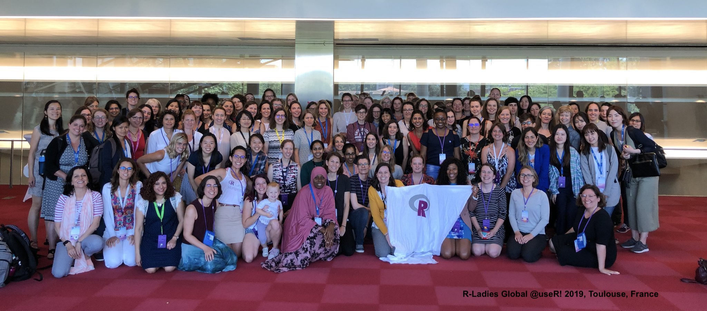

```{r setup, include=FALSE}
options(htmltools.dir.version = FALSE)
knitr::opts_chunk$set(
  fig.width=9, fig.height=3.5, fig.retina=3,
  out.width = "100%",
  cache = FALSE,
  echo = TRUE,
  message = FALSE, 
  warning = FALSE,
  fig.show = TRUE,
  hiline = TRUE
)
```


```{r xaringan-themer, include=FALSE, warning=FALSE}
library(xaringanthemer)
style_mono_accent(
  base_color = "#081d58",
  text_bold_color = "#ce1256",
  title_slide_text_color = "#edf8b1",
  header_font_google = google_font("Josefin Sans"),
  base_font_size = "20px",
  text_font_size = "1.5rem"
 #text_font_google   = google_font("Montserrat", "300", "300i")
 # code_font_google   = google_font("Fira Mono")
)
```


## Lecturer-in-charge and Chief Examiner

.pull-left[

- Dr Thiyanga S. Talagala

- PhD in Statistics (2019), Monash University, Australia

- BSc (Hons, Special) Statistics, University of Sri Jayewardenepura
      
      - Batch first and Professor R A Dayananda Gold Medalist 
      
]

.pull-right[
      
- Research interests

      - Data visualization
      
      - Computer vision
      
      - Time series forecasting
      
      - Machine learning and interpretability methods
      
      - Statistical computing
      
]
      
- Personal website: https://thiyanga.netlify.app/
---

## Requirements

- Each student is required to join both lectures and exams with a computer with R and RStudio installed.

- Internet connection.


---


## Course website

```{r, echo=FALSE}
knitr::include_url("https://hellor.netlify.app/mscschedule/")
```

https://hellor.netlify.app/mscschedule/
---

## Course outline


```{r, echo=FALSE}
knitr::include_url("https://hellor.netlify.app/msc/STA_517_3_0_Programming_and_Data_Analysis_with_R_MSc_2020.pdf")
```


---

## Help us to help you!

.pull-left[

]

--

.pull-right[

- Use the LMS forum to ask questions.

- Feel free to answer each others questions.

- I will also provide answers.

- Email ttalagala@sjp.ac.lk only for issues that are personal.

- For details on consultation see course website.


]

---

class: inverse, center, middle

# Additional resources

---

## R Ladies 



---

## R Ladies 

```{r, echo=FALSE}
knitr::include_url("https://rladies.org/")
```

---

## R Ladies Colombo

```{r, echo=FALSE}
knitr::include_url("https://rladiescolombo.netlify.app/")
```

---

## Other

- Stack Overflow: question and answer website for professional and enthusiast programmers

- Cousera

- DataCamp

- Udemy etc.

---

background-image: url('horse.png')
background-position: center
background-size: cover

---
background-image: url('job1.png')
background-position: center
background-size: cover

---
background-image: url('job2.png')
background-position: center
background-size: cover

---
background-image: url('job3.png')
background-position: center
background-size: cover

---
background-image: url('job4.png')
background-position: center
background-size: cover

---

class: inverse, center, middle


# Buckle up - Let's get started.