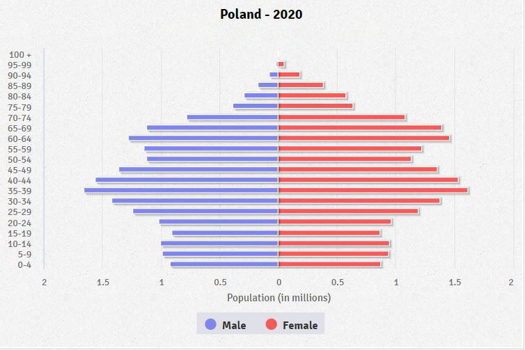
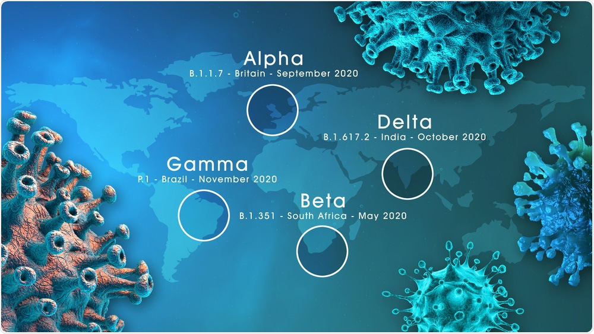
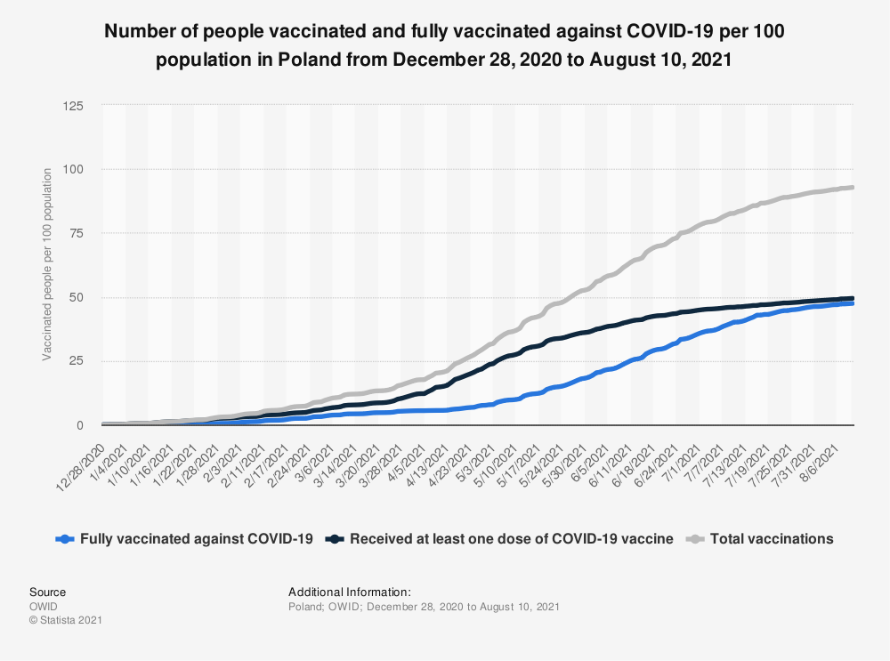
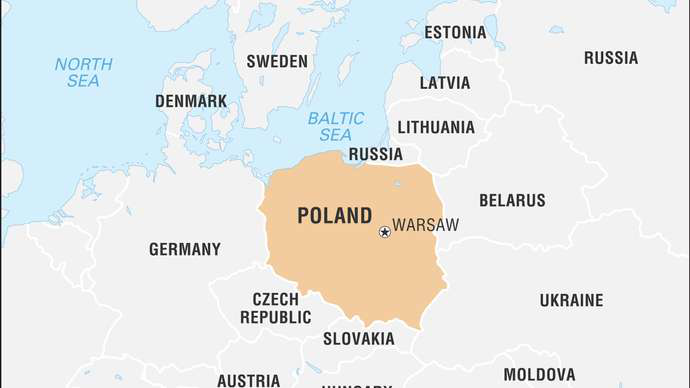
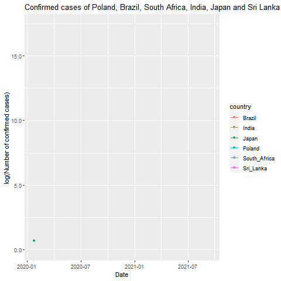

```{r setup, include=FALSE}
knitr::opts_chunk$set(echo = TRUE)

```

<style>
body {
text-align: justify; font-size:14pt}
</style>

```{r dataset, echo=FALSE, warning=FALSE, message=FALSE,out.width='100%'}
library(devtools)
devtools::install_github("thiyangt/sta3262")
library(sta3262)
library(coronavirus)

library(ggplot2)
library(maptools)
library(tibble)
library(tidyverse)
library(ggrepel)
library(png)
library(grid)
library(sp)
data(wrld_simpl)
library(magrittr)
library(tidyr)
library(plyr)

poland_corona <- coronavirus %>% filter(country == "Poland")
poland_corona$new_cases <- abs(poland_corona$cases)
new_poland_corona <- poland_corona %>% select(date:type,new_cases)
new_poland_corona <- new_poland_corona %>% pivot_wider(names_from = type,values_from=new_cases)

new_poland_corona_recovered <- new_poland_corona[!is.na(new_poland_corona$recovered),]


```

# **1. Introduction**
<p>&nbsp;</p>
```{r covid, echo=FALSE, out.width = '100%'}


```
<p>&nbsp;</p>
The Covid-19 pandemic, also known as the coronavirus pandemic, is an ongoing global pandemic of coronavirus disease is an infectious disease caused by the SARS-COV-2 virus.China had been the first country with a widespread outbreak in December 2019. Today, that is 20th of September 2021 there were 229,380,698 confirmed cases and 4,707,310 death cases in the 221 Countries and Territories around the world. The disease easily transmitted through direct contact with an infected person or through contaminated surfaces.Several variants of SARS-CoV-2 have emerged that are spreading globally. The most prevalent, all of which share the more infectious varities are:

+ B.1.1.7, also known as the Alpha variant, first detected in the UK, which has spread to over 190 countries
 
+ P.1, also known as the Gamma variant, first detected in Brazil, which has spread to over 90 countries

+ B.1.351, also known as the Beta variant, first detected in South Africa, which has spread to over 140 countries

+ B.1.617.2, also known as the Delta variant, first detected in India, which has spread to over 170 * countries 

Now, there are many vaccines developed against coronavirus and WHO gave permission for several vaccines. Some of them are Pfizer, Moderna, Astrazeneca, Sinopharm, Sputnik V and etc. 43.3% of the world population has received at least one dose of a COVID-19 vaccine.5.95 billion doses have been administered globally, and 28.87 million are now administered each day.Only 1.9% of people in low-income countries have received at least one dose.

The virus has spread across all countries and territories in world; Therefore, this report attempts to analyze the COVID – 19 related data of Poland when 22nd of January 2020 to 18th September 2021 in order to communicate it to any parties of interest. 
<p>&nbsp;</p>
## **1.1. Location of Poland**
<p>&nbsp;</p>
Poland, officially the Republic of Poland, is a country located in Central Europe.  Poland is located at a geographic crossroads that links the forested lands of northwestern Europe to the sea lanes of the Atlantic Ocean and the fertile plains of the Eurasian frontier. Now bounded by seven nations, that is Russia, Lithuania, Belarus, Ukraine, Slovakia, Czech Republic and Germany. It is divided into 16 administrative provinces, covering an area of 312,696 km².

The geographical location of Poland can be further understood through the following figure. 
<p>&nbsp;</p>
**Figure 01 : Geographical location of Poland**
<p>&nbsp;</p>
```{r , comment=NA, echo=FALSE, warning=FALSE, message=FALSE, fig.align='center',out.width = '80%'}

p <- ggplot() +
  geom_polygon(
    data = wrld_simpl,
    aes(x = long, y = lat, group = group), fill = "gray", colour = "white"
  ) +
  coord_cartesian(xlim = c(-180, 180), ylim = c(-90, 90)) +
  scale_x_continuous(breaks = seq(-180, 180, 120)) +
  scale_y_continuous(breaks = seq(-90, 90, 100))

p +
  geom_point(
    data = poland_corona, aes(x = long, y = lat), color = "red", size
    = 1
  )
```
<p>&nbsp;</p>
## **1.2. Climate condition of Poland**
<p>&nbsp;</p>
Poland has a moderate climate with both maritime and continental elements. You can count on many sunny days and many rainy days and don’t be surprised when the summer turns out to be quite hot or quite rainy. Winters are usually cold, with temperatures well below freezing, and more or less snowy.
<p>&nbsp;</p>
## **1.3. Population of Poland**
<p>&nbsp;</p>
The current population of Poland is 37,796,158 as of Monday, September 20, 2021, based on Worldometer elaboration of the latest United Nations data. Poland population is equivalent to 0.49% of the total world population. The population density in Poland is 124 per Km2 (320 people per mi2).
<p>&nbsp;</p>
**Figure 02 : Poland population by age and sex**
<p>&nbsp;</p>
```{r poland-population, echo=FALSE, out.width = '100%'}

```
<p>&nbsp;</p>
The above graph illustrates the age and sex structure of a Poland's population.The population is distributed along the horizontal axis, with males shown on the left and females on the right. The male and female populations are broken down into 5-year age groups represented as horizontal bars along the vertical axis, with the youngest age groups at the bottom and the oldest at the top. The shape of the population pyramid gradually evolves over time based on fertility, mortality, and international migration trends. According to the graph we can see most of the people are below 65 years old and more people belongs to 35-39 age group. Approximately 50 percent of population are belongs 25-54 age group.
<p>&nbsp;</p>
**Age structure:**

* 0-14 years: 14.83% (male 2,918,518/female 2,756,968)

* 15-24 years: 9.8% (male 1,928,637/female 1,823,894)

* 25-54 years: 43.33% (male 8,384,017/female 8,203,646)

* 55-64 years: 13.32% (male 2,424,638/female 2,675,351)

* 65 years and over: 18.72% (male 2,867,315/female 4,299,341) (2020 est.)
<p>&nbsp;</p>
## **1.4. Covid-19 Variants found in Poland**
<p>&nbsp;</p>
The first case of a laboratory confirmed SARS-CoV-2 infection in Poland was that of a man hospitalized in Zielona Góra, with confirmation announced officially on 4 March 2020. The local transmission phase of SARS-CoV-2 in Poland was declared to the World Health Organization on 10 March. The first death from coronavirus disease 2019 (COVID-19) in Poland was that of a 56-year-old woman on 12 March. Then whole over the world coronavirus heavily transmitted. As a result of this SARS-CoV-2 virus convert to various variants. Above I mentioned those variants. Several variants of SARS-CoV-2 have emerged that are spreading globally. AS a result of this Poland first found Alpha variant and up to now there are 14,804 confirmed cases found in Poland.The highly contagious coronavirus variant first identified in the United Kingdom (UK) is about to become the dominant strain for new COVID-19 infections in Poland. Poland has discovered the South African variant of the coronavirus(Beta) on its territory, the health minister said on February 2021, as he warned that the country was entering a third wave of the pandemic. After weeks of low infection rates, Poland faces growing numbers of new coronavirus cases as the Delta variant spreads, Poland has confirmed 106 cases of the Delta and 12 cases of the Delta Plus coronavirus mutations that originated in India, a deputy health minister has announced on July 2021. And also There is one confirmed case found in Gamma variant and there are six confirmed cases found in Mu variant in Poland.
<p>&nbsp;</p>
```{r covidVariant, echo=FALSE, out.width = '90%',fig.align='center'}


```
<p>&nbsp;</p>
## **1.5. Lockdown Status of Poland**

Poland will return to full lockdown on Saturday, extending current restrictions in some regions to the entire country. The new rules mean that recently reopened hotels, as well as cultural and sports venues, will close and the youngest children will return to remote learning. The new lockdown will come into force on 20 March and remain in place until at least 9 April
<p>&nbsp;</p>
## **1.6. Actions taken by the government**

### **1.6.1. Restrictions concerning movement**
<p>&nbsp;</p>
Current regulations in Poland in force until September 30, 2021 

**Masks**

There is the obligation to cover the nose and mouth with a mask inside the buildings (e.g. in the stairwell, on the bus, in the shop, at the market, at the post office, in the cinema, in the clinic, at the bank). You need to wear a mask (scarves, headscarves, bandannas, helmets cannot be used). The type of mask is not specified in the regulations.There is no obligation to wear masks in the open air (e.g. on the street, in a park, on boulevards, on the beach).You do not need a mask when driving a private car.Children do not have to wear masks until they are 5 years old.

**What’s open in Poland**

* Restaurants – up to 75 percent of the capacity.
* Hotels – up to 75 percent of the capacity.
* Museums and galleries (limit of 1 person per 10 m²).
* Libraries (limit of 1 person per 10 m²).
* Cinemas, theaters, opera and philharmonic houses – up to 75 percent of the capacity.
* Amusement parks – up to 75 percent of the capacity.
* Discos, night clubs – maximum 150 people.
* Fairs, conferences, exhibitions (limit of 1 person per 10 m²).
* Shops, post offices, shopping centers (limit of 1 person per 10 m²).
* Beauty salons, hairdressers, beauticians.
* Gyms, fitness clubs, swimming pools, water parks (limit of 1 person per 10 m²).
* Churches – up to 75 percent of the capacity.
* The audience at sports facilities – up to 50 percent of the capacity.

The limits do not apply to people fully vaccinated against COVID-19.

**Public transportation**

100 % of capacity. Passengers should wear masks that cover their mouth and nose.Events, meetings, weddings. Outdoor or indoor events and meetings – maximum 150 people. The limits do not apply to people fully vaccinated against COVID-19. Traveling to Poland by plane – a traveler location cardTravelers arriving in Poland by plane must fill in a traveler location card (Karta Lokalizacji Podróżnego) with their expected address in Poland. The location cards can be filled in online (https://aplikacje.gov.pl/app/klp/#/home) before the trip. If you don’t the airline crews will distribute paper cards to fill in. Quarantine after crossing the Polish borderThere is an obligatory 10-day quarantine for Polish citizens and foreigners (counting from the day following crossing the border).There are different rules for exempting from quarantine – depending on whether the traveler comes from a country within the Schengen Area or from a country outside the Schengen Area.People who present a negative coronavirus test result from the country where the traveler is coming from will NOT be released from quarantine. People vaccinated against COVID-19 are exempt from the quarantine obligation (people who have received a full course of vaccination with a vaccine registered in the European Union: Pfizer, Moderna, Astra-Zeneca, Johnson & Johnson). Full vaccination is considered 14 days after the vaccination process is completed.
People who have been infected with SARS-CoV-2 virus no later than 6 months before the date of crossing the border are released from quarantine. They must present a confirmation document, issued in Polish or in English, e.g. an EU digital COVID certificate.
<p>&nbsp;</p>
### **1.6.2. Qurantine and Isolation**
<p>&nbsp;</p>
**Who is quarantined in Poland?**

* People who are referred for the SARS-CoV-2 virus test.
* People who have had close contact with an infected person, e.g. at work or kindergarten.
* People living with an infected (isolated) person

There is an obligatory 10-day quarantine for Polish citizens and foreigners (counting from the day following crossing the border).
<p>&nbsp;</p>
## **1.7. Covid-19 vaccination in Poland**
<p>&nbsp;</p>
According to a press release issued by the Polish Government, it has been revealed that the country only recognizes the vaccines that have been approved for use by the European Medicines Agency (EMA).Therefore, this means that only the vaccines listed below are recognized as valid proof of immunization in Poland:

* Pfizer/BioNTech (Comirnaty)
* AstraZeneca EU (Vaxzevria)
* Johnson & Johnson (Janssen)
* Moderna (Spikevax)
<p>&nbsp;</p>
**Figure 03 : Poland Covid-19 vaccination statistics**
<p>&nbsp;</p>
```{r vaccination, echo=FALSE, out.width = '80%',fig.align='center'}


```
<p>&nbsp;</p>
Poland Covid-19 vaccination started on January 2021.Poland, which had one of the highest vaccination rates in the EU just two months ago, is now failing to meet the current EU average of 77% as only about 60% of Poles are vaccinated with at least one dose, figures from the European Centre for Disease Control (ECDC) show. In Poland There are 19.3 Million people fully vaccinated and 37.1 Million got the first dose now. That is there are 50.9 percent of population fully vaccinated.
<p>&nbsp;</p>
```{r , echo=FALSE, out.width = '80%',fig.align='center'}


```
<p>&nbsp;</p>
# **2. Exploratory Data Analysis**

## **2.1. Structure of the data set**
<p>&nbsp;</p>
The data set used for this analysis is The 2019 Novel Coronavirus COVID-19 (2019-nCoV) dataset which is easily available as an installable package in RStudio. The source of this data is Johns Hopkins University Center for Systems Science and Engineering (JHU CCSE) Coronavirus.

The dataset contains the daily summary of Coronavirus cases worldwide. All cases are recorded according to the following variables;

* Date
* Country
* Province/state; if available
* Latitude of center of geographic region defined by country/province
* Longitude of center of geographic region defined by country/province
* Type of reported case – confirmed, death, recovered
* Number of cases on given date

Through this analysis I selected "Poland" as country and all records are available for the time period from 22 January 2020 to 18 September 2021.

The analysis has been done by R, a programming language for statistical computing and graphics.
<p>&nbsp;</p>
## **2.2. Covid-19 Statisics of Poland**
<p>&nbsp;</p>
According to the below time series plots to the confirmed cases,recovered cases, death cases and active cases with respect to the date and number of cases, it can be seen that number of confirmed cases increasing rapidly on September 2020 to November 2020. Then the according to plot number of confirmed cases decreasing. But again confirmed cases rapidly increasing on February 2021 to April 2021. That is the progress of the disease in the first few weeks after confirmation of first case is comparatively slow with respect to the high acceleration in September 2020 to November 2020 and February 2021 to April 2021. As well as highest number of confirmed cases 35,283 found on 1 April 2021. According to the plot number of death cases increasing rapidly on September 2020 to November 2020.Then number of death cases slowly decreasing but on February 2021 to April 2021 again number death cases rapidly increasing. It can be seen that highest number of death cases 956 found on 8 April 2021.When compared with the September to November 2020 and February to April 2021, there is increasing a significant number of active cases within the island but a considerably high number of patients have also recovered.
<p>&nbsp;</p>
**Figure 04 : Poland Confirmed cases, Death cases, Recovered cases and Active cases vs Date**
<p>&nbsp;</p>
```{r confirmed, echo=FALSE, warning=FALSE, message=FALSE,out.width='100%'}

library(plotly)
library(gridExtra)
library(grid)

fig2 <- plot_ly(new_poland_corona, x = ~date, y = ~confirmed, name = 'Confirmed cases', type = 'scatter', mode = 'lines',
                line = list(color = 'rgb(65, 105, 225)', width = 2)) 


fig1 <- plot_ly(new_poland_corona, x = ~date, y = ~death, name = 'Death cases', type = 'scatter', mode = 'scatter',
               line = list(color = 'rgb(205, 12, 24)', width = 2)) 


fig3 <- plot_ly(new_poland_corona_recovered, x = ~date, y = ~new_poland_corona_recovered$recovered, name = 'Recovered cases', type = 'scatter', mode = 'lines',
                line = list(color = 'rgb(34, 139, 34)', width = 2)) 


new_poland_corona_recovered$cum_confirmed <- cumsum(new_poland_corona_recovered$confirmed)
new_poland_corona_recovered$cum_death <- cumsum(new_poland_corona_recovered$death)
new_poland_corona_recovered$cum_recovered <- cumsum(new_poland_corona_recovered$recovered)


active_cases <- new_poland_corona_recovered$cum_confirmed - (new_poland_corona_recovered$cum_death + new_poland_corona_recovered$cum_recovered)
new_poland_corona_recovered$active_cases <- active_cases

fig4 <- plot_ly(new_poland_corona_recovered, x = ~date, y = ~active_cases, name = 'Active cases', type = 'scatter', mode = 'lines',line = list(color = 'rgb(0, 0, 0)', width = 2))


fig <- subplot(fig2,fig3,fig1,fig4,nrows = 2)  %>% layout(title = "Statistics Graph of Poland Date vs Number of cases", plot_bgcolor='#e5ecf6',
         xaxis = list( 
           zerolinecolor = '#ffff', 
           zerolinewidth = 2, 
           gridcolor = 'ffff'), 
         yaxis = list( 
           zerolinecolor = '#ffff', 
           zerolinewidth = 2, 
           gridcolor = 'ffff'))

fig <- fig %>%layout(legend = list(orientation='h',font=list(size=20))) 

fig


```
<p>&nbsp;</p>
Below figure shows that cumulative sum of confirmed cases,death cases and recovered cases in Poland. It can be seen that confirmed cases were reported in the Poland from the beginning of March. The number of confirmed cases accelerated very rapidly. Further,number of recovered cases also accelerated rapidly according to the confirmed cases. Figure shows that death cases of Poland
increasing when compared to the confirmed cases and recovered cases it is slowly increasing. Further, Poland was able to flatten its curves of confirmed, deaths and recovered when June 2021 to upto now.
<p>&nbsp;</p>
**Figure 05 : Poland log cumulative number of Confirmed,Death,Actice cases vs Date**
<p>&nbsp;</p>
```{r cum_poland, echo=FALSE, warning=FALSE, message=FALSE,out.width='100%'}
new_df <- data.frame(new_poland_corona_recovered$date,new_poland_corona_recovered$cum_confirmed,new_poland_corona_recovered$cum_death,new_poland_corona_recovered$cum_recovered)


library(plotly)
figf <- plot_ly(new_df, x = ~new_poland_corona_recovered.date, y = ~log(new_poland_corona_recovered.cum_confirmed), name = 'Confirmed Cases', type = 'scatter', mode = 'lines') 
figf <- figf %>% add_trace(y = ~log(new_poland_corona_recovered.cum_death), name = 'Death Cases', mode = 'lines') 
figf <- figf %>% add_trace(y = ~log(new_poland_corona_recovered.cum_recovered), name = 'Recovered Cases', mode = 'lines')

figf <- figf %>% layout(title="Cumulative Confirmed cases, Death cases and Recovered cases of Poland",xaxis = list(title = "Date"),yaxis = list(title = "log(Cumulative number of cases)"))
figf
```
<p>&nbsp;</p>
## **2.3. Poland Covid-19 statistics Comparison with Other countries**
<p>&nbsp;</p>
### **2.3.1. Poland Covid-19 statistics Comparison with countries near the Poland **
<p>&nbsp;</p>
Poland bounded by seven nations, that is Russia, Lithuania, Belarus, Ukraine, Slovakia, Czech Republic and Germany. The geographical location of Poland can be further understood through the following figure.
<p>&nbsp;</p>
```{r poland, echo=FALSE, out.width = '100%'}

```
<p>&nbsp;</p>
In this chapter I would like to compare Poland Covid-19 statistics with these seven countries. 
<p>&nbsp;</p>
**Figure 06 : Poland and countries near the Poland daily confirmed cases**
<p>&nbsp;</p>
```{r countries, echo=FALSE, out.width = '100%',comment=NA}
# this animation i creadted by use this dateset. The code for creating this animation I include to the folder. It is in Animation.R script file.
knitr::include_graphics("covidpoland.gif")
```
<p>&nbsp;</p>
This figure shows that total confirmed cases of Poland, Russia, Ukraine, Germany, Slovakia, Lithuania, Belarus and Czechia(Czech Republic). Those are the countries, which are surrounded by Poland. If those countries have risk, then Poland also in a risk.According to the figure Germany is the first country confirmed cases found. But according to the time confirmed cases in Russia rapidly increasing. Russia has large number of total confirmed cases found on January 2020 to September 2021. Poland and Germany, had fast increased case in January 2020 to September 2021. Belarus, Slovakia and Lithuania approximately similar confirmed cases reported January 2020 to September 2021. Poland is in third highest total confirmed  cases in September 2021. Lithuania lowest total confirmed cases found country among those seven countries.
<p>&nbsp;</p>
**Figure 07 : Poland and countries near the Poland death cases vs date**
<p>&nbsp;</p>
```{r cum_death_countries, echo=FALSE, warning=FALSE, message=FALSE,out.width='100%'}
poland_corona <- coronavirus %>% filter(country == "Poland")
poland_corona$new_cases <- abs(poland_corona$cases)
new_poland_corona <- poland_corona %>% select(date:type, new_cases)
new_poland_corona <- new_poland_corona %>% pivot_wider(names_from = type, values_from=new_cases)
new_poland_corona$cum_death <- cumsum(new_poland_corona$death)


russia_corona <- coronavirus %>% filter(country == "Russia")
new_russia_corona <- russia_corona %>% select(date:type, cases)
new_russia_corona <- new_russia_corona %>% pivot_wider(names_from = type,values_from=cases)
new_russia_corona$cum_death <- cumsum(new_russia_corona$death)

ukraine_corona <- coronavirus %>% filter(country == "Ukraine")
new_ukraine_corona <- ukraine_corona %>% select(date:type, cases)
new_ukraine_corona <- new_ukraine_corona %>% pivot_wider(names_from = type, values_from=cases)
new_ukraine_corona$cum_death <- cumsum(new_ukraine_corona$death)

germany_corona <- coronavirus %>% filter(country == "Germany")
germany_corona$new_cases <- abs(germany_corona$cases)
new_germany_corona <- germany_corona %>% select(date:type,new_cases)
new_germany_corona <- new_germany_corona %>% pivot_wider(names_from = type,values_from=new_cases)
new_germany_corona$cum_confirmed <- cumsum(new_germany_corona$confirmed)
new_germany_corona$cum_death <- cumsum(new_germany_corona$death)


belarus_corona <- coronavirus %>% filter(country == "Belarus")
belarus_corona$new_cases <- abs(belarus_corona$cases)
new_belarus_corona <- belarus_corona %>% select(date:type, new_cases)
new_belarus_corona <- new_belarus_corona %>% pivot_wider(names_from = type, values_from=new_cases)
new_belarus_corona$cum_death <- cumsum(new_belarus_corona$death)

slovakia_corona <- coronavirus %>% filter(country == "Slovakia")
slovakia_corona$new_cases <- abs(slovakia_corona$cases)
new_slovakia_corona <- slovakia_corona %>% select(date:type, new_cases)
new_slovakia_corona <- new_slovakia_corona %>% pivot_wider(names_from = type, values_from=new_cases)
new_slovakia_corona$cum_death <- cumsum(new_slovakia_corona$death)

lithuania_corona <- coronavirus %>% filter(country == "Lithuania")
lithuania_corona$new_cases <- abs(lithuania_corona$cases)
new_lithuania_corona <- lithuania_corona %>% select(date:type, new_cases)
new_lithuania_corona <- new_lithuania_corona %>% pivot_wider(names_from = type, values_from=new_cases)
new_lithuania_corona$cum_death <- cumsum(new_lithuania_corona$death)

czechia_corona <- coronavirus %>% filter(country == "Czechia")
czechia_corona$new_cases <- abs(czechia_corona$cases)
new_czechia_corona <- czechia_corona %>% select(date:type,new_cases)
new_czechia_corona <- new_czechia_corona %>% pivot_wider(names_from = type, values_from=new_cases)
new_czechia_corona$cum_death <- cumsum(new_czechia_corona$death)

Poland <- new_poland_corona$cum_death
Russia <- new_russia_corona$cum_death
Germany <- new_germany_corona$cum_death
Ukraine <- new_ukraine_corona$cum_death
Belarus <- new_belarus_corona$cum_death
Slovakia <- new_slovakia_corona$cum_death
Lithuania <- new_lithuania_corona$cum_death
Czechia <- new_czechia_corona$cum_death

seven_countries_cum_deaths <- data.frame(new_poland_corona$date, Poland, Russia, Germany, Ukraine,Belarus, Slovakia, Lithuania,Czechia)

library(plotly)
fig <- plot_ly(seven_countries_cum_deaths, x = ~new_poland_corona.date, y = ~log(Poland), name = 'Poland', type = 'scatter', mode = 'lines') 
fig <- fig %>% add_trace(y = ~log(Russia), name = 'Russia', mode = 'lines') 
fig <- fig %>% add_trace(y = ~log(Germany), name = 'Germany', mode = 'lines')
fig <- fig %>% add_trace(y = ~log(Ukraine), name = 'Ukraine', mode = 'lines')
fig <- fig %>% add_trace(y = ~log(Belarus), name = 'Belarus', mode = 'lines')
fig <- fig %>% add_trace(y = ~log(Slovakia), name = 'Slovakia', mode = 'lines')
fig <- fig %>% add_trace(y = ~log(Lithuania), name = 'Lithuania', mode = 'lines')
fig <- fig %>% add_trace(y = ~log(Czechia), name = 'Czechia', mode = 'lines')
fig <- fig %>% layout(title="Cumulative Death cases of Poland and countries near the Poland",xaxis = list(title = "Date"),yaxis = list(title = "log(Cumulative number of death cases)"))
fig
```
<p>&nbsp;</p>
Above figure shows that cumulative sum of death cases in Poland and countries near the Poland. When comparing the number of deaths of the 7 countries, it can be seen that deaths were reported in these seven countries from the beginning of March. The number of deaths of Russia accelerated very rapidly when compared to other six countries. The number of deaths began to stabilize for Germany, Poland, Czechia, Ukraine, Slovakia and Lithuania by end of September 2021. Further, figure shows that Russia and Belarus death cases still increasing. Therefore, it can be seen that Poland was able to flatten its curve of total deaths in a September 2021 than Russia.
<p>&nbsp;</p>
### **2.3.2. Poland Covid-19 statistics Comparison with Brazil, India, Japan, Sri Lanka and South Africa **
<p>&nbsp;</p>
**Figure 08 : Poland, Brazil, India, Japan,S ri Lanka and South Africa daily confirmed cases vs date**
<p>&nbsp;</p>
```{r temp, echo=FALSE, warning=FALSE, message=FALSE,out.width='100%',comment=NA}

# this animation i creadted by use this dateset. The code for creating this animation I include to the folder. It is in Countries_Animation.R script file.
```
<p>&nbsp;</p>
This figure shows that total confirmed cases of Poland, India, Japan, Brazil, South Africa and Sri Lanka. Other than Poland all other countries are non European countries. So the goal is to comparison covid 19 statistics of Poland with above non European countries. According to the figure confirmed cases in India and Brazil accelerated very rapidly. India had large number of total confirmed cases found on January 2020 to September 2021. Poland and South Africa, had fast increased case in January 2020 to September 2021 but it is slow than India and Brazil. Further, Japan and Sri Lanka confirmed cases also increasing. India Confirmed cases accelerated very rapidly in April 2021 to July 2021.
<p>&nbsp;</p>
**Figure 09 : Poland, Brazil, India, Japan,S ri Lanka and South Africa daily death cases vs date**
<p>&nbsp;</p>
```{r cumdeath_countries, echo=FALSE, warning=FALSE, message=FALSE,out.width='100%'}
poland_corona <- coronavirus %>% filter(country == "Poland")
poland_corona$new_cases <- abs(poland_corona$cases)
new_poland_corona <- poland_corona %>% select(date:type, new_cases)
new_poland_corona <- new_poland_corona %>% pivot_wider(names_from = type, values_from=new_cases)
new_poland_corona$cum_death <- cumsum(new_poland_corona$death)


india_corona <- coronavirus %>% filter(country == "India")
india_corona$new_cases <- abs(india_corona$cases)
new_india_corona <- india_corona %>% select(date:type, new_cases)
new_india_corona <- new_india_corona %>% pivot_wider(names_from = type, values_from=new_cases)
new_india_corona$cum_death <- cumsum(new_india_corona$death)


brazil_corona <- coronavirus %>% filter(country == "Brazil")
brazil_corona$new_cases <- abs(brazil_corona$cases)
new_brazil_corona <- brazil_corona %>% select(date:type,new_cases)
new_brazil_corona <- new_brazil_corona %>% pivot_wider(names_from = type,values_from=new_cases)
new_brazil_corona$cum_death <- cumsum(new_brazil_corona$death)


japan_corona <- coronavirus %>% filter(country == "Japan")
japan_corona$new_cases <- abs(germany_corona$cases)
new_japan_corona <- japan_corona %>% select(date:type, new_cases)
new_japan_corona <- new_japan_corona %>% pivot_wider(names_from = type, values_from=new_cases)
new_japan_corona$cum_death <- cumsum(new_japan_corona$death)


sa_corona <- coronavirus %>% filter(country == "South Africa")
sa_corona$new_cases <- abs(sa_corona$cases)
new_sa_corona <- sa_corona %>% select(date:type, new_cases)
new_sa_corona <- new_sa_corona %>% pivot_wider(names_from = type, values_from=new_cases)
new_sa_corona$cum_death <- cumsum(new_belarus_corona$death)

sl_corona <- coronavirus %>% filter(country == "Sri Lanka")
sl_corona$new_cases <- abs(sl_corona$cases)
new_sl_corona <- sl_corona %>% select(date:type, new_cases)
new_sl_corona <- new_sl_corona %>% pivot_wider(names_from = type, values_from=new_cases)
new_sl_corona$cum_death <- cumsum(new_slovakia_corona$death)


Poland <- new_poland_corona$cum_death
Brazil <- new_brazil_corona$cum_death
India <- new_india_corona$cum_death
Japan <- new_japan_corona$cum_death
SA <- new_sa_corona$cum_death
SL <- new_sl_corona$cum_death


six_countries_cum_deaths <- data.frame(new_poland_corona$date, Poland, Brazil, India, Japan, SA, SL)

library(plotly)
fig <- plot_ly(six_countries_cum_deaths, x = ~new_poland_corona.date, y = ~log(Poland), name = 'Poland', type = 'scatter', mode = 'lines') 
fig <- fig %>% add_trace(y = ~log(Brazil), name = 'Brazil', mode = 'lines') 
fig <- fig %>% add_trace(y = ~log(India), name = 'India', mode = 'lines')
fig <- fig %>% add_trace(y = ~log(Japan), name = 'Japan', mode = 'lines')
fig <- fig %>% add_trace(y = ~log(SA), name = 'South Africa', mode = 'lines')
fig <- fig %>% add_trace(y = ~log(SL), name = 'Sri Lanka', mode = 'lines')

fig <- fig %>% layout(title="Cumulative Death cases of Poland and other five countries",xaxis = list(title = "Date"),yaxis = list(title = "log(Cumulative number of death cases)"))
fig
```
<p>&nbsp;</p>
Above figure shows that cumulative sum of death cases in Poland, India, Brazil, Japan, South Africa and Sri Lanka. When comparing the number of deaths of the 6 countries, it can be seen that deaths were reported in these six countries from the beginning of March. The number of deaths of Brazil accelerated very rapidly when beginning of the covid pandemic compared to other six countries. Further, the number of death cases in India were rapidly accelerated when March 2021 to July 2021. Poland covid death cases were increased when June 2021 and then curve is flat. That is Poland covid death cases are in under controlled now. 
<p>&nbsp;</p>
### **2.3.3. Poland and above mentioned other countries case fatality rates**
<p>&nbsp;</p>
A case fatality rate tells you how severe a disease is. It also measures how effective treatments are, on average. The lower the case fatality rate, the better. If more people die from a disease, the case fatality rate increases.
<p>&nbsp;</p>
**Figure 10 : Poland and all countries case fatality rate**
<p>&nbsp;</p>
```{r fatality, echo=FALSE, warning=FALSE, message=FALSE,out.width='100%'}
total_poland <- sum(new_poland_corona$confirmed)
total_russia <- sum(new_russia_corona$confirmed)
total_germany <- sum(new_germany_corona$confirmed)
total_ukraine <- sum(new_ukraine_corona$confirmed)
total_belarus <- sum(new_belarus_corona$confirmed)
total_slovakia <- sum(new_slovakia_corona$confirmed)
total_lithuania <- sum(new_lithuania_corona$confirmed)
total_czechia <- sum(new_czechia_corona$confirmed)
total_india <- sum(new_india_corona$confirmed)
total_japan <- sum(new_japan_corona$confirmed)
total_brazil <- sum(new_brazil_corona$confirmed)
total_sl <- sum(new_sl_corona$confirmed)
total_sa <- sum(new_sa_corona$confirmed)

death_poland <- sum(new_poland_corona$death)
death_russia <- sum(new_russia_corona$death)
death_germany <- sum(new_germany_corona$death)
death_ukraine <- sum(new_ukraine_corona$death)
death_belarus <- sum(new_belarus_corona$death)
death_slovakia <- sum(new_slovakia_corona$death)
death_lithuania <- sum(new_lithuania_corona$death)
death_czechia <- sum(new_czechia_corona$death)
death_india <- sum(new_india_corona$death)
death_japan <- sum(new_japan_corona$death)
death_brazil <- sum(new_brazil_corona$death)
death_sl <- sum(new_sl_corona$death)
death_sa <- sum(new_sa_corona$death)

poland_fatality <- (death_poland/total_poland)*100
russia_fatality <- (death_russia/total_russia)*100
germany_fatality <- (death_germany/total_germany)*100
ukraine_fatality <- (death_ukraine/total_ukraine)*100
belarus_fatality <- (death_belarus/total_belarus)*100
slovakia_fatality <- (death_slovakia/total_slovakia)*100
lithuania_fatality <- (death_lithuania/total_lithuania)*100
czechia_fatality <- (death_czechia/total_czechia)*100
india_fatality <- (death_india/total_india)*100
brazil_fatality <- (death_brazil/total_brazil)*100
japan_fatality <- (death_japan/total_japan)*100
sa_fatality <- (death_sa/total_sa)*100
sl_fatality <- (death_sl/total_sl)*100

fig <- plot_ly(
  x = c("Poland", "Russia", "Germany", "Ukraine", "Belarus","Slovakia","Lithuania","Czechia","India","Japan","Brazil","Sri Lanka","South Africa"),
  y = c(poland_fatality, russia_fatality,germany_fatality,ukraine_fatality,belarus_fatality,slovakia_fatality,lithuania_fatality,czechia_fatality,india_fatality,japan_fatality,brazil_fatality,sl_fatality,sa_fatality),
  type = "bar"
)

fig <- fig %>% layout(title="Case fatality rates of each countries",xaxis = list(title = "Country"),yaxis = list(title = "case fatality rate"))
fig

```
<p>&nbsp;</p>
The above bar chart higher rate of fatality rate seen in Lithuania and Slovakia and lowest fatality rate can be shown in Belarus. Compared to other countries Poland fatality rate moderate. Lithuania and Slovakia total confirmed cases are smaller than Russia and India but case fatality rate is high. That means most people die from the disease those countries.
<p>&nbsp;</p>
### **2.3.4. Poland and above mentioned other countries vaccination rates**
<p>&nbsp;</p>
**Table 01 : Poland and other countries vaccination rates**
<p>&nbsp;</p>
```{r vaccinePercent, echo=FALSE, out.width = '100%'}
country <- c("Poland", "Russia", "Germany", "Ukraine", "Belarus", "Slovakia", "Lithuania", "Czechia", "India", "Brazil", "SouthAfrica", "SriLanka", "Japan")
Fully_vaccinated_percentage <- c("51.26%","28.58%","63.33%","12.56%","16.01%","41.03%","60.18%","55.37%","16.09%","40.69%","13.98%","53.93%","57.51%")
Partial_vaccinated_percentage <- c("1.01%","4.04%","3.75%","3.04%","3.87%","3.52%","3.78%","1.23%","29.24%","29.11%","6.29%","12.90%","11.51%")

df <- data.frame(country,Fully_vaccinated_percentage,Partial_vaccinated_percentage)
knitr::kable(df,align = "lccrr")
```
<p>&nbsp;</p>
According to the above table most of the countries vaccination successfully doing now.
<p>&nbsp;</p>
## **3. Discussion**
<p>&nbsp;</p>
The dataset is loaded by coronavirus dataset given in the package R. Poland dataset is obtained by it. The dataset has 45 null values in recovered cases and there is minus value also. Further, before the analysis all the minus values convert to the absolute values. Recovered cases had all the null values and when calculating active cases removed all the null values. In figure 04 , it can be seen, before March there were no confirmed or death cases. The first case of a laboratory confirmed SARS-CoV-2 infection in Poland was that of a man hospitalized in Zielona Góra, with confirmation announced officially on 4 March 2020. When considering the all cases Poland is caparisoned with other countries also. Those countries are selected due to a specific unique reasons. Russia, Germany, Ukraine, Belarus, Slovakia, Lithuania and Czechia(Czech Republic) are the countries which are surrounded by the Poland. Therefore, if there is a any risk in those countries there is a risk in Poland. That is the reason choose those countries to comparison with Poland. Further, those all countries European countries.Secondly, to comparison with Poland choose non European countries. Those are India, Brazil, Japan, South Africa and Sri Lanka. Further there is some special reasons for choose those countries.India is  victimized by the Delta variant of SARS-CoV-2 first found. And also, South Africa is victimized the Beta variant of SARS-CoV-2 first found. Brazil is victimized by the Gamma variant of SARS-CoV-2 first found. Sri Lanka also victimized in early and it’s have medium health facilities. Japan also victimized in early and it's have good health facilities. Those date are also obtained by coronavirus dataset and it happened to see some negative cases and null values. The all unusual observations are re-coded as a same manner above mentioned.  

Poland was able to control the situation by actions taken by the government and lockdown but unfortunately due to the alpha variant and delta variant disease is rapidly increasing. But when vaccination starting Poland can control the disease.
        
The progress of COVID-19 of Poland cannot be clearly understood by solely analyzing Poland’s data, therefore a comparison of Poland with countries of significance during the COVID-19 pandemic has been carried out in order to reach the final conclusions.
        
In the case of comparison between India, Brazil, Japan, South Africa and Sri Lanka; it was recognized that due to the immense value differences in the number of cases, when plotted on a graph the larger values dominated making it impossible to interpret the smaller values. As a solution to this, the natural logarithmic values were calculated for individual cases and the graphs were plotted taking the cumulative counts(Figure 08).
       
When compared to its neighboring countries although the reporting of the disease occurred for all countries in similar time periods. Further, All these countries can controlled the situation by actions taken by the government and lockdown, some how lockdown and actions taken by the government released disease increase rapidly. After SARS-CoV-2 variants found then most of the varinats spreading rapidly. Due to that cause most of the countries covid disease rapidly increasing.
        
When compared to the India, Brazil, Japan, South Africa, Sri Lanka and Poland, although the reporting of the disease occurred for all countries in similar time periods. But Brazil can not control the situation because Brazil goverment did't get the actions. After that Gamma variant found Brazil Confirmed cases and death cases rapidly increasing.(Figure 08 shows that). India early controlled the situation but Delta variant found also it's confirmed cases and death cases rapidly increasing. Japan, South Africa, Sri Lanka and Poland early controlled the situation clearly but due to the variants all those countries death cases and confirmed cases increasing and In Poland we can see three covid waves due to this variants. But vaccination starting all these countries can control the disease.
        
 A case fatality rate tells you how severe a disease is. It also measures how effective treatments are, on average. The lower the case fatality rate, the better. If more people die from a disease, the case fatality rate increases.  
    
<p>&nbsp;</p>
## **4. Conclusion**
The main objective of all the countries are to finally flatten the endemic curve. In conclusion, it can be said that Poland currently controlled the COVID-19 Pandemic when compared to most countries. The Government of Poland has been able to apply many successful public health response strategies and stabilize the progress of the disease. Further, the government Covid-19 vaccination successfully currently doing. That is the main reason for Poland's situation to be controlled now. But most important thing is every country get ready for any variant newly arrive in covid-19 and countries health facilities must be improve everyday. Vaccination can doing decrease the death cases only and vaccination does not affect to the some variants. Therefore,not only the vaccination the face mask culture, clean your hands, keep a safe distance and always doing random tests through the socity are more important.
<p>&nbsp;</p>
## **5. References**
<p>&nbsp;</p>
* STA 326 2.0 Programming and Data Analysis with R, viewed 20 September 2021, https://hellor.netlify.app/

* Individual Projects :: STA 326 2.0 Programming and Data Analysis with R, viewed 20 September 2021, https://hellor.netlify.app/coronareports/

* Assignment - Help file, viewed by 20 September 2021, https://hellor.netlify.app/slides/coronavirus_assignment_help_file

* Coronavirus: World. 2021, Worldmeter, viewed 20 September 2021, https://www.worldometers.info/coronavirus/

* Covid 19 pandemic - Wikipedia, viewed 20 September 2021, https://en.wikipedia.org/wiki/COVID-19_pandemic

* Coronavirus (covid - 19) vaccinations:https : OurWorldInData, viewed 20 September 2021, 
https://ourworldindata.org/covid-vaccinations

* Poland | History, Geography, facts and points of interests, Britannica, Viewed 20 September 2021, https://www.britannica.com/place/Poland

* Climate|study.gov.pl, viewed 20 September 2021, https://study.gov.pl/climate

* Poland population, worldometer, viewed 20 September 2021, https://www.worldometers.info/world-population/poland-population/

* Poland age structure, Demographics, Viewed 20 September 2021, https://www.indexmundi.com/poland/age_structure.html

* Calculate covid stats, viewed  25 September 2021, https://www.nebraskamed.com/COVID/how-to-calculate-covid-19-stats-for-your-area

* Plotly bar charts, viewed  25 September 2021, https://plotly.com/r/bar-charts/

* TowardsDataScience, viewed  25 September 2021, https://towardsdatascience.com/visualize-the-pandemic-with-r-covid-19-c3443de3b4e4

* Animated graphs, viewed  25 September 2021, https://www.r-graph-gallery.com/287-smooth-animation-with-tweenr.html

* Actions taken by the government, viewed  26 September 20201, http://kidsinthecity.pl/coronavirus-situation-in-poland/

* vaccination percentage , viewed 27 September 2021,
https://ourworldindata.org/covid-vaccinations
