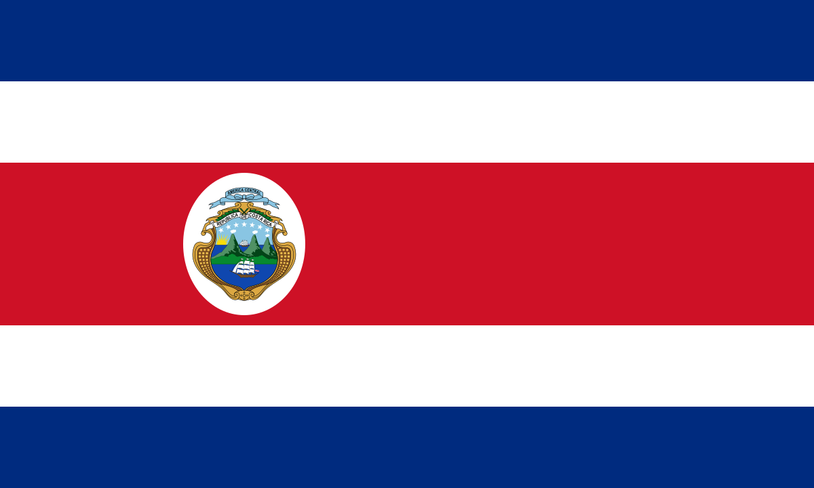
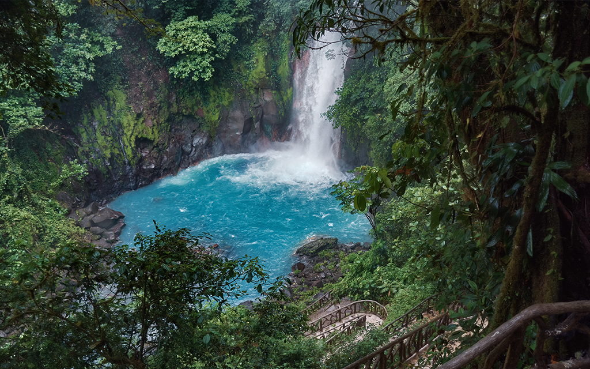

```{r setup, include=FALSE}
knitr::opts_chunk$set(echo = FALSE, message=FALSE, warning=FALSE, comment=NA)
```

```{r, include = FALSE}
library(devtools)
library(sta3262)
get_individual_project_country("AS2018502")
library(htmltools)
```

<style>
    p.tab1 { padding-left: 2em; }
    ol.tab2 { padding-left: 4em; }
    ul.tab3 { padding-left: 4em; }
    a.tab4 { padding-left: 2em; }
</style>

<br>

# <b> <font size = "7"> Costa Rica </b> </font size>

<br>

## <b> 1. Introduction </b>

<br>

### &emsp; <b> Background </b>

<br>

<p class = "tab1" align="justify"> <span style="font-family:Times New Roman; font-size:1.5em;"> **Costa Rica**, literally "Rich Coast", officially the Republic of Costa Rica is a country in Central America. Costa Rica is a rugged, rainforested Central American country with coastlines on the Caribbean and Pacific. Though its capital, San Jose, is home to cultural institutions like the Pre-Columbian Gold Museum, Costa Rica is known for its beaches, volcanoes, and biodiversity. Roughly a quarter of its area is made up of protected jungle, teeming with wildlife including spider monkeys and quetzal birds. </span> </p>

<p class = "tab1" align="justify"> <span style="font-family:Times New Roman; font-size:1.5em;"> It has a population of around 5 million in a land area of 51,060 square kilometers (19,714 square miles). An estimated 333,980 people live in the capital and largest city, San José, with around 2 million people in the surrounding metropolitan area. </span> </p>

<p class = "tab1" align="justify"> <span style="font-family:Times New Roman; font-size:1.5em;"> It is known for its long-standing and stable democracy, and for its highly educated workforce, most of whom speak English.[13] The country spends roughly 6.9% of its budget (2016) on education, compared to a global average of 4.4%.[13] Its economy, once heavily dependent on agriculture, has diversified to include sectors such as finance, corporate services for foreign companies, pharmaceuticals, and ecotourism. Many foreign manufacturing and services companies operate in Costa Rica's Free Trade Zones (FTZ) where they benefit from investment and tax incentives. </span> </p>
<br>

<center>

{width=40%}

</center>

<br>

```{r}
library(tidyverse)
library(coronavirus)
library(magrittr)
coronavirus$cases <- abs(coronavirus$cases)
coronavirus <- as.data.frame(coronavirus, stringAsFactors = TRUE)
costa_rica_corona <- coronavirus %>% filter(country == "Costa Rica")
```

### &emsp; <b> Visualization of the location </b>

<p class = "tab1" align="justify"> <span style="font-family:Times New Roman; font-size:1.5em;"> Costa Rica bordered by Nicaragua to the north, the Caribbean Sea to the northeast, Panama to the southeast, the Pacific Ocean to the southwest, and Ecuador to the south of Cocos Island. </span> </p>

<br>

```{r, fig.align='center', out.height="150%", out.width="150%" }
library(ggplot2)
library(plotly)
library(maptools)
library(tibble)
library(ggrepel)
library(png)
library(grid)
library(sp)

data(wrld_simpl)

p <- ggplot() +
  geom_polygon(
    data = wrld_simpl,
    aes(x = long, y = lat, group = group), fill = "light blue", colour = "white"
  ) +
  coord_cartesian(xlim = c(-180, 180), ylim = c(-90, 90)) +
  scale_x_continuous(breaks = seq(-180, 180, 120)) +
  scale_y_continuous(breaks = seq(-90, 90, 100))

p +
  geom_point(
    data = costa_rica_corona, aes(x = long, y = lat), color = "red", size
    = 2
  )
```

<br>

### &emsp; <b> Climate in Costa Rica </b>

<p class = "tab1" align="justify"> <span style="font-family:Times New Roman; font-size:1.5em;"> Costa Rica experiences a tropical climate year round. There are two seasons. The "summer" or dry season is December to April, and "winter" or rainy season is May to November.Costa Rica is beautifully warm all year, with an average annual temperature of 80°-90° Fahrenheit on the coasts and 75°-80° in the countryside and on the mountainsides. The most stable weather is between December and April. These months have little to no rain in most of the country. Other months typically have rain at some point of the day which has the benefit of vibrant, lively green throughout the natural views. Discounts can be found for rainy season months. </span> </p>

<p class = "tab1" align="justify"> <span style="font-family:Times New Roman; font-size:1.5em;"> You’d want to come to Costa Rica between January and March or in June or July to avoid humidity. Avoid September and October. Humidity also depends on the area you’d visit. Rainforest areas have rain almost all year. To avoid humidity, we recommend Guanacaste, as it has the least rain in the country, year-round. For the most pleasant, least humid weather in Costa Rica, you want to be in Guanacaste.
Unlike other countries with four established seasons, the climate in Costa Rica can easily be divided into two seasons: rainy and dry. Or, summer and winter. High and low. You get the idea. </span> </p>

<br>

<center>

{width=40%}
</center>

<br>

### &emsp; <b> Epidemics happened in Costa Rica </b>

<p class = "tab1" align="justify"> <span style="font-family:Times New Roman; font-size:1.5em;"> Globalization and increased human travel and trade have facilitated the entry of diseases into new locations and the reappearance of diseases eradicated in some places, resulting in the re-emergence of infectious diseases. Increased access to scientific data from multiple research groups, on the other hand, can aid in the creation of new and improved disease control techniques. For enhanced understanding, a mix of scientific study and trustworthy field assessments that incorporate many areas of knowledge and distinct geographic locations (global regions, countries, and communities) is required. </span> </p>

<p class = "tab1" align="justify"> <span style="font-family:Times New Roman; font-size:1.5em;"> Dengue fever is the most common vector-borne disease in Costa Rica, and the mosquito that transmits the virus is Ae aegypti. But it was reintroduced in some places throughout the 1970s, and Ae aegypti was discovered in 1993. Autochthonous cases of dengue fever were recorded in the country at the end of 1993, after a 30-year absence. Since the return of Ae aegypti in Costa Rica, more than 140 000 instances have been documented, with all four serotypes being identified.
The COVID-19 pandemic in Costa Rica is part of a worldwide coronavirus illness 2019 (COVID-19) pandemic caused by coronavirus 2 (severe acute respiratory syndrome) (SARS-CoV-2). After a 49-year-old lady tourist from New York, United States tested positive for the virus on March 6, 2020, it was verified that the illness had spread to Costa Rica.</span> </p>

<br>

### &emsp; <b> How Covid-19 effects to Costa Rica </b>

<p class = "tab1" align="justify"> <span style="font-family:Times New Roman; font-size:1.5em;"> Costa Rica had recorded 392,781 positive cases, 317,290 recoveries, and 4,906 deaths as of July 19, 2021. As of July 13, 2021, 2,606,791 vaccination doses had been administered. There are 1,783,949 initial doses and 822,842-second dosages among them.
There were 2,433 females and 3,844 males among those who died—those who have died away range in age from 0 to 103 years old.
There have been instances recorded in every Costa Rican province. There are active cases in each of the country's 82 cantons. The most active instances are in the cantons of Alajuela, San Jose, and San Carlos.
All verified persons have been separated and monitored by medical personnel in their homes, motels, specialist accommodation, or hospitals. When feasible, the government is doing contact tracing for sick persons and imposing a 10- to 14-day quarantine on anyone who may have been exposed.
According to the Chamber of Commerce and the Federation of Business Chambers of the Central American Isthmus, about 3% of firms had decreased their personnel as of March 25, with that number expected to rise to 55% in a month. According to some predictions, 18% of activities would be halted, and 11% will be permanently closed.</span> </p>

<p class = "tab1" align="justify"> <span style="font-family:Times New Roman; font-size:1.5em;"> The Costa Rican Institute of Tourists put the tourism sector in a state of absolute emergency and catastrophe on March 25, predicting a zero-visitor season for at least three months.The Costa Rican Chamber of Restaurants and Bars (CACORE) announced 109,000 layoffs on March 26, with 42 per cent (7,980) of associated companies closing.The exploitation of agricultural workers
In June, a sharp spike in positive cases in the country's northern cantons, which border Nicaragua and are home to the country's primary pineapple production, revealed migrant workers' exploitation, resulting in a labour and health catastrophe.
Vaccinations - Costa Rica's vaccination priorities are broken down into six categories: (1) Retirees and nursing home residents, first responders, and medical personnel (2) Costa Rica's senior population (those aged 58 and over), (3) individuals aged 16 to 58 with risk factors (4) teachers and other Education Ministry personnel, imprisoned persons, and judicial staff; (5) health science students and associated technicians in clinical domains; (6) people aged 40–57 who do not have any of the risks as mentioned earlier factors but work in a setting where they interact with others. Along with Panama and El Salvador, Costa Rica is spearheading the charge in Central America for Covid-19 immunization.</span> </p>


<br>

### &emsp; <b> Lock-down Status of the Country </b>

<p class = "tab1" align="justify"> <span style="font-family:Times New Roman; font-size:1.5em;"> At the onset of the epidemic, Costa Rica, like many other nations, shuttered many businesses and public areas/services. Costa Rican government stated in late April 2020 that federal restrictions would be eased gradually and on a trial basis.
This started as a four-part strategy. Each phase included other companies and services while also enforcing rigorous sanitary regulations. Restaurants, for example, were permitted to reopen at 50% capacity.
The reopening plan was completed in three parts; however, the fourth phase (initially slated for July 2020) was delayed owing to an increase in COVID-19 cases.
Instead of moving on with the fourth phase, the government has made incremental changes to the measures over time. Local tourism was boosted in June and July 2020, for example, with the reopening of hotels, beaches (for a short time), and national parks. Officials have always stated that if the number of cases continues to grow, limitations may be reinstated.
Starting in September 2020, officials will relax regulations, allowing most companies with a health permit (such as restaurants, stores, and numerous services) to operate at 50% capacity and hotels to operate at 100% capacity (with common areas at 50 per cent). Bars and casinos were allowed to reopen in October, with rigorous health regulations in place.
Most companies are currently able to function between the hours of 5:00 a.m. and 10:00 p.m.
Beaches are now open from 5:00 a.m. to 8:00 p.m. every day of the week.
Between the hours of 10:00 p.m. and 5:00 a.m., driving on Costa Rican roads is prohibited. In addition, driving privileges are restricted on certain days based on license plate numbers. Exemptions apply to specific modes of transportation (tourist cars, delivery trucks, and so on). </span> </p>

<br>

### &emsp; <b> Actions taken by the Government </b>

<p class = "tab1" align="justify"> <span style="font-family:Times New Roman; font-size:1.5em;"> Here are a few critical steps:</span> </p>

<ul class = "tab3" style = "font-family:Times New Roman; font-size:1.5em;">

  <li>Costa Rica has had the necessary laboratory test for identifying COVID-19 since February 2020. INCIENSA, the country's Center of Disease Investigation, has overseen all government testing. See our post Where to Get a Covid-19 Test in Costa Rica for private testing alternatives.</li>
  
  <li>Hospitals and emergency services (such as 911) have procedures to deal with patients who exhibit or describe symptoms. In addition, a COVID-19 hospital has been established in the San Jose region. The public health system has also increased and continues to expand its intensive care (ICU) bed capacity.</li>
  
  <li>A new telephone number (1322) has been established for Coronavirus consultations. For urgent medical crises and other emergencies, dial 911.</li>
  
  <li>The government-run healthcare system (CCSS) is constantly educating the population about preventative measures. They're using television, radio, and social media to spread the word.</li>
  
  <li>For commercial chains, supermarkets, and smaller convenience stores, the Ministry of Health has published new standards. Cleaning and sanitary processes, as well as occupancy limitations, are detailed in these documents.</li>
  
  <li>The Ministry of Health changed the mask or face shield rule on July 20, 2020. Except in private residences and restaurants, they are needed in all indoor areas (customers are exempt but not staff). Since September 9, all of those locations have required the use of a mask. A face shield can also be used, but only in conjunction with a mask.</li>
  
  <li> The general population, aged 18 and up, is now being vaccinated by the public healthcare system.</li>
  
</ul>

<br>

## <b> 2. Exploratory Data Analysis </b>

<p class = "tab1" align="justify"> <span style="font-family:Times New Roman; font-size:1.5em;"> The necessary data set was obtained from the “coronavirus” package in R.This includes information about top countries that have been affected from Covid-19. Data includes details from 22<sup>nd</sup> January, 2020 to 18<sup>th</sup> September, 2021. The description of data is as follows : </span> </p>

<ol class = "tab2" style = "font-family:Times New Roman; font-size:1.5em;">
  <li>date - Collection date</li>
  <li>province - Specific province of the country</li>
  <li>country - Country</li>
  <li>lat - Latitude of the country</li>
  <li>long - Longitude of the country</li>
  <li>type - Type of the case reported(confirmed, recovered, death)</li>
  <li>cases - Number of cases reported</li>
</ol>

<br>

### A Summary of the Cases in Costa Rica

<br>

```{r}
summary(costa_rica_corona)
```

<br>

<p class = "tab1" align="justify"> <span style="font-family:Times New Roman; font-size:1.5em;"> This gives an idea about the maximum, minimum, mean, median, 1<sup>st</sup> quantile and the 3<sup>rd</sup> quantile of the data separately. </span> </p>

<br>

### &emsp; <b> Confirmed Cases in Costa Rica </b>

<br>

```{r, out.height="100%", out.width="100%"}
costa_rica_corona$Month <- months(as.Date(costa_rica_corona$date))
confirmed_costa_rica_corona <- costa_rica_corona %>% filter(type=="confirmed")
p1 <- ggplot(confirmed_costa_rica_corona,aes(date, cases), is.na=FALSE) +
  geom_point(color = "steel blue") +
  geom_line(color = "steel blue") +
  ggtitle("Time series analysis for Confirmed cases in Costa Rica")

ggplotly(p1)
```

<br>

<p class = "tab1" align="justify"> <span style="font-family:Times New Roman; font-size:1.5em;"> The above plot shows the confirmed covid-19 cases in Costa Rica from 22.01.2020 to 18.09.2021. It shows that the maximum number of confirmed cases were found on 14.09.2021 where the value is 6592. </span> </p>

<br>

### &emsp; <b> Recovered Cases in Costa Rica </b>

<br>

```{r, out.height="100%", out.width="100%"}
recovered_costa_rica_corona <- costa_rica_corona %>% filter(type=="recovered")
p1 <- ggplot(recovered_costa_rica_corona,aes(date, cases), is.na=FALSE) +
  geom_point(color = "olive drab") +
  geom_line(color = "olive drab") +
  ggtitle("Time series analysis for Recovered cases in Costa Rica")
 
ggplotly(p1)
```


<br>

<p class = "tab1" align="justify"> <span style="font-family:Times New Roman; font-size:1.5em;"> The above plot shows the recovered covid-19 cases in Costa Rica from 22.01.2020 to 18.09.2021. It shows that the maximum number of recovered cases were found on 02.05.2021 where the value is 7652. </span> </p>

<br>

### &emsp; <b> Deaths Cases in Costa Rica </b>

<br>

```{r, out.height="100%", out.width="100%"}
deaths_costa_rica_corona <- costa_rica_corona %>% filter(type=="death")
p1 <- ggplot(deaths_costa_rica_corona,aes(date, cases), is.na=FALSE) +
  geom_point(color = "indian red") +
  geom_line(color = "indian red") +
  ggtitle("Time series analysis for Death cases in Costa Rica")
 
ggplotly(p1)
```

<br>

<p class = "tab1" align="justify"> <span style="font-family:Times New Roman; font-size:1.5em;"> The above plot shows the deaths happened due to covid-19 in Costa Rica from 22.01.2020 to 18.09.2021. It shows that the maximum number of deaths were found on 14.09.2021 where the value is 97. </span> </p>

<br>

### &emsp; <b> Daily Covid Confirmed, Deaths and Recovered Cases in Costa Rica </b>

<br>

```{r, out.height="200%", out.width="100%"}
p1 <- ggplot(costa_rica_corona,aes(date, cases), is.na=FALSE) +
  geom_point(color = "golden rod 1") +
  geom_line(color = "golden rod 1") +
  facet_grid(rows = vars(type)) +
  ggtitle("Time series analysis for Confirmed, Death and Recovered Cases in Costa Rica")
 
ggplotly(p1)
```

<br>

<p class = "tab1" align="justify"> <span style="font-family:Times New Roman; font-size:1.5em;"> The above plot shows the daily confirmed, recovered and death cases happened due to covid-19 in Costa Rica from 22.01.2020 to 18.09.2021. The plot depicts that the death rate is very lower than the confirmed cases rate and recovered cases rate. </span> </p>

<br>

### &emsp; <b> Total Confirmed, Deaths and Recovered Cases in Costa Rica </b>

<br>

```{r, fig.align='center', out.height="150%", out.width="150%"}
costa_rica_corona <-  costa_rica_corona%>%group_by(type)%>%mutate(cum_cases = cumsum(cases))

ggplot(costa_rica_corona, aes(date, cum_cases, colour = type)) + geom_path(size = 1) +
  labs(title = "Total no.of Confirmed, Death, Recovered Cases in Costa Rica")
```

<br>

<p class = "tab1" align="justify"> <span style="font-family:Times New Roman; font-size:1.5em;"> The above plot shows total confirmed, recovered and death cases happened due to covid-19 in Costa Rica from 22.01.2020 to 18.09.2021. </span> </p>

<br>

```{r, fig.align='center', out.height="150%", out.width="150%", include = FALSE}
coronavirus <- as.data.frame(coronavirus)

data(wrld_simpl)

p <- ggplot() +
  geom_polygon(
    data = wrld_simpl,
    aes(x = long, y = lat, group = group,), fill = "gray", colour = "white"
  ) +
  coord_cartesian(xlim = c(-120, 0), ylim = c(0, 30)) +
  scale_x_continuous(breaks = seq(-120, 0,20)) +
  scale_y_continuous(breaks = seq(0,10,30))


p +
  geom_point(
    data = coronavirus , aes(x = long, y = lat), color = "red", size
    = 1
  )  + geom_text(aes(x=coronavirus$long, y=coronavirus$lat, label=coronavirus$country))
```


```{r, include = FALSE}
nearcountries <- subset.data.frame(coronavirus, ( 0< lat & lat < 30) & (-90 < long & long < -50) )
count(nearcountries,country)
```


```{r, include = FALSE}
near_countries <- filter(coronavirus, country =="Colombia"|country =="Costa Rica"|
                           country =="Guyana"|country =="Panama"|country =="Venezuela")
count(near_countries,country)
```

### &emsp; <b> Comparison with the Nearest Counties </b>

<br>

### &emsp; <b> <u> Nearest Countries to Costa Rica </u> </b>

<br>

```{r, fig.align='center', out.height="150%", out.width="150%"}
p +
  geom_point(
    data = near_countries , aes(x = long, y = lat), color = "red", size
    = 1
  )  + geom_text(aes(x=near_countries$long, y=near_countries$lat, label=near_countries$country))
```

<br>

<p class = "tab1" align="justify"> <span style="font-family:Times New Roman; font-size:1.5em;"> The above map shows that the most nearest countries to Costa Rica. </span> </p>

<br>

### &emsp; <b> <u> Comparison on the Confirmed Cases </u> </b>

<br>

```{r, fig.align='center', out.height="200%", out.width="150%"}
costa_rica_corona <- coronavirus  %>% filter(country == "Costa Rica")
confirmed_costa_rica_corona <- costa_rica_corona %>% filter(type=="confirmed")

colombia_corona <- coronavirus  %>% filter(country == "Colombia")
confirmed_colombia_corona <- colombia_corona %>% filter(type=="confirmed")

guyana_corona <- coronavirus  %>% filter(country == "Guyana")
confirmed_guyana_corona <- guyana_corona %>% filter(type=="confirmed")

panama_corona <- coronavirus  %>% filter(country == "Panama")
confirmed_panama_corona <- panama_corona %>% filter(type=="confirmed")

venezuela_corona <- coronavirus  %>% filter(country == "Venezuela")
confirmed_venezuela_corona <- venezuela_corona %>% filter(type=="confirmed")

neighbor_confirm <- rbind(confirmed_costa_rica_corona, confirmed_colombia_corona, confirmed_guyana_corona, confirmed_panama_corona, confirmed_venezuela_corona)

ggplot(neighbor_confirm, aes(x=country, y=cases, col= country)) + geom_boxplot(outlier.shape = NA, alpha = 0.2) + geom_jitter(aes(col=country)) + ggtitle("A Boxplot of Confirmed cases in Costa Rica's Neighbour Countries")
```

<br>

<p class = "tab1" align="justify"> <span style="font-family:Times New Roman; font-size:1.5em;"> The above plot shows that, when considering the countries which were selected for the comparison has a very low rate of confirmed cases compared to Costa Rica. All the four countries have the confirmed cases value lower than 10000. </span> </p>

<br>

### &emsp; <b> <u> Comparion on the Recovered Cases </u> </b>

<br>

```{r, fig.align='center', out.height="200%", out.width="150%"}
costa_rica_corona <- coronavirus  %>% filter(country == "Costa Rica")
recovered_costa_rica_corona <- costa_rica_corona %>% filter(type=="recovered")

colombia_corona <- coronavirus  %>% filter(country == "Colombia")
recovered_colombia_corona <- colombia_corona %>% filter(type=="recovered")

guyana_corona <- coronavirus  %>% filter(country == "Guyana")
recovered_guyana_corona <- guyana_corona %>% filter(type=="recovered")

panama_corona <- coronavirus  %>% filter(country == "Panama")
recovered_panama_corona <- panama_corona %>% filter(type=="recovered")

venezuela_corona <- coronavirus  %>% filter(country == "Venezuela")
recovered_venezuela_corona <- venezuela_corona %>% filter(type=="recovered")

neighbor_recovered <- rbind(recovered_costa_rica_corona, recovered_colombia_corona, recovered_guyana_corona, recovered_panama_corona, recovered_venezuela_corona)

ggplot(neighbor_recovered, aes(x=country, y=cases, col= country)) + geom_boxplot(outlier.shape = NA, alpha = 0.2) + geom_jitter(aes(col=country)) + ggtitle("A Boxplot of Recovered cases in Costa Rica's Neighbour Countries")
```

<br>

<p class = "tab1" align="justify"> <span style="font-family:Times New Roman; font-size:1.5em;"> The above plot shows that, when considering the countries which were selected for the comparison has a very low rate of recovered cases compared to Costa Rica. </span> </p>

<br>

### &emsp; <b> <u> Comparion on the Death Cases </u> </b>

<br>

```{r, fig.align='center', out.height="200%", out.width="150%"}
costa_rica_corona <- coronavirus  %>% filter(country == "Costa Rica")
deaths_costa_rica_corona <- costa_rica_corona %>% filter(type=="death")

colombia_corona <- coronavirus  %>% filter(country == "Colombia")
deaths_colombia_corona <- colombia_corona %>% filter(type=="death")

guyana_corona <- coronavirus  %>% filter(country == "Guyana")
deaths_guyana_corona <- guyana_corona %>% filter(type=="death")

panama_corona <- coronavirus  %>% filter(country == "Panama")
deaths_panama_corona <- panama_corona %>% filter(type=="death")

venezuela_corona <- coronavirus  %>% filter(country == "Venezuela")
deaths_venezuela_corona <- venezuela_corona %>% filter(type=="death")

neighbor_deaths <- rbind(deaths_costa_rica_corona, deaths_colombia_corona, deaths_guyana_corona, deaths_panama_corona, deaths_venezuela_corona)

ggplot(neighbor_deaths, aes(x=country, y=cases, col= country)) + geom_boxplot(outlier.shape = NA, alpha = 0.2) + geom_jitter(aes(col=country)) + ggtitle("A Boxplot of Death cases in Costa Rica's Neighbour Countries")
```

<br>

<p class = "tab1" align="justify"> <span style="font-family:Times New Roman; font-size:1.5em;"> The above plot shows that, when considering the countries which were selected for the comparison has a very low rate of death cases compared to Costa Rica. </span> </p>

<br>

## <b> 3. Conclusions and Discussion </b>

<p class = "tab1" align="justify"> <span style="font-family:Times New Roman; font-size:1.5em;"> Covid 19 is identified in December 2019 in Wuhan, Hubei but It is increased speedily in January to March. However, it is directly affected to the other countries. At that time, most of countries in Asia had high risk but all countries did not expect serious situations like this. China is the country which has largest population plus they have strong health facilities and modern technologies. After the virus entered to the population they taken action to preventing virus. </span> </p>

<p class = "tab1" align="justify"> <span style="font-family:Times New Roman; font-size:1.5em;"> In Costa Rica, due to absence of quarantine measures the confirmed cases have increased rapidly. Compared to the neabouring counties, a large number of patients have been tested positive for COVID-19 during the period until 18.09.2021 in Costa Rica. Over the entire period of the infection’s spread in the country, 142 patients with confirmed coronavirus infection have died. </span> </p>

<p class = "tab1" align="justify"> <span style="font-family:Times New Roman; font-size:1.5em;"> Highest number of new covid cases has reported on 14<sub>th</sub> September, 2021 as 6952 patients in Costa Rica. But death cases seems to be little when compared to confirmed cases.</span> </p>

<p class = "tab1" align="justify"> <span style="font-family:Times New Roman; font-size:1.5em;"> At the very first stage Costa Rica did not impose any lockdown. The World Health Organization (WHO) insistently recommended that the Costa Rica government should enhance social distancing and give up on events. If Costa Rica took immediate actions at during the period, the confirmed count and also the death count could be minimized. Because of not taking actions, confirmed cases of Costa Rica has increased than other countries. </span> </p>

<br> 

## <b> 4. References </b>

<br>

<a class = "tab4" style="font-family:Times New Roman; font-size:1.5em;" heref="https://www.twoweeksincostarica.com/costa-rica-coronavirus/"> https://www.twoweeksincostarica.com/costa-rica-coronavirus/ </a>

<a class = "tab4" style="font-family:Times New Roman; font-size:1.5em;" heref="https://www.visitcostarica.com/en/costa-rica/planning-your-trip/entry-requirements"> https://www.visitcostarica.com/en/costa-rica/planning-your-trip/entry-requirements </a>

<a class = "tab4" style="font-family:Times New Roman; font-size:1.5em;" heref="https://wwwnc.cdc.gov/travel/notices/covid-4/coronavirus-costa-rica"> https://wwwnc.cdc.gov/travel/notices/covid-4/coronavirus-costa-rica </a>

<a class = "tab4" style="font-family:Times New Roman; font-size:1.5em;" heref="https://en.wikipedia.org/wiki/COVID-19_pandemic_in_Costa_Rica"> https://en.wikipedia.org/wiki/COVID-19_pandemic_in_Costa_Rica </a>

<a class = "tab4" style="font-family:Times New Roman; font-size:1.5em;" heref="https://www.ncbi.nlm.nih.gov/pmc/articles/PMC2408883/"> https://www.ncbi.nlm.nih.gov/pmc/articles/PMC2408883/ </a>

<a class = "tab4" style="font-family:Times New Roman; font-size:1.5em;" heref="https://www.paho.org/en/stories/pandemic-and-social-exclusion-invisible-stigma-costa-rica"> https://www.paho.org/en/stories/pandemic-and-social-exclusion-invisible-stigma-costa-rica </a>

<a class = "tab4" style="font-family:Times New Roman; font-size:1.5em;" heref="https://www.weforum.org/agenda/2020/05/costa-rica-winning-battle-coronavirus-covid-19/"> https://www.weforum.org/agenda/2020/05/costa-rica-winning-battle-coronavirus-covid-19/ </a>

<br>