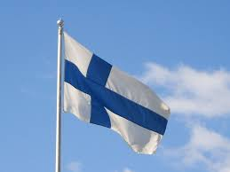
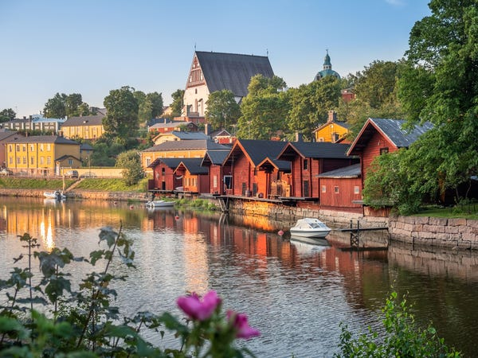
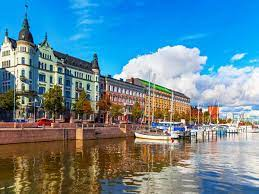
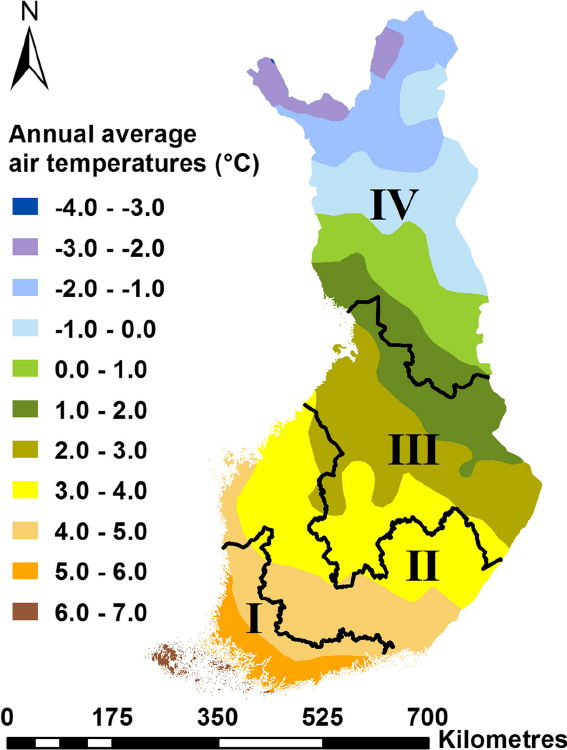

```{r setup, include=FALSE}
knitr::opts_chunk$set(echo = TRUE)
```


```{r, echo=FALSE,warning=FALSE,message=FALSE,comment=FALSE,results=FALSE}

library(devtools)
library(sta3262)
library(coronavirus)
library(tidyverse)
library(magrittr)

get_individual_project_country("AS2018514")

# convert negative cases to zero
coronavirus[coronavirus < 0] <- 0 
 
```

```{r,echo=FALSE}

finland_corona <- coronavirus %>% filter(country == "Finland")


# convert missing cases in finland_corona data frame to zero
finland_corona[is.na(finland_corona)] <-0
#view(finland_corona)
```


$$\\[0.1in]$$

# **1. Finland**

## **1.1 Introduction**

 Finland is a country located in Northern Europe bordering the Baltic Sea, Gulf of Bothnia, and the Gulf of Finland. Neighboring countries include Sweden, Russia, and Norway, with Estonia lying to its south across the Gulf of Finland. In 1809 Finland, previously under Swedish control, was ceded to Russia after they invaded. The Finns retain a great deal of autonomy, including their own legal system. In the year of 1995 Finland became a member of the European Union.

  Finland is well-known for being the Happiest Country in the World, in addition to having the world's best education system and cleanest air. Finland is known for its saunas, reindeers, Nokia, and the Santa Claus village. Also the country is sometimes called the land of a thousand lakes and has 187,888 of them.

* Capital City - Helsinki

* Head Of Government - Prime Minister: Sanna Marin

* Population - 5,540,000

* Currency - Euro (EUR)

* Languages
    * Finnish (official) 87.6%
    * Swedish (official) 5.2%
    * Russian 1.4%
    * other 5.8% 
    
* Religions
    * Lutheran 69.8%
    * Greek Orthodox 1.1%
    * other 1.7%
    * unspecified 27.4% 
    
    
{width=30%}
{width=30%}
{width=30%}


$$\\[0.1in]$$

The geographical location of Finland can be further understood through the following figure.

```{r,echo=FALSE,warning=FALSE,message=FALSE}
library(ggplot2)
library(maptools)
library(tibble)
library(ggrepel)
library(png)
library(grid)
library(sp)

data(wrld_simpl)

p <- ggplot() +
  geom_polygon(
    data = wrld_simpl,
    aes(x = long, y = lat, group = group), fill = "light green", colour = "black"
  ) +
  coord_cartesian(xlim = c(-200, 200), ylim = c(-110, 90)) +
  scale_x_continuous(breaks = seq(-150, 150, 50)) +
  scale_y_continuous(breaks = seq(-90, 90, 50))

p +
  geom_point( data = finland_corona, aes(x = long, y = lat), color = "red", size= 2 )+theme_bw()


```

```{r,echo=FALSE,message=FALSE,results=FALSE}
xlim=c(20,25)
ylim=c(58,70)

plot(wrld_simpl,xlim=xlim,ylim=ylim,col='olivedrab3',bg='lightblue')+points(27,65,pch = 15 )+text(27.5,65,labels="Finland",pos=1, offset=0.4)

```


## **1.2 Climate of Finland**

  Finland has a predominantly subarctic climate. The majority of the country has
a subarctic climate, with cool summers. The southern coast experiences a humid
continental climate, with slight summers. The country's area in the extreme
northern latitudes and proximity to major water bodies mainly influence the 
climate.
  
  Finland lies between the high latitudes of 60 and 70 degrees North,totally in the taiga
belt.The Arctic Circle passes via the Finnish region of Lapland.The landscape 
is mostly flat with few hills and mountains. Halti, between the border of 
Finland and Norway in the extreme north, with an altitude of 1324 meters, is
the highest point in Finland. The Finnish Lakeland area has thousands of lakes, 
while numerous islands dot the Archipelago Sea region in the southwest. 
Saimaa is the largest lake in Finland, with an area of 1700 square miles.
    
  The longest season in Finland is Winter and it lasts from October to mid May
in the extreme north. Polar nights last for fifty one days north of the
Arctic Circle when the sun doesn't rise above the horizon. Lakes freeze
regularly, and even the seas once in a while solidify at the peak of the 
winter. Cold air loads from Russia push the temperatures under -20 Celsius.
The northern and eastern areas are the coldest, and temperatures plummet
to -50 Celsius in the northern Lapland. The Gulf Stream and the North 
Atlantic Drift currents prevent the winters from extreme cold. Westerly 
winds preserve the summers cloudy. The continental excessive-pressure system
over Eurasia brings cold winters and excessive summer season temperatures.
The Barents Sea is open for navigation even in the winter. Summers are warm 
and short anywhere besides at the southern coast. The sun doesn't set for 
seventy three days in the summer season in the extreme north. Temperatures 
are typically in the 20 Celsius to 30 Celsius in lots of the country. 
Nights in Lapland stay cold under 10 Celsius. Vegetation grows unexpectedly
in the short summer season. The snow melts by the end of April in the cold 
spring season, and the landscape is liable to floods. September is cold and
moist in the autumn.

  Finland gets moderate annual rainfall of 508mm (20") to 711.2mm (28"). The 
northern area registers 482.6mm (19") to 584.2mm (23"), even as the south 
records 584.2mm (23") to 711.2mm (28"). The rainfall takes place throughout 
the year, with a peak during August in the summer. Half of the yearly 
precipitation in the north falls as snow. Lapland gets its first snowfall by 
September end and the southwestern corner the latest by Christmas. Permanent
snow cover of 609.6mm (24") to 914.4mm (36") in the north and 203.2mm (8") to 
304.8mm (12") in the south happens in March. The annual sunshine in Finland is
vulnerable and stages from 1550 hours in northern Lapland to 1800 hours in the
southwestern corner. The average seawater temperatures are between 0 Celsius 
to 13.9 Celsius in the Gulf of Bothnia and 1.1 Celsius  to 17.2 Celsius in 
the southwest. October to January is the windiest period. Finnish seas
register an average of nineteen stormy days in the year.

  The maximum recorded temperature in Finland is 37.2 Celsius, set on June 29, 2010,
in Liperi. The lowest temperature on record is -51.5 Celsius, set on January 28, 1999,
in Kittila, Lapland.Finland faces weather hazards, mainly in the form of snowstorms, floods,
and avalanches. Floods mostly occur during spring after the melting of the snow.The best time
to visit Finland is from June to mid-August in the summer.

This figure shows that, annual average air temperature measured in Celsius in Finland.

{width=50%}

$$\\[0.1in]$$

This figure shows that, seasons in Finland.

{width=50%}

$$\\[0.2in]$$ 


## **1.3 Lock-down status** 

  On March 16, 2020, the Finnish government and the Finnish President declared a
state of emergency for COVID19. In Finland, 272 laboratory-confirmed cases were
diagnosed by COVID-19 on March 16, 2020 at 2 p.m. THL director Markku Tervahauta
told MTV3 that the actual number of COVID-19 cases could be 20 to 30 times higher
than confirmed by tests. because the tests were limited to risk groups, critically
ill patients and health workers.

  On March 16, 2020, the government also announced that it had decided to take
the following measures by promulgating a decree implementing the Emergency 
Authority Act. The measures were supposed to apply until April 13th, after 
approval by the Finnish Parliament, but were later extended to May 13th:

  * All schools will be closed, not including early education.
  * Most government-run public facilities (theatres, libraries, museums etc.) 
will be shut down.
  * Critical personnel will be exempted from the Working Hours Act and Annual 
Holidays Act, both in the private and public sector.
  * At most 10 people can participate in a public meeting, and people over the
age of 70 should avoid human contact if possible.
  * Outsiders are forbidden from entering healthcare facilities and hospitals, 
excluding relatives of critically ill people and children
  * The capacity of social and healthcare will be increased in the private
and public sector, while less critical activity will be decreased.
  * Preparations for the shutdown of borders will start, and citizens or permanent
residents returning to Finland will be placed under a 2-week quarantine.
  

  In the end of March 2020, Parliament unanimously decided to temporarily close
the borders of the Uusimaa region, which has the most confirmed cases, in hopes
of containing the epidemic in the rest of the country. The restriction took effect
at midnight. It has 1.7 million inhabitants, almost a third of the total population
of Finland, and includes the capital Helsinki. Travel to and from Uusimaa was banned
for no good reason and several hundred police officers enforced the restriction
with the help of the Finnish armed forces.

  In April 2020, travel restrictions between the Uusimaa region and the rest of the
country were lifted. On May 4, the government approved a timetable to lift some
restrictions. Libraries are now open for loans. Kindergartens and elementary schools
should return to normal education and restrictions on other educational institutions
have been lifted. In addition, international work trips within the Schengen area and
the opening of outdoor sports facilities would be allowed, both with restrictions. On
June 1, the maximum number of people allowed to meet was increased to 50, eating in
restaurants and at sports competitions was allowed "with special agreements", and
closed public spaces were gradually opened. According to a government decision of June
11, travelers arriving from the Baltic countries and the other Nordic countries except
Sweden will no longer have to be quarantined for two weeks from June 15. Other
international travel restrictions remain in place.

  From July 1st, outdoor events with more than 500 people are allowed if the safety
distance between people can be maintained. On July 8, the government announced that
border controls for travel between Finland and several EU and Schengen countries with
low infection rates will also allow travel for professional and other necessary
reasons from 11 countries outside Europe from July 13. Due to increasing infection
rates in these countries, border controls for travelers from Austria, Slovenia and
Switzerland were restored on July 27th. At the same time, unlimited travel from 9
countries outside the EU was allowed.On August 3, a coronavirus testing facility
opened for passengers arriving at Helsinki Airport, and on the same day THL confirmed
that they would make a recommendation to wear masks in public places where a distance
of 1.5. can not be maintained at 2 meters. On August 4th, an app for tracking contacts
with infected people will be launched as a pilot version for employees in the city of
Helsinki and the Pirkanmaa hospital district. The app is expected to be available to
the public on August 31st. In August, the Finnish Institute for Health and Welfare
issued a recommendation to wear face masks in situations where social distancing is
not possible.The recommendation applies to all regions of Finland except North
Karelia, East Savonia and Central and South Ostrobothnia and does not apply to
children under the age of 15 or those who do not wear a mask for health reasons.


  On September 22, the government announced the reintroduction of quarantine
recommendations for people entering from Sweden and Estonia from September 28, as the
number of cases per capita in these countries had exceeded the limit. it is "entirely
possible". On September 22nd, THL announced that it would issue regional mask
recommendations for public spaces in parts of Finland where case numbers are
increasing. On September 24, Finland began using dogs to detect the corona virus.

  On October 1, THL announced that the number of corona virus cases detected in Finland
had exceeded 10,000. 344 new cases were reported on October 30, a new record in a
single day since the pandemic began. Finland received its first order. from Pfizer and
BioNTech's COVID19 vaccine on December 28th. The next day, the vaccinations began, and
the front line medical workers at the Helsinki University Hospital Intensive Care Unit
(HUS) were the first to receive the vaccination. 

  On December 28, Finland reported its first cases of a new SARSCoV2 variant from the
UK after a person traveling from Western Europe tested positive for COVID-19.On the
same day, a second variant from South Africa was reported in Finland after two people
tested positive for COVID-19.

  In February 2021, what was initially thought to be a unique variant of the
corona virus called Fin796H was found in Finland, which showed some previously
discovered mutations in the British and South African variants of the virus; However,
it later emerged that this variant had previously been discovered in Nigeria and Great
Britain, among others.

  
**Current Restrictions**

  * If you have symptoms, get tested for COVID-19 and then stay home.
  * Remember to keep a safe distance from others.
  * Wash your hands and cough into a tissue or your sleeve.
  * Wear a mask while you are in place with other people.
  * Keep the Koronavilkku app on and follow its instructions.
  * Get vaccinated when it's your turn.
  
  It is still necessary to comply with the restrictions and recommendations in order
to cope with the epidemic, the COVID-19 vaccine protects against the most severe form
of the disease as more and more people can be vaccinated, restrictions lifted and
society reopened.

  The extent of the current restrictions depends on the severity of the COVID-19
situation in the region. The competent authorities of each region decide on the
applicable recommendations and restrictions under the communicable disease
legislation.

$$\\[0.3in]$$ 

## **1.4 Actions taken by the government for Covid-19**

**General Information**

  Finnish Government has decided upon a total euro 15 billion general package to 
support corporations, ensure jobs and finance unemployment subsidies for laid-off
employees (20 March 2020, Government of Finland). On April 7, the Government 
announced that it contemplates redirecting additional euro 0.5 billion funds to support
corporations. The addition is directed to be distributed by the existing public 
finance providers (e.g. Finnvera, Business Finland, ELY etc.).
  
**Measures taken by the Government**

  * 2.6% reduction in private sector's pension contributions (applicable at earliest Jun 20 and valid until Dec 20)
  
  * Lay-off notice period reduced to five days including that even fixed terms employees may be laid-off
  
  * Employees on probation period may be released because of financial reasons (all laid off workers will immediately be entitled to unemployment subsidies)
  
  * Unemployment agencies will receive additional euro 20 million government aid
  
  * Self-employed will not be required to close businesses in order to be entitled to unemployment aid
  
  * Creditors' rights to pursue debtors into bankruptcy is narrowed. Currently,
  lack of liquidity is an accepted reason. By recent change in legislation this
  right is temporarily suspended. The possibilities to enter into debt restructuring procedures are loosened
  
  * Finnish legislation restricts maximum collection charges from consumers whilst
  similar restrictions do not apply to enterprises. According to recent legislation changes the same restrictions are set to apply for SME enterprises
  
  * Direct marketing of consumer credits is suspended 
 
  * Maximum APR% for consumer credits has dropped from 20% to 10%.
  
  * Consumers under official recovery proceedings are given reliefs but the new legislation is under work
  
  * The app for tracing coronavirus was released on 31 August and health authorities
  expected it to take one month to reach one million users, but that number was
  reached within 24 hours.


**Vaccination**

  Vaccination will be offered based on a medical risk assessment. In the initial phase, the vaccine will be offered to healthcare and social welfare workers caring for COVID-19 patients and to care home workers, elderly persons and persons at high risk for severe disease due to underlying health conditions.
  
  Finland is taking part in the European Union's joint vaccine procurement, which
guarantees access to COVID-19 vaccines from several manufacturers. The European 
Commission has negotiated agreements on 7 different COVID-19 vaccines.

  1. Comirnaty (Pfizer-BionTech)
  2. COVID-19 Vaccine SpikeVax (previously Moderna) 
  3. Vaxzevria (previously COVID-19 Vaccine AstraZeneca)
  4. COVID-19 Vaccine Janssen (Johnson & Johnson)
  5. BIBP/Sinopharm
  6. COVISHIELD
  7. CoronaVac
  
  * Total doses given - 7.49M
  * People fully vaccinated - 3.37M
  * Percentage of fully vaccinated - 61.1%


  The practical arrangements for vaccination must take into account the possibility 
  that a COVID-19 vaccine will not be available to everyone at once. According to an
  estimate by the Ministry of Social Affairs and Health, the first vaccines will 
  arrive in Finland at the beginning of 2021.


$$\\[0.3in]$$

# **2. Exploratory Data Analysis**

## **2.1 Summary**

This figure shows the summary of COVID-19 in Finland.

```{r,echo=FALSE,message=FALSE,comment=NA}

summary(finland_corona)

```

* This finland_corona data set is a data frame.

* The data set contains 1818 rows and seven variables.Rows include
COVID-19 data in Finland and the variables are date, province, country, lat,
long, type and cases.

* province, country and type are character variables and each variable has 1818 characters.

* According to the date variable, it has data from 2020-01-22 to 2021-09-18.

* According to the cases variable, it has values between 0 and 9000.The maximum value of
cases is 9000 and the minimum value of cases is 0. Also the mean value of cases is 100.9.


```{r,echo=FALSE,message=FALSE,results=FALSE}


confirmed_finland_corona <- finland_corona %>% filter(type=="confirmed")
death_finland_corona <- finland_corona %>% filter(type=="death")
recovered_finland_corona <- finland_corona %>% filter(type=="recovered")


#total of confirmed
sum(confirmed_finland_corona$cases)

#total of death
sum(death_finland_corona$cases)

#total of recovered
sum(recovered_finland_corona$cases)

#total of active cases
active_finland_cases <- sum(confirmed_finland_corona$cases)-(sum(recovered_finland_corona$cases)+sum(death_finland_corona$cases))
active_finland_cases


#death rate in Finland
death_rate <- (sum(death_finland_corona$cases)/sum(confirmed_finland_corona$cases))*100 
death_rate

```


```{r,echo=FALSE,message=FALSE,results=FALSE}

# seperate all cases by year
# get year

confirmed_finland_corona$year <-as.numeric(format(confirmed_finland_corona$date,'%Y'))

recovered_finland_corona$year <-as.numeric(format(recovered_finland_corona$date,'%Y'))

death_finland_corona$year <-as.numeric(format(death_finland_corona$date,'%Y'))


#obtain confirmed cases in 2020 
confirmed_finland_2020 <-subset(confirmed_finland_corona,subset =confirmed_finland_corona$year==2020)

#maximum of confirmed cases in 2020
max(confirmed_finland_2020$cases)

#date of highest confirmed cases in 2020
highest_con_2020 <- confirmed_finland_2020$date [which.max(confirmed_finland_2020$cases)]
highest_con_2020


#obtain confirmed cases in 2021 
confirmed_finland_2021 <-subset(confirmed_finland_corona,subset =confirmed_finland_corona$year==2021)

#maximum of confirmed cases in 2021
max(confirmed_finland_2021$cases)

#date of highest confirmed cases in 2021
highest_con_2021 <- confirmed_finland_2021$date [which.max(confirmed_finland_2021$cases)]
highest_con_2021


#obtain death cases in 2020 
death_finland_2020 <-subset(death_finland_corona,subset =death_finland_corona$year==2020)

#maximum of death cases in 2020
max(death_finland_2020$cases)

#date of highest death cases in 2020
highest_dea_2020 <- death_finland_2020$date [which.max(death_finland_2020$cases)]
highest_dea_2020


#obtain death cases in 2021 
death_finland_2021 <-subset(death_finland_corona,subset =death_finland_corona$year==2021)

#maximum of death cases in 2021
max(death_finland_2021$cases)

#date of highest death cases in 2021
highest_dea_2021 <- death_finland_2021$date [which.max(death_finland_2021$cases)]
highest_dea_2021


#obtain recovered cases in 2020
recovered_finland_2020 <-subset(recovered_finland_corona,subset =recovered_finland_corona$year==2020)

#obtain recovered cases in 2021
recovered_finland_2021 <-subset(recovered_finland_corona,subset =recovered_finland_corona$year==2021)


```


$$\\[0.1in]$$ 

### **2.1.1 Summary of confirmed cases in Finland**

This figure shows the summary of confirmed cases of COVID-19 in Finland.

```{r,echo=FALSE,message=FALSE,comment=NA}
#In the mid part of r markdown ,the  year is added to the confirmed_finland_corona

summary(confirmed_finland_corona)

```

* This confirmed_finland_corona dataset is a data frame.

* The data set contains 606 rows and eight variables.Rows include COVID-19 confirmed cases
data in Finland and the variables are date, province, country, lat, long, type, cases and year.

* province, country and type are character variables and each variable has 606 characters.

* According to the date variable ,it has data from 2020-01-22 to 2021-09-18.

* According to the cases variable, it has values between 0 and 1322. The maximum value of confirmed cases is 1322 and the minimum value of confirmed cases is 0.0. Also the mean value of confirmed cases is 224.8 and median value of cases is 149.0.


$$\\[0.1in]$$ 

### **2.1.2 Summary of recovered cases in Finland**

This figure shows the summary of recovered cases of COVID-19 in Finland.

```{r,echo=FALSE,message=FALSE,comment=NA}

#In the mid part of r markdown ,the  year is added to the recovered_finland_corona

summary(recovered_finland_corona)

```

* This recovered_corona data set is a data frame.

* The data set contains 606 rows and eight variables.Rows include COVID-19 recovered cases data in Finland and the variables are date, province, country, lat, long, type, cases and year.

* province, country and type are character variables and each variable has 606 characters.

* According to the date variable ,it has data from 2020-01-22 to 2021-09-18.
* According to the cases variable, it has values between 0 and 9000. The maximum value of recovered cases is 9000 and the minimum value of recovered cases is 0. Also the mean value of recovered cases is 76.24.

$$\\[0.1in]$$ 

### **2.1.3 Summary of death cases in Finland**

This figure shows the summary of death cases of COVID-19 in Finland.

```{r,echo=FALSE,message=FALSE,comment=NA}

# In the mid part of r markdown ,the  year is added to the death_finland_corona
summary(death_finland_corona)

```

* This death_corona data set is a data frame.

* The data set contains 606 rows and eight variables.Rows include COVID-19 death cases data in Finland and the variables are date, province, country, lat, long, type, cases and year.

* province, country and type are character variables and each variable has 606 characters.

* According to the date variable ,it has data from 2020-01-22 to 2021-09-18.

* According to the cases variable, it has values between 0 and 43. The maximum value of death cases is 43 and the minimum value of death cases is 0. Also the mean value of death cases is 1.762.


$$\\[0.1in]$$ 

### **2.1.4 Summary of Covid-19 in Finland**

This table shows the total number of confirmed, recovered, death and active Cases from 2020-January-22 to 2021-September-18 in Finland.


Type                       Total 
----                    -----------
Confirmed Cases           136214
Recovered Cases           46200
Death Cases               1068
Active Cases              88946 


* Death rate in Finland : 0.7840604% (7.84 deaths per thousand inhabitants in Finland)

* During the year 2020 (From 2020-01-22 to 2020-12-31), the highest number of confirmed cases in Finland
was registered as 840 on December 10 and the highest number of death cases in Finland was registered as
43 on April 21.

* During the year 2021 (from 2021-01-01 to 2021-09-18), the highest number of confirmed cases in Finland
was registered as 1322 on August 08 and the highest number of death cases in Finland was registered as
18 on March 31.


$$\\[0.3in]$$ 

## **2.2 Visualizations**


### **2.2.1 Visualization of changes in Covid-19 confirmed, recovered, death cases in Finland**


```{r,echo=FALSE, warning=FALSE, message=FALSE}


library(gganimate)
library(magick)

ggplot(confirmed_finland_corona,aes(x=date,y=cases)) + geom_path(size=1) + labs(title = "Confirmed cases in Finland")

```

According to the above figure, confirmed cases started at the end of January and it
increased by the mid of May and started decreasing after that. Then again the number of
confirmed cases started to increase at the end of september. Highest number of confirmed
cases during the year 2020 was registered on 10th of December. Confirmed cases started
decreasing from the mid of April and it decreased to a minimal number of cases by the end
of June. Then confirmed cases suddenly started to increase in large numbers during the
month of July. The largest number of confirmed cases in 2021 was reported on 8th of August.


```{r,echo=FALSE, warning=FALSE, message=FALSE}

ggplot(death_finland_corona,aes(x=date,y=cases)) + geom_path(size=1) + labs(title = "Death cases in Finland")
```

According to the above figure, death cases started at the end of March and it increased by
the mid of April. Then the number of death cases started decreasing. It increased again by
the end of the year 2020. The highest number of death cases was reported on 21st of April
2020.


```{r,echo=FALSE, warning=FALSE, message=FALSE}

ggplot(recovered_finland_corona,aes(x=date,y=cases)) + geom_path(size=1) + labs(title = "Recovered cases in Finland")

```

According to the above figure, the first recovered case registered in February 2020. The
highest number of recovered cases was reported on 11th February.

The below plot shows the changes in Covid-19 confirmed, death and recovered cases over time(date).

```{r,echo=FALSE, warning=FALSE, message=FALSE}
plot <- ggplot(finland_corona,aes(x=date,y=cases,col=type))+
  geom_line() + geom_point(size=2) + transition_reveal(date) +labs(title = "Confirmed, Death and Recovered cases in Finland")


plot <- plot + theme(panel.grid.major = element_blank(), panel.grid.minor = element_blank())


animated_plot <- animate(plot, nframes=70, renderer=magick_renderer())
animated_plot


```

The following figure shows the box plot of Covid-19 confirmed, recovered and death cases in Finland.

```{r,echo=FALSE}

ggplot(finland_corona,aes(x=cases, y=type, fill=type))+geom_boxplot()+scale_fill_brewer(palette="PuBu")+theme_light()+labs(title = " Boxplot of Confirmed, Recovered and Death Cases In Finland" )

```

Finland has a small amount of death cases compared to confirmed cases.

$$\\[0.1in]$$ 

### **2.2.2  Cumulative Sums of Confirmed, Death, Recovered Cases in Finland**

```{r,echo=FALSE}

cum_finland_corona <- finland_corona %>% group_by(type) %>% mutate(cum_cases =cumsum(cases))

ggplot(cum_finland_corona,aes(x=date,y=cum_cases,color=type))+geom_path(size=1)+ labs(title="Cumulative sums graph of confirmed,death,recovered cases in Finland",x="Date",y="Cumulative Cases")

```

The above graph displays the behaviour of Total number of Confirmed cases, Death cases and Recovered cases in Finland.


$$\\[0.1in]$$ 


### **2.2.3 Relationship Between Confirmed and Recovered Cases in Finland** 

The scatter plot below illustrates the relationship between Covid-19 confirmed cases and recovered cases in Finland.

```{r,echo=FALSE,message=FALSE}

qplot(x=confirmed_finland_corona$cases, y=recovered_finland_corona$cases,geom=c("point","smooth"),main="Relationship between confirmed cases and recovered cases in Finland")+ ylab("recovered cases")+ xlab("confirmed cases")


```

```{r,echo=FALSE,message=FALSE,results=FALSE}

#Pearson's correlation coefficient

cor(confirmed_finland_corona$cases,recovered_finland_corona$cases,method = "pearson")

```
Pearson's correlation coefficient = 0.081047~ 0.1

Correlation coefficient is close to 0.1.Therefore, there is a very weak positive association between the Covid-19 confirmed cases and recovered cases in Finland.

$$\\[0.1in]$$

### **2.2.4 Relationship Between Confirmed and Death Cases in Finland** 

The scatter plot below illustrates the relationship between Covid-19 confirmed cases and death cases in Finland.

```{r,echo=FALSE,message=FALSE}

qplot(x=confirmed_finland_corona$cases, y=death_finland_corona$cases,geom=c("point","smooth"),main="Relationship between confirmed cases and death cases in Finland")+ ylab("death cases")+ xlab("confirmed cases")


```


```{r,echo=FALSE,message=FALSE,results=FALSE}

#Pearson's correlation coefficient

cor(confirmed_finland_corona$cases,death_finland_corona$cases,method = "pearson")

```

Pearson's correlation coefficient = 0.1646088 ~ 0.2

Correlation coefficient is close to 0.2.Therefore, there is a very weak positive association between the Covid-19 confirmed cases and death cases in Finland.


$$\\[0.1in]$$ 

### **2.2.5 Confirmed,Death & Recovered Cases VS Year in Finland** 

This bar chart below illustrates the yearly confirmed, death and recovered cases in Finland.

```{r,echo=FALSE,message=FALSE,warning=FALSE}
year <-as.numeric(format(finland_corona$date,'%Y'))
#view(finland_corona)

finland_corona1 <- cbind(finland_corona,year)
#view(finland_corona1)


ggplot(finland_corona1, aes(fill=type, y=cases, x=as.character(year))) + 
    geom_bar(position="stack", stat="identity")+labs(title=" Confirmed,Death & Recovered Cases VS Year in Finland")+xlab("year")+scale_fill_manual(values=c("red", "black", "yellow"))


```

Number of confirmed cases in 2021 is higher than number of confirmed cases in 2020. 
Also the number of recovered cases in 2021 is lower than number of recovered cases in 2020.

$$\\[0.3in]$$ 


### **2.2.6 Monthly Confirmed Cases In 2020**

The following bar graph shows the number of monthly confirmed cases in Finland from 2020-January-22 to 2020-December-31.

```{r,echo=FALSE,message=FALSE}
month <- months(as.Date(confirmed_finland_2020$date))

month1 <- factor(month, levels = month.name)

confirmed_finland_2020new <- cbind(confirmed_finland_2020,month)


ggplot(confirmed_finland_2020new, aes(fill=month,month,cases)) + geom_bar( stat="identity")+labs(title=" Monthly Confirmed Cases In 2020  ",fill="Month")+xlab("Month")+scale_x_discrete(limits = month.name)+theme_minimal()+scale_fill_brewer(palette="Paired")+coord_flip()


```
 
 December has the highest number of confirmed cases and it is more than 9000.
 Lowest number of confirmed cases was registered in the month of January.


$$\\[0.3in]$$ 


### **2.2.7 Monthly Confirmed Cases In 2021**

The following bar graph shows the number of monthly confirmed cases in Finland 
from January 01 to September 18 in the year 2021.


```{r,echo=FALSE,message=FALSE}
month21 <- months(as.Date(confirmed_finland_2021$date))

month21new <- factor(month21, levels = month.name)

confirmed_finland_2021new <- cbind(confirmed_finland_2021,month21)


ggplot(confirmed_finland_2021new, aes(fill=month21,month21,cases)) + geom_bar( stat="identity")+labs(title=" Monthly Confirmed Cases in 2021 ",fill="Month")+xlab("Month")+scale_x_discrete(limits = month.name)+theme_minimal()+scale_fill_brewer(palette="Paired")+coord_flip()

```

In the months of August and March, the confirmed cases were registered in large numbers in the year 2021.
The lowest number of confirmed cases was reported in June.The highest number of confirmed cases was reported in
August.


$$\\[0.3in]$$ 


### **2.2.8 Monthly Death Cases In 2020**

The following bar graph shows the number of monthly death cases in Finland from January 22 to December 31 in the year 2020.

```{r,echo=FALSE,message=FALSE}
month_d <- months(as.Date(death_finland_2020$date))

month_d_new <- factor(month_d, levels = month.name)

death_finland_2020new <- cbind(death_finland_2020,month_d)


ggplot(death_finland_2020new, aes(fill=month_d,month_d,cases)) + geom_bar( stat="identity")+labs(title=" Monthly Death Cases In 2020  ",fill="Month")+xlab("Month")+scale_x_discrete(limits = month.name)+theme_minimal()+scale_fill_brewer(palette="Set3")+coord_flip()

```

The first death case was registered in March 2020. The highest death cases were reported in the month of April and it is nearly 200. The lowest number of death cases after reporting the first death case was registered in July.


$$\\[0.1in]$$

### **2.2.9 Monthly Death Cases In 2021**

The following bar graph shows the number of monthly death cases in Finland from January 01 to September 18 in the year 2021.


```{r,echo=FALSE,message=FALSE}
month21_d <- months(as.Date(death_finland_2021$date))

month21new_d <- factor(month21_d, levels = month.name)

death_finland_2021new <- cbind(death_finland_2021,month21_d)


ggplot(death_finland_2021new, aes(fill=month21_d,month21_d,cases)) + geom_bar( stat="identity")+labs(title=" Monthly Death Cases in 2021 ",fill="Month")+xlab("Month")+scale_x_discrete(limits = month.name)+theme_minimal()+scale_fill_brewer(palette="Set3")+coord_flip()

```

The largest number of death cases in the year 2021 was registered at the beginning of the year and it is more than 100 deaths. The lowest number of cases was registered in the month of June and it is less than 15.


$$\\[0.1in]$$

### **2.2.10 Monthly Recovered Cases In 2020**

The following bar graph shows the number of monthly recovered cases in Finland from January 22 to December 31 in the year 2020.


```{r,echo=FALSE,message=FALSE}
month_r <- months(as.Date(recovered_finland_2020$date))

month_r_new <- factor(month_r, levels = month.name)

recovered_finland_2020new <- cbind(recovered_finland_2020,month_r)


ggplot(recovered_finland_2020new, aes(fill=month_r,month_r,cases)) + geom_bar( stat="identity")+labs(title=" Monthly Recovered Cases In 2020  ",fill="Month")+xlab("Month")+scale_x_discrete(limits = month.name)+theme_minimal()+scale_fill_brewer(palette="Set3")+coord_flip()

```


The first recovered case was reported in February 2020 and the lowest number of recovered cases reported after the first recovered case was in the month of February as well. The highest number of recovered cases was reported at the end of year 2020 and it was nearly 12500.


$$\\[0.1in]$$

## **2.3 Comparison with other countries**


### **2.3.1 Neighbouring countries to compare with Finland.**

```{r,echo=FALSE,comment= FALSE,message=FALSE}

nearcountries <- subset.data.frame(coronavirus, ( 45< lat & lat < 80) & (20 < long & long < 30) )

#convert missing values to zero.
nearcountries[is.na(nearcountries)] <-0

p2 <- ggplot() +
  geom_polygon(
    data = wrld_simpl,
    aes(x = long, y = lat, group = group,), fill = "light blue ", colour = "white"
  ) +
  coord_cartesian(xlim = c(0, 50), ylim = c(40, 70)) +
  scale_x_continuous(breaks = seq(0, 50,10)) +
  scale_y_continuous(breaks = seq(40,70,5))+labs(title = "Neighbouring Countries to Finland")

p2 +geom_point(data = nearcountries , aes(x = long, y = lat), color = "red", size = 2 )  + 
  geom_text(aes(x=nearcountries$long,y=nearcountries$lat,label=nearcountries$country))


```

$$\\[0.1in]$$ 

### **2.3.2 Visualizations of Finland VS Neighbouring Countries**

#### **2.3.2.1 Daily Confirmed, Recovered and Death Cases in the Countries**

```{r,echo=FALSE,message=FALSE,warning=FALSE}
confirmed_near_countries <-filter(nearcountries,type == "confirmed")
recovered_near_countries <-filter(nearcountries,type == "recovered")
death_near_countries <-filter(nearcountries,type == "death")


#confirmed cases
p3 <-ggplot(confirmed_near_countries,aes(x=date,y=cases,col=country))+
  geom_line() + geom_point(size=2) + transition_reveal(date) +labs(title = "Daily Confirmed cases in the countries")

p3 <- p3 + theme(panel.grid.major = element_blank(), panel.grid.minor = element_blank())

animated_p3 <- animate(p3, nframes=70, renderer=magick_renderer())
animated_p3
```

The above figure displays the behaviour of confirmed cases in neighbouring countries around Finland during the period of January 2020 to September 2021.


```{r,echo=FALSE,message=FALSE,warning=FALSE}
#recovered cases 
p4 <-ggplot(recovered_near_countries,aes(x=date,y=cases,col=country))+
  geom_line() + geom_point(size=2) + transition_reveal(date) +labs(title = "Daily Recovered cases in the countries")

p4 <- p4 + theme(panel.grid.major = element_blank(), panel.grid.minor = element_blank())

animated_p4 <- animate(p4, nframes=70, renderer=magick_renderer())
animated_p4

```

The above figure displays the behaviour of recovered cases in neighbouring countries around Finland during the period of January 2020 to September 2021.

```{r,echo=FALSE,message=FALSE,warning=FALSE}
#death cases
p5 <-ggplot(death_near_countries,aes(x=date,y=cases,col=country))+
  geom_line() + geom_point(size=2) + transition_reveal(date) +labs(title = "Daily Death cases in the countries")

p5 <- p5 + theme(panel.grid.major = element_blank(), panel.grid.minor = element_blank())

animated_p5 <- animate(p5, nframes=70, renderer=magick_renderer())
animated_p5


```

The above figure displays the behaviour of death cases in neighbouring countries around Finland during the period of January 2020 to September 2021.

$$\\[0.1in]$$

#### **2.3.2.2 Bar Chart of Confirmed Cases in the Countries**

```{r,echo=FALSE,message=FALSE}

pc <- ggplot(confirmed_near_countries,aes(x=country,y=cases,fill= country))+
  geom_bar(stat = "identity" )+theme_bw()+labs(title="Confirmed cases of the Countries")+scale_fill_brewer(palette = "YlOrRd")

pc

```

According to the above figure, Romania has the highest number of confirmed cases
around the neighbourhood of Finland. The second largest number of confirmed cases
were reported from Belarus. Compared to other countries Finland has the least
number of confirmed cases.

$$\\[0.1in]$$

#### **2.3.2.3 Bar Chart of Death Cases in the Countries**

```{r,echo=FALSE,message=FALSE,warning=FALSE}
p6 <- ggplot(death_near_countries,aes(x=country,y=cases,fill= country))+
  geom_bar(stat='identity') +theme_light()+labs(title="Death cases of the Countries")+ scale_fill_brewer(palette="Accent")

p6
```

According to the above figure, Romania has the highest number of death cases
around the neighbourhood of Finland. The second largest number of death cases
were reported from Moldova. Compared to other countries Finland has the least
number of death cases.

$$\\[0.1in]$$ 

#### **2.3.2.4 Bar Chart of Recovered Cases in the Countries**

```{r,echo=FALSE,message=FALSE}
pr <- ggplot(recovered_near_countries,aes(x=country,y=cases,fill= country))+
  geom_bar(stat='identity') +theme_bw()+labs(title="Recovered cases of the Countries")+ scale_fill_brewer(palette = "PuRd" )

pr

```

According to the above figure, Romania has the highest number of recovered cases
around the neighbourhood of Finland. The second largest number of recovered cases
were reported from Belarus. Compared to other countries Finland has the least
number of recovered cases.

$$\\[0.1in]$$

#### **2.3.2.5 Stacked Bar Chart of Confirmed, Recovered and Death Cases Comparison**

```{r,echo=FALSE,message=FALSE}
ggplot(nearcountries, aes(fill=type, y=cases, x=country)) + 
    geom_bar(position="stack", stat="identity") +scale_fill_manual(values = c("Green","Purple","Yellow"))+labs(title="Visualization of Confimed, Death and Recovered Cases In The Countries")+theme_bw()

```

The above figure displays the comparison of confirmed, recovered and death cases
with the neighbouring countries. Romania has the largest number of covid-19 cases
meanwhile Finland remains as the country with the least number of covid-19 cases
occurred. Belarus has the second highest cases among the countries.


$$\\[0.5in]$$ 

# **3. Conclusions & Discussion**

## **3.1 Discussion**

The dataset is loaded by the coronavirus package in R.This data was available for the period from 22th January 2020 to
09th September 2021 only. The Finland dataset is obtained by
using the given package. The dataset had some negative values for cases and those were assumed as zero.
The finland dataset had some missing values for recovered cases and most of recovered cases were zero
then those missing values were assumed as zero.As you can see in the above figures,The first covid
confirmed case was reported in the month of January 2020. The number of confirmed cases registered as the
highest in the month of August 2021. The first patient to recover was in the month of February 2020 and
a year later in the same month recovered cases registered at the highest level.The first death from
covid-19 was reported in March 2020. The highest number of deaths were reported in the month of April
and it is nearly 200. Then it became lower by July 2020. During the year 2020 (From 2020-01-22 to
2020-12-31), the highest number of confirmed cases in Finland was registered as 840 on December 10 and the
highest number of death cases in Finland was registered as 43 on April 21.During the year 2021 (from
2021-01-01 to 2021-09-18), the highest number of confirmed cases in Finland was registered as 1322 on August
08 and the highest number of death cases in Finland was registered as 18 on March 31. If you take a look at
the comparison between Finland and its neighbouring countries, Romania has the highest number of confirmed
cases, death cases and recovered cases around the neighbourhood of Finland. The second largest number of
confirmed cases and recovered cases were reported from Belarus and the second largest number of death cases
were reported from Moldova. Compared to other countries Finland has the least number of covid-19 cases. All
the data sets and figures are described clearly one by one above.

$$\\[0.1in]$$

## **3.2 Conclusions**

Coronavirus alias Covid-19 was identified in December 2019 in Wuhan, Hubei, China but it spreaded
speedily in January to March. However, it was directly affected by the other countries. At that time,
most countries in the Asian region had a high risk but all the countries did not expect serious
situations like this. China is the country which has the largest population and they have strong health
facilities and modern technologies. After the virus entered the population they took action to prevent
it. All the other countries took immediate action to prevent entering this virus into their country.
Somehow the virus entered almost all the countries.

At first, the United States of America had several confirmed cases in early February in 2020. Italy had
reported a large number of confirmed cases day by day in March 2020. Their death rate was much higher
than other countries at that time. Then in early April, confirmed cases were increased in the USA. After
Italy was victimized, most other countries in Europe were also at risk.

Finland became a victim of the virus at the end of January and it happened to increase confirmed cases
by April and May. The Finnish government took some actions on this situation in March but at that time
the virus had spread to the society but not as large as the US or Italy. Finnish government applied
travel restrictions and a remote working environment was introduced. Finland controlled the pandemic
situation well in their country in July 2020 but in the month of August the confirmed cases started to
increase again. Finnish people kept the rules which were applied by the government in order to prevent
Covid-19. An app to track covid-19 cases was released by the government and it took a bare time to reach
millions of users. Vaccination was started in the month of December 2020 and the health authorities have
done a brilliant job to vaccinate the finnish people as quickly as possible. Belarus, Estonia, Latvia, 
Lithuania, Moldova and Romania are the neighbouring countries of the Finland.Compared to the
neighbouring countries, Finland has done a great job to prevent covid-19 as they remain as the least
number of cases reported around the neighbourhood. As the current situation in Finland, the finnish
government is proposing to lift the restrictions because the pandemic is now in a controlled state.


$$\\[0.5in]$$ 

# **4. References**

* [Assignment Help File](https://hellor.netlify.app/slides/coronavirus_assignment_help_file)

* [Finland](https://en.wikipedia.org/wiki/Finland)

* [A Quick Introduction to Finland](http://www.alternativefinland.com/a-quick-introduction-to-finland/)

* [Finland:Introduction](https://globaledge.msu.edu/countries/finland)

* [Climate of Finland](https://en.wikipedia.org/wiki/Climate_of_Finland)

* [Finland - Monthly Weather Forecast and Climate](https://www.weather-atlas.com/en/finland-climate)

* [THL recommendation on vaccine series accepted in Finland](https://thl.fi/en/web/infectious-diseases-and-vaccinations/what-s-new/coronavirus-covid-19-latest-updates/travel-and-the-coronavirus-pandemic/which-vaccines-are-accepted-at-the-points-of-entry-into-the-country-)

* [Decisions by the Government](https://valtioneuvosto.fi/en/information-on-coronavirus/decisions-by-the-government) 

* [Governance-Finland](https://www.covid19healthsystem.org/countries/finland/livinghit.aspx?Section=5.%20Governance&Type=Chapter)

* [Finland - Government and Institution Measures in Response to COVID-19](https://home.kpmg/xx/en/home/insights/2020/04/finland-government-and-institution-measures-in-response-to-covid.html)

* [COVID-19 Information](https://fi.usembassy.gov/covid-19-information/)

* [COVID-19 pandemic in Finland](https://en.wikipedia.org/wiki/COVID-19_pandemic_in_Finland)

* [Information and advice on the coronavirus](https://valtioneuvosto.fi/en/information-on-coronavirus)

* [R Markdown Cookbook](https://bookdown.org/yihui/rmarkdown-cookbook/)

* [Dynamic display of data with animated plots](https://thenode.biologists.com/dynamic-display-of-data-with-animated-plots/research/)

* [Learn R By Example](https://www.learnbyexample.org/r/)

* [How can I order the months chronologically in ggplot2 short of writing the months out?](https://stackoverflow.com/questions/36020146/how-can-i-order-the-months-chronologically-in-ggplot2-short-of-writing-the-month)


