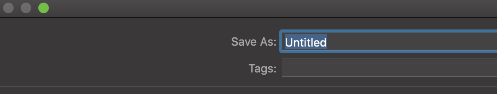
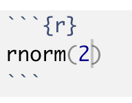

```{r xaringan-themer, include=FALSE, warning=FALSE}
library(xaringanthemer)
style_mono_accent(
  base_color = "#1c5253",
  header_font_google = google_font("Josefin Sans"),
  text_font_google   = google_font("Montserrat", "400", "300i"),
  code_font_google   = google_font("Fira Mono")
)
```

class: middle center bg-main1

# Packages 

## `install.packages("rmarkdown")`

## `install.packages("knitr")`


--

```{r, echo=FALSE}
anicon::faa("bell", animate="ring", size=5)
```

## Additional packages

## `install.packages("tidyverse")`


---
background-image:url("screenshots/1img.png")
background-size: contain

---
background-image:url("screenshots/2img.png")
background-size: contain

---
background-image:url("screenshots/3img.png")
background-size: contain

---
background-image:url("screenshots/4img.png")
background-size: contain
---
background-image:url("screenshots/5img.png")
background-size: contain
---
background-image:url("screenshots/6img.png")
background-size: contain
---
background-image:url("screenshots/7img.png")
background-size: contain
---
background-image:url("screenshots/8img.png")
background-size: contain
---
background-image:url("screenshots/9img.png")
background-size: contain

---
background-image:url("screenshots/10img.png")
background-size: contain

---
background-image:url("screenshots/11img.png")
background-size: contain

---
background-image:url("screenshots/12img.png")
background-size: contain

---
background-image:url("screenshots/13img.png")
background-size: contain

---
background-image:url("screenshots/14img.png")
background-size: contain

---
background-image:url("screenshots/15img.png")
background-size: contain

---
background-image:url("screenshots/16img.png")
background-size: contain

---
background-image:url("screenshots/17img.png")
background-size: contain

---
class: middle center bg-main1

```{r, echo=FALSE}
anicon::faa("wrench", size=5)
```

# Creating an R Markdown document

---

background-image: url(rmarkdown_step1.png)
background-position: center
background-size: contain


---
background-image: url(rmarkdown_step2.png)
background-position: center
background-size: contain

---

background-image: url(rmarkdown_step2_1.png)
background-position: center
background-size: contain
---

background-image: url(rmarkdown_step3.png)
background-position: center
background-size: contain

class: center, middle


---

background-image: url(rmarkdown_step4.png)
background-position: center
background-size: contain

class: center, middle

---

# Select a folder to save the document 


---

# Give a name to the document


---

background-image: url(rmarkdown_step5.png)
background-position: center
background-size: contain

class: center, middle

---

background-image: url(rmarkdown_step6.png)
background-position: center
background-size: contain

class: center, middle

---

background-image: url(rmarkdown_step7.png)
background-position: center
background-size: contain

class: center, middle

---

## Introduction to R Markdown

- R Markdown is a file format for making dynamic documents with R.

- R Markdown allows you to organize your code, outputs, content and commentary in one place.

- These documents are self-contained and fully reproducible which makes it very easy to share.

- R Markdown document is written in markdown.

- Markdown is one of the world's most popular markup language.
    - R Markdown (in R)
    - Jupyter Notebooks (in Python)
    

---

# Advantages

1. For .bold[.green[communicating]] to .bold[.red[decision makers]], who want to focus on the results and conclusions, not the code behind the analysis.

1. For .bold[.green[collaborating]] with other .bold[.red[data scientists]], who are interested in both your conclusions, and how you reached them (i.e. the codes that you used to take the outputs).

1. As an environment in which to do data science, as a modern day lab notebook where you can capture not only .bold[.blue[what you did]], but also .bold[.blue[what you were thinking]].


*From R for Data Science by Hadley Wickham and Grrett Grolemud.*

---

# Change header

.pull-left[

**Code**

```r

# Header 1

## Header 2

### Header 3

```

]

.pull-right[

**Output**


# Header 1

## Header 2

### Header 3


]


---

class: inverse, center, middle

# Add content

---
.pull-left[

**Code**

```r

# Header 1

This is section 1.

## Header 2

This is section 1.2

### Header 3

This is section 1.2.1

```

]

.pull-right[

**Output**


# Header 1

This is section 1.

## Header 2

This is section 1.2

### Header 3

This is section 1.2.1


]

---
class: inverse, center, middle

# Add R codes


---

.pull-left[

**Code**



]

.pull-right[

**Output**


```{r}
rnorm(2)
```

]


---
class: inverse, center, middle

# Chunk options

---

* `eval = FALSE` - prevents the code from being evaluated

* `include = FALSE` - runs the code but doesn't show it in the final document

* `echo = FALSE` - prevents the code but not the results from appearing

* `message = FALSE` - prevents messages from appearing in the finished file

* `results = "hide"` - hides the printed output

* `error = TRUE` - causes the render to continue even if the code returns an error
---

## Text formatting

.pull-left[

## Code


]

.pull-right[

## Output

*M1: This text is in italics.*

_M2: This is also italics._

**M3: This text is in bold.**

__M4: This is also bold.__


~~This text is strikethrough.~~

]

---
class: inverse, center, middle

# Mathematical Equations

---

**The code:**


**Output:**

The general formula for the probability density function of the normal distribution with mean $\mu$ and variance $\sigma$ is given by

$$
f_X(x) = \frac{1}{\sigma\sqrt{(2\pi)}} e^{-(x-\mu)^2/2\sigma^2}.
$$

---

## How to type Greek letters?

Please read my blog post here: 

https://thiyanga.netlify.app/post/greekletters/

---

### Generate PDF and WORD documents

.pull-left[

**Create a PDF document**


Requires (MiKTex on Windows, MacTex 2013+ on OS X, Tex Live 2013+ on Linux) OR

Install tinytex in R. Type the following code on R Console.
```r
tinytex::install_tinytex()
```
]


.pull-right[

**Create a Word document**


Requires an installation of MS Word.

]

---

# R Markdown Demonstration

> Download [Rmarkdown_practical_lesson1.Rmd](/rscripts/rmarkdown_labwork/Rmarkdown_practical_lesson1.Rmd)

> Download [sampleimage.jpg](/rscripts/rmarkdown_labwork/sampleimage.jpg)

> Before running the file `Rmarkdown_practical_lesson_2021.Rmd`, save `Rmarkdown_practical_lesson_2021.Rmd` and `sampleimage.jpg` into your current working directory. 

> Follow the video lecture for instructions. 


---
class: center, middle


Slides available at: hellor.netlify.app

All rights reserved by [Thiyanga S. Talagala](https://thiyanga.netlify.com/)

---

class: middle center bg-main1

```{r, echo=FALSE}
anicon::faa("align-center", animate="pulse", size=5)
```

# To learn more follow the link here: [https://talks-thiyanga.netlify.app/rmarkdown_rladies/rmarkdownrladies_tst#1](https://talks-thiyanga.netlify.app/rmarkdown_rladies/rmarkdownrladies_tst#1)

