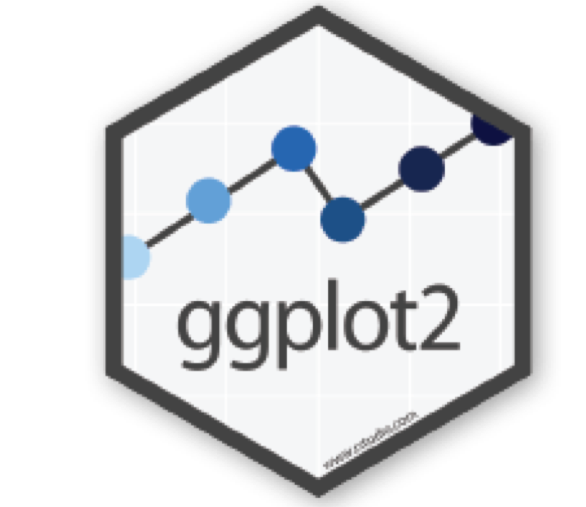

```{r setup, include=FALSE}
options(htmltools.dir.version = FALSE)
library(emo)
```


# packages


```{r, comment=NA, message=FALSE, warning=FALSE}
library(tidyverse) # To obtain ggplot2
library(magrittr)
```

 

---

# Dataset

```{r, comment=NA, message=FALSE}
library(gapminder)
glimpse(gapminder)
```

---

# Plotting with R

## Base R

- using `plot()` function

## Using ggplot2: grammar of graphics

1.  ggplot2 package: `qplot()` function

    - **q**plot: **quick** plot
    
    - very similar to how you graph with `plot()` function

2. ggplot2 package: `ggplot()` function

    - fully utilize the power of grammar

---

# Grammar of graphics

Mapping data to **aesthetic** attributes (colour, shape, size) of **geometric** objects (points, lines, bars).

---
## Elements of ggplot2 object

- Data: data to be plotted

- Aes: mapping between variables to their visualization

- Geoms: objects/shapes you add as layers to the graph (How the plot will work?)

- Stats: statistical transformations when you are not plotting the raw data

- Faceting: multiple panels
---

class: duke-orange, center, middle

# Making your first plot with ggplot

---
# Data

.pull-left[
```r
ggplot(gapminder) # Data
```

]

.pull-right[

```{r, comment=NA, fig.height=6, echo=FALSE}
ggplot(gapminder)
```
]
---

#  Data + Aesthetics 

.pull-left[
```r
ggplot(gapminder, 
*aes(x = lifeExp, y = gdpPercap))  # Data

```

]

.pull-right[

```{r, comment=NA, fig.height=6, echo=FALSE}
ggplot(gapminder, aes(y = lifeExp, x = gdpPercap))
```
]
---
#  Data + Aesthetics + Geometry

.pull-left[
```r
ggplot(gapminder, 
 aes(y = lifeExp, x = gdpPercap)) + # Data
* geom_point()
```

]

.pull-right[

```{r, comment=NA, fig.height=6, echo=FALSE}
ggplot(gapminder, aes(y = lifeExp, x = gdpPercap))+
  geom_point()
```
]

---
#  Data + Aesthetics + Geometry

.pull-left[
```r
ggplot(gapminder, 
 aes(y = lifeExp, x = gdpPercap)) + # Data
* geom_point(col="forestgreen")
```

]

.pull-right[

```{r, comment=NA, fig.height=6, echo=FALSE}
ggplot(gapminder, aes(y = lifeExp, x = gdpPercap))+
  geom_point(col="forestgreen")
```
]

---
#  Data + Aesthetics + Geometry (customizing)

.pull-left[
```r
ggplot(gapminder, 
 aes(y = lifeExp, x = gdpPercap)) + # Data
 geom_point(col="forestgreen", 
*  size=5)
```

]

.pull-right[

```{r, comment=NA, fig.height=6, echo=FALSE}
ggplot(gapminder, aes(y = lifeExp, x = gdpPercap))+
  geom_point(col="forestgreen", size=5)
```
]
---
#  Data + Aesthetics + Geometry (customizing)

.pull-left[
```r
ggplot(gapminder, 
 aes(y = lifeExp, x = gdpPercap)) + # Data
 geom_point(col="forestgreen", 
  size=5,
*  alpha=0.5)
```

]

.pull-right[

```{r, comment=NA, fig.height=6, echo=FALSE}
ggplot(gapminder, aes(y = lifeExp, x = gdpPercap))+
  geom_point(col="forestgreen", size=5, alpha=0.5)
```
]

---
#  Data + Aesthetics + Geometry (customizing)

.pull-left[
```r
ggplot(gapminder, 
 aes(y = lifeExp, x = gdpPercap)) + # Data
 geom_point(col="forestgreen", 
  size=5,
  alpha=0.5,
  shape=3)
```

]

.pull-right[

```{r, comment=NA, fig.height=6, echo=FALSE}
ggplot(gapminder, aes(y = lifeExp, x = gdpPercap))+
  geom_point(col="forestgreen", size=5, alpha=0.5, shape=3)
```
]

---
#  Data + Aesthetics + Geometry (customizing) +  Facets

.pull-left[
```r
ggplot(gapminder, 
 aes(y = lifeExp, x = gdpPercap)) + # Data
 geom_point(col="forestgreen", 
  alpha=0.5)+
*  facet_grid(. ~ continent)
```

]

.pull-right[

```{r, comment=NA, fig.height=6, echo=FALSE}
ggplot(gapminder, 
 aes(y = lifeExp, x = gdpPercap)) + # Data
 geom_point(col="forestgreen", 
  alpha=0.5)+
  facet_grid(. ~ continent)
```
]

---

#  Data + Aesthetics + Geometry (customizing) +  Facets

.pull-left[
```r
ggplot(gapminder, 
 aes(y = lifeExp, x = gdpPercap)) + # Data
 geom_point(col="forestgreen", 
  alpha=0.5)+
*  facet_grid(continent ~ .)
```

]

.pull-right[

```{r, comment=NA, fig.height=6, echo=FALSE}
ggplot(gapminder, 
 aes(y = lifeExp, x = gdpPercap)) + # Data
 geom_point(col="forestgreen", 
  alpha=0.5)+
  facet_grid(continent ~ .)
```
]
---


#  Data + Aesthetics + Geometry (customizing) +  Facets + Statistics

.pull-left[
```r
ggplot(gapminder, 
 aes(y = lifeExp, x = gdpPercap)) + # Data
 geom_point(col="forestgreen", 
  alpha=0.5)+
  facet_grid(continent ~ .)+
*  stat_smooth(method = "lm", se=F, col="red")
```

]

.pull-right[

```{r, comment=NA, fig.height=6, echo=FALSE}
ggplot(gapminder, 
 aes(y = lifeExp, x = gdpPercap)) + # Data
 geom_point(col="forestgreen", 
  alpha=0.5)+
  facet_grid(continent ~ .) +
  stat_smooth(method = "lm", se=F, col="red")
```
]
---


#  Data + Aesthetics + Geometry (customizing) +  Facets + Statistics + Coordinates

.pull-left[
```r
ggplot(gapminder, 
 aes(y = lifeExp, x = gdpPercap)) + # Data
 geom_point(col="forestgreen", 
  alpha=0.5)+
  facet_grid(continent ~ .)+
  stat_smooth(method = "lm", se=F, col="red") +
  coord_equal()
```

]

.pull-right[

```{r, comment=NA, fig.height=6, echo=FALSE}
ggplot(gapminder, 
 aes(y = lifeExp, x = gdpPercap)) + # Data
 geom_point(col="forestgreen", 
  alpha=0.5)+
  facet_grid(continent ~ .) +
  stat_smooth(method = "lm", se=F, col="red")
  
```
]

---


#  Data + Aesthetics + Geometry (customizing) +  Facets + Statistics + Coordinates + Themes

.pull-left[
```r
ggplot(gapminder, 
 aes(y = lifeExp, x = gdpPercap)) + # Data
 geom_point(col="forestgreen", 
  alpha=0.5)+
  facet_grid(continent ~ .)+
  stat_smooth(method = "lm", se=F, col="red") +
  coord_equal()+
*  theme(panel.background = element_blank())
```

]

.pull-right[

```{r, comment=NA, fig.height=6, echo=FALSE}
ggplot(gapminder, 
 aes(y = lifeExp, x = gdpPercap)) + # Data
 geom_point(col="forestgreen", 
  alpha=0.5)+
  facet_grid(continent ~ .) +
  stat_smooth(method = "lm", se=F, col="red")+
  theme(panel.background = element_blank())
```
]
---
# Different geoms


---
class: center, middle


Slides available at: hellor.netlify.app

All rights reserved by [Thiyanga S. Talagala](https://thiyanga.netlify.com/)


