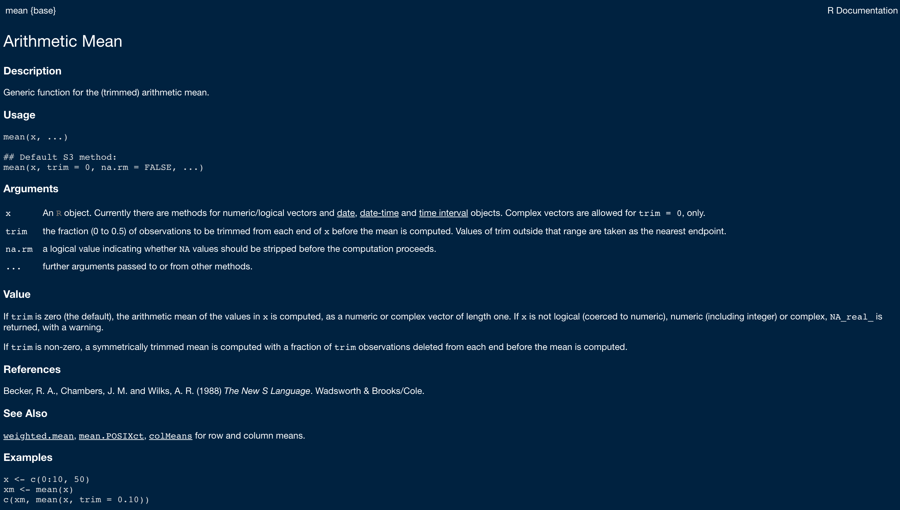
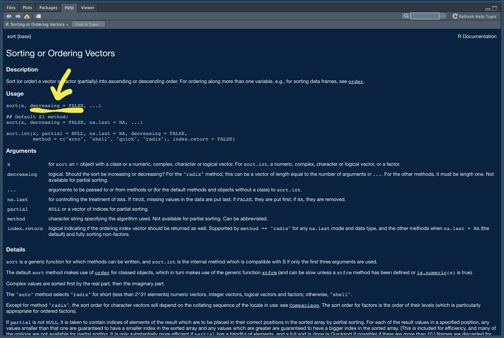
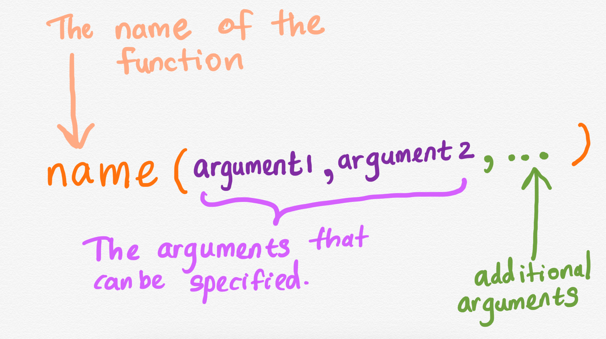
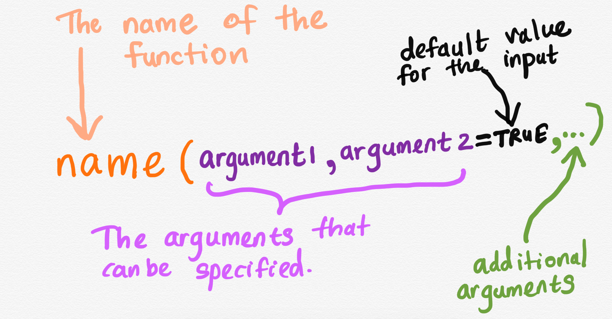
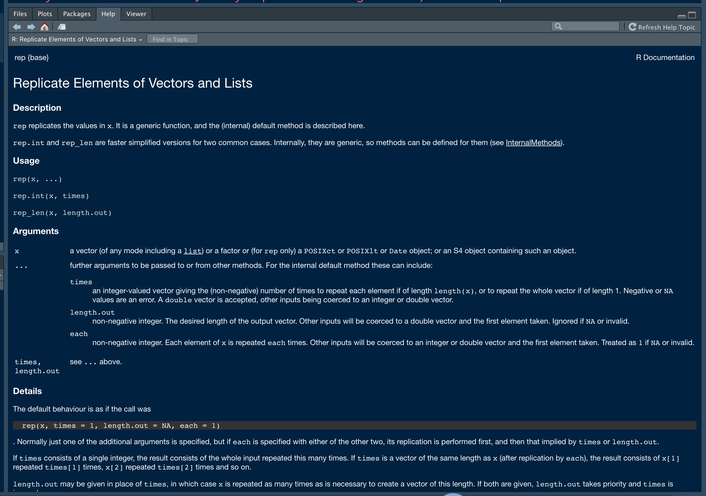

```{r setup, include=FALSE}
options(htmltools.dir.version = FALSE)
knitr::opts_chunk$set(
  fig.width=9, fig.height=3.5, fig.retina=3,
  out.width = "100%",
  cache = FALSE,
  echo = TRUE,
  message = FALSE, 
  warning = FALSE,
  fig.show = TRUE,
  hiline = TRUE
)
```

<style type="text/css">
.remark-slide-content {
    font-size: 35px;
}
</style>

```{r xaringan-themer, include=FALSE, warning=FALSE}
library(xaringanthemer)
#style_duo_accent(
#  primary_color = "#1381B0",
#  secondary_color = "#FF961C",
#  inverse_header_color = "#FFFFFF"
#)
style_solarized_light(text_font_google   = google_font("Josefin Sans", "400", "400i", "800i", "800"))
#style_mono_light(
#  base_color = "#1c5253",
#  header_font_google = google_font("Josefin Sans"),
#  text_font_google   = google_font("Josefin Sans", "400", "400i", "800i", "800"),
#  code_font_google   = google_font("Fira Mono")
#)
```


## Function Anatomy

.pull-left[
```{r, comment=NA}
vec1 <- c(1, 2, 3, 4, 5)
mean(vec1)
```

```{r, comment=NA}
vec2 <- c(1, 2, NA, 3, 4, 5)
mean(vec2)
```

]

## Help 

`?mean`

---

## help: `mean`



---

## help: `sort`



---





---

## `mean` with additional inputs 

.pull-left[
```{r, comment=NA}
vec1 <- c(1, 2, 3, 4, 5)
mean(vec1)
```

```{r, comment=NA}
vec2 <- c(1, 2, NA, 3, 4, 5)
mean(vec2)
```

]

.pull-right[
```{r, comment=NA}
mean(vec2, na.rm=TRUE)
```


]
---





---


---

.pull-left[
```{r, comment=NA}
vec <- c(10, 1, 2, 4, 100, 15)
sort(vec)
sort(vec, decreasing = TRUE)
sort(vec, decreasing = FALSE)
```
]

.pull-right[


]


---
## `rep`



---

class: inverse, center, middle

# [Vector creation with `rep` function in R!](https://hellor.netlify.app/2021/week1/l12021.html#64)

---

class: center, middle

## Thank you!

Slides available at: hellor.netlify.app

All rights reserved by [Thiyanga S. Talagala](https://thiyanga.netlify.app/)


