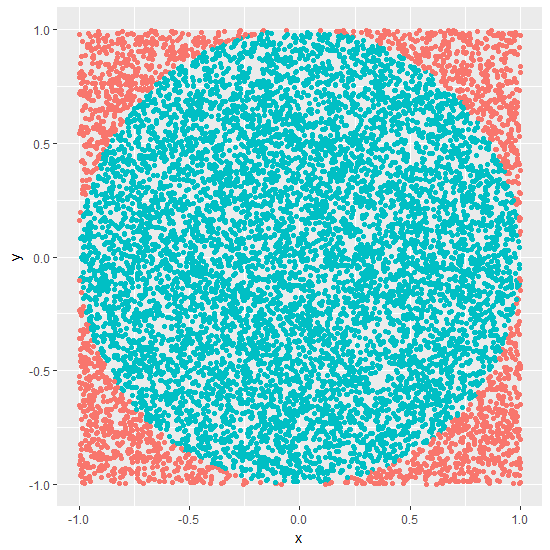

```{r setup, include=FALSE}
options(htmltools.dir.version = FALSE)
```

# Problem 1

Write a function to prints out standard random normal numbers (use rnorm()) but stops (breaks) if you get a number bigger than 1.


Using next adapt the loop from last exercise so that doesn’t print negative numbers.

---

# Problem 2

Write a function to simulate the flip a coin $n$ times, keeping track of the individual outcomes (1 = heads, 0 = tails) in a vector that
you preallocte. Assume $P(H)=0.5$.

Example output:

```{r, comment=NA, echo=FALSE}
flip_coin <- function(n){
  out <- numeric(n)
  for (i in 1:n){
    coin.out <- rbinom(1, p=0.5, n=1)
    if(coin.out==1){
      out[i] <- "H"
    } else {
      out[i] <- "T"
    }
  }
  out
}

```

```{r, comment=NA}
flip_coin(10)
```


---
```{r, comment=NA}
flip_coin <- function(n){
  out <- numeric(n)
  for (i in 1:n){
    coin.out <- rbinom(1, p=0.5, n=1)
    if(coin.out==1){
      out[i] <- "H"
    } else {
      out[i] <- "T"
    }
  }
  out
}

```

```{r, comment=NA}
flip_coin(10)
```

---

- Modify the function so that it takes another argument, which will be the $P(H)$.

- Run the function 10, 100, 1000 and 10000 times with $P(H)=0.8$ and report the proportion of times that head is selected.

---

background-image: url('montyhall.jpg')
background-position: center
background-size: contain

# Monty Hall Problem

.footer-note[.tiny[.green[Image Credit: ][Ben Bennetts ](https://hollamhouse.files.wordpress.com/2016/08/monty-hall-1.jpg)]]


---

background-image: url('mstep1.png')
background-position: center
background-size: contain
---

background-image: url('mstep2.png')
background-position: center
background-size: contain
---

# Monty Hall Problem: Rules

- The host must always open a door that was not picked by the contestant.

--

- The host must always open a door to reveal a goat and never the car.

--

- The host must always offer the chance to switch between the originally chosen door and the remaining closed door.

             Taken from https://en.wikipedia.org/wiki/Monty_Hall_problem

---
class: center, middle, duke-orange

# Let's play the game!

Click here to play: http://www.math.ucsd.edu/~crypto/Monty/monty.html

# Does switching increases the chance of winning the car?

---

background-image: url('stayswap.png')
background-position: center
background-size: contain

---

We use `sample` function to assign `car`, `goat`, `goat`, behind the doors.

```{r, comment=NA}
sample(c("car", "goat", "goat"))

sample(c("car", "goat", "goat"))
```

--
Here is a function that will take player's initial choice of door.

```{r, comment=NA}
select_first_door <- function(door){
  door.allocation <- sample(c("car", "goat", "goat"))
  door.allocation[door]
}

select_first_door(2) # My first choice is the 2nd door
```

--

Modify your function so that it shows the player the door that the host selects. Hint: `sample` function act as a host.

---

Modify your function so that it includes the player strategy (switch or stay) as an input, and returns the appropriate result.

- Run your function 1000 times, for each strategy and report the proportion of times that car is selected. (You could put this
in a loop and compute the proportion of times car shows.) 
- How many times would you expect car to be selected out of 1000 runs? 

---

# Approximating Pi = 3.14616

$$\frac{A_{circle}}{A_{square}}=\frac{\pi r^2}{4r^2}$$
Equation of a circle center around 0: $x^2+y^2=r^2$



Write a function to approximate $\pi$ using Monte Carlo simulations.

---

# Root finding algorithms: Bisection method

Let $X_1,...X_n \sim N(\theta, 1)$, where $\theta$ is unknown. It is easy to show that the log-likelihood is (up to $n$)

$$l(\theta)=-\frac{1}{2}\sum_{i=1}^n(x_i-\theta)^2.$$

The derivative of the log-likelihood (score function) is
$$l'(\theta)=\sum_{i=1}^n(x_i-\theta).$$ We can show that $\hat{\theta}=\bar{x}$, but we will estimate $\theta$ using the bisection method.

---

# Bisection method


```{r, echo=FALSE}
knitr::include_url('http://www.mathcs.emory.edu/~cheung/Courses/170/Syllabus/07/bisection.html')
```


---


---

# Random Variable Generation: Inverse-Transform Method

Let $X$ be a random variable with CDF $F$. Since $F$ is a nondecreasing function, the inverse function $F^{-1}$ may be defined as
$$F^{-1}(y)=inf\{x: F(x)\geq y\}, 0 \leq y \leq 1.$$

It is easy to show that if $U \sim U(0, 1)$, then

$$X=F^{-1}(U)$$

has CDF $F$. Namely, since $F$ is invertible and $P(U \leq u)=u$, we have

$$P(X \leq x)=P(F^{-1}(U)\leq x)=P(U\leq F(x))=F(x)$$