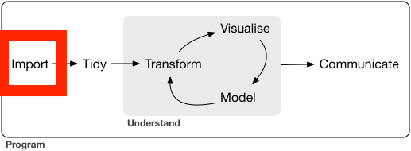

```{r setup, include=FALSE}
options(htmltools.dir.version = FALSE)
knitr::opts_chunk$set(
  fig.width=9, fig.height=3.5, fig.retina=3,
  out.width = "100%",
  cache = FALSE,
  echo = TRUE,
  message = FALSE, 
  warning = FALSE,
  fig.show = TRUE,
  hiline = TRUE
)
```

<style type="text/css">
.remark-slide-content {
    font-size: 35px;
}
</style>


```{css, echo = FALSE}
h1, #TOC>ul>li {
  color: #66a61e;
  font-weight: bold;
}
h2, #TOC>ul>ul>li {
  color: #e7298a;
  #font-family:  "Times";
  font-weight: bold;
}
h3, #TOC>ul>ul>li {
  color: #7570b3;
  #font-family:  "Times";
  font-weight: bold;
}
```

```{r xaringan-themer, include=FALSE, warning=FALSE}
library(xaringanthemer)
#style_duo_accent(
#  primary_color = "#1381B0",
#  secondary_color = "#FF961C",
#  inverse_header_color = "#FFFFFF"
#)
style_solarized_light(text_font_google   = google_font("Josefin Sans", "400", "400i", "800i", "800"))
#style_mono_light(
#  base_color = "#1c5253",
#  header_font_google = google_font("Josefin Sans"),
#  text_font_google   = google_font("Josefin Sans", "400", "400i", "800i", "800"),
#  code_font_google   = google_font("Fira Mono")
#)
```

# Today's menu

.pull-left[

- Data import 


- Data export


]

.pull-right[
<center></center>
]

---
background-image: url(readr.png)
background-size: 100px
background-position: 98% 6%

# Data Science Workflow: Import

```{r, comment=NA, fig.height=8, comment=NA, echo=FALSE}

```


---
## Data import with readr

`readr`: part of the core tidyverse.

```{r,comment=NA}
library(tidyverse)
```


--


## `readr` data import functions

- `read_csv`: reads comma-delimited files.

- `read_csv2`: reads semicolon-separated files

- `read_tsv`: reads tab-delimited files


---

## 🛠 Import data from a .csv file (local machine)


### Syntax


```r
datasetname <- read_csv("include_file_path")
```

When you run `read_csv`, it prints out the names and type of each column.

.full-width[.content-box-yellow[Switch to R]]

  
---

## If the file is saved inside the project folder: part 1

<iframe width="1080" height="600" src="https://www.youtube.com/embed/i-tshXv6lTg" title="YouTube video player" frameborder="0" allow="accelerometer; autoplay; clipboard-write; encrypted-media; gyroscope; picture-in-picture" allowfullscreen></iframe>


---

## If the file is saved outside the project folder: part 2

<iframe width="1080" height="600" src="https://www.youtube.com/embed/i-tshXv6lTg" title="YouTube video player" frameborder="0" allow="accelerometer; autoplay; clipboard-write; encrypted-media; gyroscope; picture-in-picture" allowfullscreen></iframe>


---

## 🛠 Importing csv file from a website

### Syntax

```r
datasetname <- read_csv("include url here")
```

### Example

```{r, comment=NA, cache=TRUE}
url <- "https://thiyanga.netlify.app/project/datasets/foodlabel.csv"
foodlabel <- read_csv(url)
```

```{r,comment=NA}
head(foodlabel, 1)
```
---

## `read.csv` and `read_csv`

*  `read.csv` is in base R.

*  `read_csv` is in tidyverse.

*  `read.csv()` performs a similar job to `read_csv()`.

* `read_csv()` works well with other parts of the tidyverse.

*  `read_csv()` is faster than `read.csv()`.

*  `read_csv()` will always read variables containing text as character variable.  In contrast, the base R function `read.csv()` will, by default, convert any character variable to a factor.

<!--This is often not what you want, and can be overridden by passing the option stringsAsFactors = FALSE to read.csv().-->


---

## 🛠 Writing data to a .csv file

- We can save tibble (or dataframe) to a csv file, using `write_csv()`.

- `write_csv()` is in the `readr` package.

---

## Syntax

```r
write_csv(name_of_the_data_set_you_want_to_save, "path_to_write_to")
```

## Example

```r
data(iris)
# This will save inside your project folder
write_csv(iris, "iris.csv") 
# This will save inside the data folder which is inside your project folder
write_csv(iris, "data/iris.csv") 
```

Swtich to R

---

<iframe width="1000" height="600" src="https://www.youtube.com/embed/3pW3wZ-Dprg" title="YouTube video player" frameborder="0" allow="accelerometer; autoplay; clipboard-write; encrypted-media; gyroscope; picture-in-picture" allowfullscreen></iframe>


---

# 🛠 Importing data from .xlsx files

## Syntax

```r
library(readxl)
mydata <- read_xlsx("file_path")
```

.full-width[.content-box-yellow[Switch to R]]

---

<iframe width="1000" height="600" src="https://www.youtube.com/embed/K58J7EvGXDA" title="YouTube video player" frameborder="0" allow="accelerometer; autoplay; clipboard-write; encrypted-media; gyroscope; picture-in-picture" allowfullscreen></iframe>


---
# Importing SAS, SPSS and STATA files

## SAS

```r
read_sas("mtcars.sas7bdat")
write_sas(mtcars, "mtcars.sas7bdat")
```
## SPSS

```r
read_sav("mtcars.sav")
write_sav(mtcars, "mtcars.sav")

```
## Stata
```r
read_dta("mtcars.dta")
write_dta(mtcars, "mtcars.dta")
```

---

# Importing other types of data


- `feather`: for sharing with Python and other languages

- `httr`: for web apis

- `jsonlite`: for JSON

- `rvest`: for web scraping

- `xml2`: for XML

.full-width[.content-box-blue[Working with feather, httr, jsonlite, rvest and xml2 is beyond the scope of the course.]]

---

class: center, middle

Slides available at: hellor.netlify.app

All rights reserved by [Thiyanga S. Talagala](https://thiyanga.netlify.com/)
