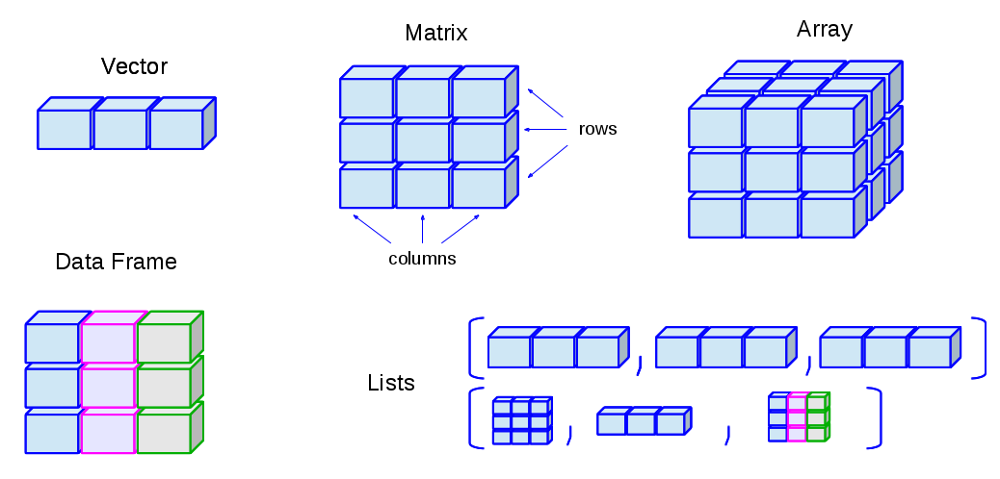

# Recap

# STA 326 2.0 Programming and Data Analysis with R


# Data structures

 

- Explicit coercion

- Combining objects

- Name elements

- Subsetting

- tibble and factor

- dataframe vs tibble

- Simplifying vector creations


# Simple mathematical and statistical functions

### R can be used as a simple calculator.

|  Operator | Description  |
|---|---|
| + | addition   |
| -  | substraction|
|*| multiplication|
|^|exponentiation (5^2 is 25)|
|%%| modulo-remainder of the division of the number to the left by the number on its right. (5%%3 is 2)|

### Some more maths functions

|  Operator | Description  |
|---|---|
|  abs(x) | absolute value of x   |
| log(x, base=y)  |  logarithm of x with base y; if base is not specified, returns the natural logarithm |
|exp(x)| exponential of x|
|sqrt(x)|square root of x|
|factorial(x)| factorial of x|

### Basic statistic functions

|  Operator | Description  |
|---|---|
|  mean(x) | mean of x   |
| median(x)  |  median of x |
|mode(x)| mode of x|
|var(x)|variance of x|
|scale(x)| z-score of x|
|quantile(x)| quantiles of x|
|summary(x)|summary of x: mean, minimum, maximum, etc.|


### Probability distribution functions

- **d** prefix for the **distribution** function

- **p** prefix for the **cummulative probability**

- **q** prefix for the **quantile**

- **r** prefix for the **random** number generator

### Logical operations

|<	|less than|
|<=	|less than or equal to|
|>	|greater than|
|>=	|greater than or equal to|
|==	|exactly equal to|
|!=	|not equal to |
|!x	|Not x|
|x | y |	x OR y|
|x & y |	x AND y|
|isTRUE(x)	|test if X is TRUE|

### Matrix operations

- Matrix multiplication

- Transpose

- ets

### Handling missing observations

```r
is.na
```


# Writing functions with R

```r
function_name <- function(inputs){

<FUNCTION BODY>

}

```

# Programming styles

- base R

- tidyverse

- pipe operator %>%

# Import and Export data

- readr functions

# Data Visualization

- qplot

- ggplot

# Data Transform and Data Wrangling

- `tidyr` and `dplyr` functions

# Reproducible reporting

- Rmarkdown

# Random number generation

- built-in functions in R

- Inverse transform method

# Statistical modelling and Inference

- Regression analysis

- Hypotheses testing

# Functionals

- lapply and sapply

- map

- modify

- map_df

You can update this with all the topics we discussed.
