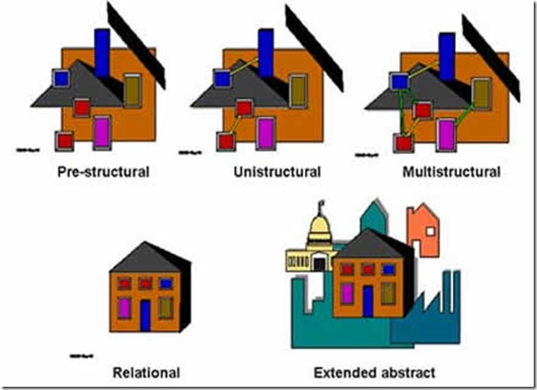
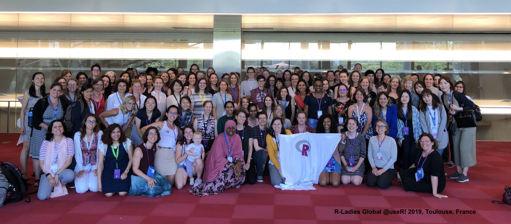

```{r setup, include=FALSE}
options(htmltools.dir.version = FALSE)
knitr::opts_chunk$set(
  fig.width=9, fig.height=3.5, fig.retina=3,
  out.width = "100%",
  cache = FALSE,
  echo = TRUE,
  message = FALSE, 
  warning = FALSE,
  fig.show = TRUE,
  hiline = TRUE
)
```

```{r xaringan-themer, include=FALSE, warning=FALSE}
library(xaringanthemer)
#style_duo_accent(
#  primary_color = "#1381B0",
#  secondary_color = "#FF961C",
#  inverse_header_color = "#FFFFFF"
#)
#style_solarized_light(text_font_google   = google_font("Josefin Sans", "400", "400i", "800i", "800"))
#style_mono_light(
#  base_color = "#1c5253",
#  header_font_google = google_font("Josefin Sans"),
#  text_font_google   = google_font("Josefin Sans", "400", "400i", "800i", "800"),
#  code_font_google   = google_font("Fira Mono")
#)
```

<style type="text/css">
.remark-slide-content {
    font-size: 32px;
    padding: 1em 4em 1em 4em;
    color: black;
    padding-top: 10px;
    padding-left: 30px;
    padding-right: 30px;
    padding-bottom: 10px;
}
</style>


## Lecturer-in-charge and Chief Examiner

- Dr Thiyanga S. Talagala

- PhD in Statistics (2019), Monash University, Australia

- BSc (Hons, Special) Statistics, University of Sri Jayewardenepura
      
      - Batch first and Professor R A Dayananda Gold Medalist 
      
- Research interests: Data visualization, Computer vision, Machine learning and interpretability methods

      
- Personal website: https://thiyanga.netlify.app/
---

### Requirements

- Computer with R and RStudio installed.

- Link to download: https://posit.co/download/rstudio-desktop/

- Internet connection.

### Enrolment

- Student must register at the beginning (week 1 - week 3) of the semester cannot join after the third week.

### Drop Course Policy

- Last date to drop: week 7

- You should inform the lecturer-in-charge through an email.

---


## Course website

```{r, echo=FALSE}
knitr::include_url("https://hellor2023.netlify.app/")
```

https://hellor2023.netlify.app/

---

## Course outline


[Click here](https://hellor2023.netlify.app/courseoutline/2023_STA326_2_Programming_and_Data_Analysis_with_R.pdf)


---

## Make-up examination for the mid-semester examination only

Category A

- An illness that requires the student to miss all of his or her classes for 2 days or more.

Category B

- A period of grief for loss of a family member or friend.

Category C

- A family emergency.


**A valid documentation of proof is required prior to the assignment deadline.**

---
# Makeup Examination - Mid Semester Examination

Type: Viva Voce (Oral Examination) 

Mode of delivery: Onsite

You need to contact the lecturer and make an appointment for the make-up examination.

Otherwise, marks for the formative assessment will be 0.

Note: Make-up examinations will not be given for end-of-semester examinations.


---

## Philosophy driving our policy has three goals


- Keep things fair

- Encourage good time-management

- Encouragement and appreciation of on time submission students


---

## Help us to help you!

.pull-left[

]

--

.pull-right[

- Use the LMS forum to ask questions.

- Feel free to answer each others questions.

- I will also provide answers.

- Email ttalagala@sjp.ac.lk only for issues that are personal.

- For details on consultation see course website.


]

---

class: inverse, center, middle

# Additional resources

---

## R Ladies 



---

## R Ladies 

```{r, echo=FALSE}
knitr::include_url("https://rladies.org/")
```

---

## R Ladies Colombo

```{r, echo=FALSE}
knitr::include_url("https://rladiescolombo.netlify.app/")
```

---

## Other

- Stack Overflow: question and answer website for professional and enthusiast programmers

- Cousera

- DataCamp

- Udemy etc.

---

background-image: url('horse.png')
background-position: center
background-size: cover

---
background-image: url('job1.png')
background-position: center
background-size: cover

---
background-image: url('job2.png')
background-position: center
background-size: cover

---
background-image: url('job3.png')
background-position: center
background-size: cover

---
background-image: url('job4.png')
background-position: center
background-size: cover

---

class: inverse, center, middle


# Buckle up - Let's get started.