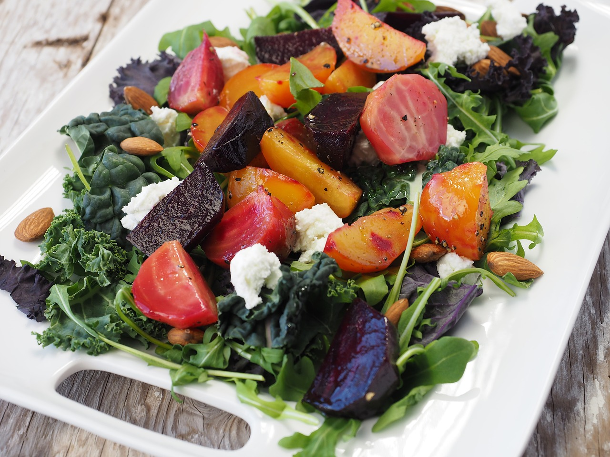
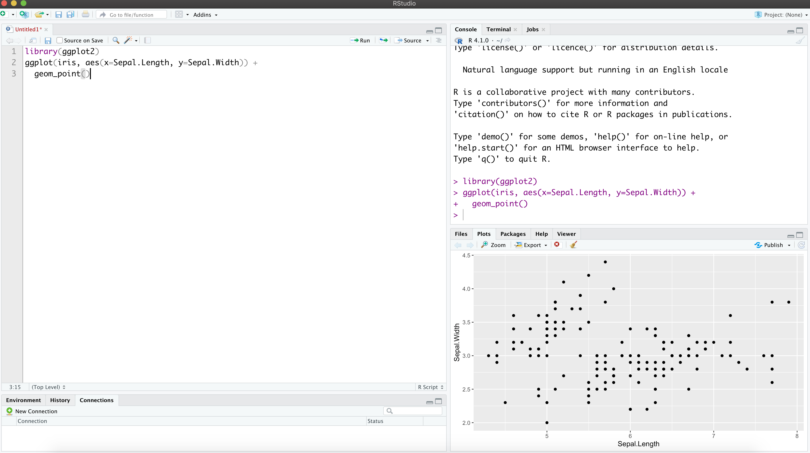

```{r setup, include=FALSE}
options(htmltools.dir.version = FALSE)
knitr::opts_chunk$set(
  fig.width=9, fig.height=3.5, fig.retina=3,
  out.width = "100%",
  cache = FALSE,
  echo = TRUE,
  message = FALSE, 
  warning = FALSE,
  fig.show = TRUE,
  hiline = TRUE
)
```

```{r xaringan-themer, include=FALSE, warning=FALSE}
library(xaringanthemer)
#style_duo_accent(
#  primary_color = "#1381B0",
#  secondary_color = "#FF961C",
#  inverse_header_color = "#FFFFFF"
#)
style_solarized_light(text_font_google   = google_font("Josefin Sans", "400", "400i", "800i", "800"))
#style_mono_light(
#  base_color = "#1c5253",
#  header_font_google = google_font("Josefin Sans"),
#  text_font_google   = google_font("Josefin Sans", "400", "400i", "800i", "800"),
#  code_font_google   = google_font("Fira Mono")
#)
```

# Today's menu

.pull-left[
- What is R?

- Why R?

- R and Rstudio.

- Installing R and Rstudio?

- Familiarize with RStudio interface.

- R Studio cloud.

- Using R as a calculator.

- Basic vector operations.
]

.pull-right[
<center></center>
]

---

## What statistical software packages are you familiar with?


---

### R Programming Language


- R is a software environment for statistical computing and graphics.

- Language designers: **R**oss Ihaka and **R**obert Gentleman at the University of Auckland, New Zealand.

- Parent language: S

- The latest R version 4.1.0 has been released on 2021 - 6 - 5.

<center></center>


---


<!--You have already mastered Minitab. -->

.pull-left[

### Minitab - Menu driven software

<center></center>

<!--Minitab. Commonly used in: social science, marketing, education, sociology, ... Menu-driven statistical software-->


]


.pull-right[

### R - Scripting language

<center></center>

]

---


.pull-left[

### Menu driven software

<center></center>

<!--Minitab. Commonly used in: social science, marketing, education, sociology, ... Menu-driven statistical software-->


]


.pull-right[

## Pros

- Do not have to remember the commands.

- User friendly.


## Cons

- Irritating if there are too many levels of menues to move around.

- Difficult to reproduce results.

- Collaboration

]


---


<!--You have already mastered Minitab. -->

.pull-left[

### Scripting language

<center></center>

]


.pull-right[

## Pros


## Cons


]


---

## Why learn R?

- Free and open-source software package

- Large community of users

- Latest cutting edge technology

---

background-image: url('ricon.png')
background-position: right
background-size: contain

## R 

---
background-image: url('rmac2.png')
background-position: right
background-size: contain

## R environment - macOS

---
background-image: url('rmac1.png')
background-position: right
background-size: contain

## R  environment - macOS
---

background-image: url('renv.png')
background-position: right
background-size: contain

## R environment

---
background-image: url('rstudio1.png')
background-position: right
background-size: contain

## The RStudio IDE
---

background-image: url('rstudio2.png')
background-position: right
background-size: contain

## The RStudio IDE

---
background-image: url('airport.jpg')
background-position: center
background-size: cover

.content-box-yellow[
## R and RStudio
]

---
class: inverse, center, middle

# Create a new project

---
background-image: url('project1.png')
background-position: center
background-size: contain
---

background-image: url('project2.png')
background-position: center
background-size: contain
---

background-image: url('project3.png')
background-position: center
background-size: contain
---

background-image: url('project4.png')
background-position: center
background-size: contain
---

background-image: url('project5.png')
background-position: center
background-size: contain
---

background-image: url('project6.png')
background-position: center
background-size: contain


---

class: inverse, center, middle

# Basics of R programming


---

## R Console

```{r, comment=NA}
7+1

```


```{r, comment=NA}
rnorm(10) 

```


---


## Variable assignment

```{r, comment=NA}
a <- rnorm(10)
a
```

--

```{r, comment=NA}
b <- a*100
b
```

---


# Data permanency

- `ls()` can be used to display the names of the objects which are currently stored within R.

- The collection of objects currently stored is called the **workspace**.

```{r, comment=NA}
ls()

```

---

## Remove objects

- To remove objects the function `rm` is available


    
### Remove specific objects: `rm(x, y, z)`
    
    
```{r, comment=NA}
rm(a)
ls()
```

### Remove all objects: `rm(list=ls())`

```{r, comment=NA}
rm(list=ls())
ls()
```

---

class: inverse, center, middle

# Close the project


---

background-image: url('project7.png')
background-position: center
background-size: contain

At the end of an R session, if **save**: the objects are written to a file called .RData in the current directory, and the command lines used in the session are saved to a file called .Rhistory

---

class: inverse, center, middle

# When R is started at later time **from the same directory**.

---

background-image: url('p81.png')
background-position: center
background-size: cover


---

background-image: url('p82.png')
background-position: center
background-size: cover

.pull-left[.full-width[.content-box-yellow[When R is started at later time **from the same directory** it reloads the **associated workspace** and **commands history.**]]]

---

background-image: url('project9.png')
background-position: center
background-size: cover

--
.pull-left[.full-width[.content-box-yellow[When R is started at later time **from the same directory** it reloads the **associated workspace** and **commands history.**]]]


---

## Comment your code

- Each line of a comment should begin with the comment symbol and a single space: # . 

```{r, comment=NA}
rnorm(10) # This is a comment 
sum(1:10) # Summation of numbers from 1 to 10.
```

---


## Style Guide

- Good coding style is like correct punctuation: you can manage without it, butitsuremakesthingseasiertoread.  -- Hadley Wickham

```{r, comment=NA}
sum(1:10)#Bad commenting style
sum(1:10) # Good commenting style

```

- Also, use commented lines of - and = to break up your file into easily readable sub-sections.

```r
# Read data ----------------

# Plot data ----------------
```

To learn more read Hadley Wickham's [Style guide](http://adv-r.had.co.nz/Style.html).

---

## Objects in R


1. .red[Data structures] are the ways of arranging data.

    - You can create objects, using the left pointing arrow <-
--
1. .red[Functions] tell R to do something.

    - A function may be applied to an object.

    - Result of applying a function is usually an object too.

    - All function calls need to be followed by parentheses.

```{r, comment=NA}
a <- 1:20 # data structure
sum(a) # sum is a function applied on a

```

```r
help.start() # Some functions work on their own.
```

---


## Getting help with functions and features

- R has inbuilt help facility


**Method 1**

```r
help(rnorm)
```

- For a feature specified by special characters such as `for`, `if`, `[[`

```r
help("[[")
```

- Search the help files for a word or phrase.

```r
help.search(‘weighted mean’) 
```

**Method 2**

```r
?rnorm
```

```r
??rnorm
```


---

background-image: url('dataStructures.png')
background-position: center
background-size: contain

## Data structures

.footer-note[.tiny[.green[Image Credit: ][venus.ifca.unican.es](http://venus.ifca.unican.es/Rintro/dataStruct.html)]]


---

background-image: url('dataStructures.png')
background-position: center
background-size: contain

## Data structures

.content-box-yellow[Data structures differ in terms of,

- Type of data they can hold

- How they are created

- Structural complexity

- Notation to identify and access individual elements
]

.footer-note[.tiny[.green[Image Credit: ][venus.ifca.unican.es](http://venus.ifca.unican.es/Rintro/dataStruct.html)]]

---

class: inverse, center, middle

# 1. Vectors

---

### Vectors

- Vectors are one-dimensional arrays that can hold numeric data, character data, or logical data.

- Combine function c() is used to form the vector.

- Data in a vector must only be one type or mode (numeric, character, or logical). You can’t mix modes in the same vector.


**Vector assignment**


```r
vector_name <- c(element1, element2, element3) # syntax

```

```r
x <- c(5, 6, 3, 1 , 100) # example
```

- assignment operator ('<-'), '=' can be used as an alternative.

- `c()` function

.red[What will be the output of the following code?]

```r
y <- c(x, 500, 600)
```

---

# Types and tests with vectors


```{r, eval=TRUE}
first_vec <- c(10, 20, 50, 70)
second_vec <- c("Jan", "Feb", "March", "April")
third_vec <- c(TRUE, FALSE, TRUE, TRUE)
fourth_vec <- c(10L, 20L, 50L, 70L)
```


To check if it is a 

- vector: `is.vector()`

```{r, comment=NA}
is.vector(first_vec)
```


- character vector: `is.character()`

```{r, comment=NA}
is.character(first_vec)
```
---
- double: `is.double()`

```{r, comment=NA}
is.double(first_vec)
```


- integer: `is.integer()`

```{r, comment=NA}
is.integer(first_vec)
```

- logical: `is.logical()`

```{r, comment=NA}
is.logical(first_vec)
```

- length

```{r, comment=NA}
length(first_vec)
```
---

# Coercion

Vectors must be homogeneous. When you attempt to combine different types they will be coerced to the most flexible type so that every element in the vector is of the same type.

Order from least to most flexible

`logical` --> `integer` --> `double` --> `character`

```{r, comment=NA}
a <- c(3.1, 2L, 3, 4, "GPA") 
typeof(a) 
```

```{r, comment=NA}
anew <- c(3.1, 2L, 3, 4)
typeof(anew) 
```

---

### Explicit coercion

Vectors can be explicitly coerced from one class to another using the `as.*` functions, if available. For example, `as.character`, `as.numeric`, `as.integer`, and `as.logical`.

```{r, comment=NA}
vec1 <- c(TRUE, FALSE, TRUE, TRUE)
typeof(vec1)

vec2 <- as.integer(vec1)
typeof(vec2)
vec2
```

.red[Why does the below output NAs?]

```{r, comment=NA}
x <- c("a", "b", "c")
as.numeric(x)
```

---

### Explicit coercion (cont.)

.pull-left[

```{r, comment=NA}
x1 <- 1:3
x2 <- c(10, 20, 30)
combinedx1x2 <- c(x1, x2)
combinedx1x2 
```


```{r, comment=NA}
class(x1)
class(x2)
class(combinedx1x2)

```

]

.pull-right[

- If you combine a numeric vector and a character vector 

```{r, comment=NA}
y1 <- c(1, 2, 3)
y2 <- c("a", "b", "c")
c(y1, y2)

```

]

---

# Name elements in a vector

You can name elements in a vector in different ways. We will learn two of them.

1. When creating it

```{r}
x1 <- c(a=1991, b=1992, c=1993)
x1
```

2. Modifying the names of an existing vector

```{r}
x2 <- c(1, 5, 10)
names(x2) <- c("a", "b", "b")
x2
```

Note that the names do not have to be unique. 
---

# To remove names of a vector

Method 1

```{r, comment=NA}
unname(x1); x1
```

Method 2

```{r, comment=NA}
names(x2) <- NULL; x2
```

.red[What will be the output of the following code?]

```r
v <- c(1, 2, 3)
names(v) <- c("a")
v
```
---

# Simplifying vector creation: `:`

1. colon `:` produce regular spaced ascending or descending sequences.

```{r, comment=NA}
 10:16

-0.5:8.5

```
---

# Simplifying vector creation: `seq`

2. sequence: `seq(initial_value, final_value, increment)`

```{r, comment=NA}
seq(1,11)

seq(1, 11, length.out=5)

seq(0, 11, by=2)
```

---

# Simplifying vector creation: `rep`

3. repeats `rep()` 

```{r, comment=NA}
rep(9, 5)

rep(1:4, 2)

rep(1:4, each=2) # each element is repeated twice

rep(1:4, times=2) # whole sequence is repeated twice

rep(1:4, each=2, times=3)

rep(1:4, 1:4)

rep(1:4, c(4, 1, 4, 2))

```

---

## Logical operators

.pull-left[

- `<=` less than or equal to

- `>=` greater than or equal to

- `|` or

- `&` and

- `<` less than

- `>` greater than

- `==` equal

]


.pull-right[

```{r, comment=NA}
c(1, 2, 3) == c(10, 20, 3)
```

```{r, comment=NA}
c(1, 2, 3) != c(10, 20, 3)
```

```{r, comment=NA}
1:5 > 3
```

```{r, comment=NA}
1:5 < 3
```

]

---

# Operators: `%in%` - in the set

```{r, comment=NA}
a <- c(1, 2, 3)
b <- c(1, 10, 3)
a%in%b
```

```{r, comment=NA}
x <- 1:10
y <- 1:3
x
y
x %in% y

```

```{r, comment=NA}
y %in% x
```
---
## Vector arithmetic


- operations are performed element by element. 

```{r, comment=NA}
c(10, 100, 100) + 2 # two is added to every element in the vector
```
--
- operations between two vectors

```{r, comment=NA}
v1 <- c(1, 2, 3); v2 <- c(10, 100, 1000)
v1 + v2
```
--
Add two vectors of unequal length

```{r, comment=NA}
longvec <- seq(10, 100, length=10); shortvec <- c(1, 2, 3, 4, 5)

shortvec + longvec

```


.red[What will be the output of the following code?]

```r
first <- c(1, 2, 3, 4); second <- c(10, 100)
first * second
```
---

# Other vector operations

- Please see the [cheatsheet](/pdf/baser.pdf).

---

# Missing values

Use `NA` or `NaN` to place a missing value in a vector.

```{r, comment=NA}
z <- c(10, 101, 2, 3, NA)
is.na(z)
```


---


class: center, middle

## Thank you!

Slides available at: hellor.netlify.app

All rights reserved by [Thiyanga S. Talagala](https://thiyanga.netlify.com/)


