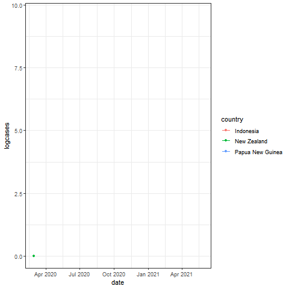

```{r setup, include=FALSE}
knitr::opts_chunk$set(echo = TRUE)
```

<h2 style = "text-align:left;">COVID-19 Outbreak in Independent State of Papua New Guinea</h2>


```{r, echo=FALSE, message=FALSE, warning=FALSE, results = 'hide', comment = " "}
library(sta3262)
get_individual_project_country("AS2017422")
library(coronavirus)
library(tidyverse)
library(magrittr)
library(skimr)
library(lubridate)
library(gganimate)
library(plotly)
```


# Abstract
The COVID-19 outbreak has become a global health crisis that has affected all over the world. therefore, understanding the out breaking patterns over the time, and the root cases for those will help to get uncover the remedial measures in order to prevent from the disease.This report provides an explanatory analysis of COVID-19 out break in Papua New Guinea.In this report the data from 22/01/2020 to 27/05/2021 has considered. And the comparison with neighboring countries has also included. Due to the less restrictions on people gatherings, and lower rate of vaccine program has caused the rise of COVID-19 cofirmed cases in Papua New Guinea.   

# 1. Background

## 1.1 Introduction

Coronavirus is a category of viruses that are known to impinge on the respiratory tract of living beings. Coronavirus can multiply rapidly as it is spreading from person to person. The first case of novel coronavirus (COVID-19) was reported in Wuhan, China on 1<sup>st</sup> December 2019, and since then its outbreak is confirmed in different parts of the world.This virus can easly transmitted through direct contact with an infected pearson or through contaminated surface. Such type of viruses causes common colds, pneumonia, bronchitis and respiratory issues such as SARS. The World Health Organization has (WHO) has affirmed COVID-19 as a global epidemic, as it is spreading at an alarming rate in more than 100 countries around the globe.

 


## 1.2 Location of Papua New Guinea

```{r echo=FALSE, fig.height=5, fig.width=10, message=FALSE, warning=FALSE}

#Plotting the country 
# This code works only when the device is connected to Internet 
library(leaflet)
library(htmlwidgets)
map <- leaflet() %>% 
  setView(lng = 143.9555, lat = -6.314993, zoom = 5) %>%
  addProviderTiles(providers$Esri.NatGeoWorldMap)
map

```

## 1.3 Climate Condition of Papua New Guinea
Papua New Guinea has a hot, humid tropical climate which is experienced all year round. The country
experiences two distinctive seasons, wet season from December to March and dry season from June to September. The
average monthly rainfall ranges between 250 – 350 mm and average temperature is between 26 -
28°C. Humidity is relatively high, ranging between 70 – 90%. Papua New Guinea is home to one of the
wettest climates of the world and annual rainfall in many areas of the country exceeds 2,500 mm,
with the heaviest events occurring in the highlands. 


## 1.4 Demographics of Papua New Guinea

Papua New Guinea, officially the Independent State of Papua New Guinea is a country in Oceania that comprises the eastern half of the island of New Guinea and its offshore islands in Melanesia. Its capital is Port Moresby. It is the world's third largest island country with an area of 462,840<sup>2</sup>. The population is approximately about 8.77 million .The country’s fertility rate is 3.59 births per woman, which is relatively high and is far above the population replacement rate of 2.1 births. GDP per capita in Papua New Guinea increased to 2505 USD in 2019.  
Queen Elizabeth II consider  as the Head of state and represented by a Governor-General. and the country has a parliament system.  
Linguistically, Papua New Guinea the world's most diverse country, with more than 700 native tongues. The country is one of the world's least explored, culturally and geographically. It is known to have numerous groups of un-contacted peoples, and researchers believe there are many undiscovered species of plants and animals in the interior. Approximately 80% of Papua New Guinea's people live in rural areas with few or no facilities of modern life. Many tribes in the isolated mountainous interior have little contact with one another, let alone with the outside world, and live within a non-monetarised economy dependent on subsistence agriculture. 

**Graph 01: Bar Graph composition of the population by Age Variable  **

```{r, echo=FALSE, message=FALSE, warning=FALSE, comment = " "}
#creating a data frame for composition of the population by age
age.g <- c("0-14", "15-24", "25-54","55-64", "65 & above" )
age_f <- c(31.98, 19.87, 37.68, 5.83, 4.46) 
demograph <- data.frame(age.g, age_f)

demograph11 <- plot_ly(demograph, x= ~age.g,  y = ~age_f, type = 'bar', color = ~age.g )%>%
  layout(yaxis = list(title ='Pecentage'), xaxis = list(title = 'Age Group'))
demograph11
```

Interpretation:  According to the above bar graph, majority of the population is from age 24 to 25. The adult population is lowest in the country which is equals to 4.46 percent. 


## 1.5 COVID-19 Outbreak and Lockdown Status  
The first case in Papua New Guinea was confirmed On 20<sup>th</sup> March 2020. The case was a 45-year-old man who had recently Spain.After conforming considerable amount of cases,On 10 August two-months lockdown was announced, would not be extended in spite of rising case numbers, saying that as per advice from specialist teams, a strategy of "living with the virus" was preferable to "drastic measures", by highlighting the present situation of economic crisis in the country. As alternative measures, self quarantine, home isolation, hotel quarantine before entering the country are used in order to lower the spread of COVID 19. 

## 1.6 Action Taken by the Government 
As mentioned above insted of 'lockdown' other measure such as self quarantine, home isolation, hotel quarantine before entering the country, was introduced by the government to lower the spread of COVID-19.But the Government of Papua New Guinea banned all travelers from Asian countries and closed its border with Indonesia, and then established an 8 pm to 6 am curfew, prohibited most public gatherings, limited groups to four people, banned public transportation, and suspended alcohol and Betel nut sales, gambling halls, night clubs, sports and sports
clubs, and religious services.
On 3 May 2021, the curfew for the National Capital District and Central Province was lifted, alcohol
restrictions have been lifted. Gatherings remain banned, social distancing measures have to be enforced, and washing hands before entering church services is mandatory.
The government has increased the initial amount of COVID-19 testing capacity in the beginning of the 2021.

## 1.7 Vaccination Program 
As the COVID-19 pandemic unfolds, more than 130,000 vaccines donated by the global facility COVAX doses have expired in Papua New Guinea. PNG is Australia’s largest aid recipient and is currently using AstraZeneca vaccines donated by Australia, New Zealand and COVAX for its first phase of a vaccine rollout. With a population of roughly 8 million, statistics reveal fewer than 100,000 people have received the COVID-19 vaccine to date


# 2.Exploratory Data Analysis

## 2.1 Introduction to Data Set

The data set used for this analysis is " coronavirus" data set wich available in RStudio. The source of the data set is Johns Hopkins University Center for Systems Science and Engineering (JHU CCSE) Coronavirus.  

A data frame with 7 variables.

| Variable        | Description           
| ------------- |:----------------------------------------------------------------:|
| date    | Date in YYYY-MM-DD format|
| province| Name of province/state, for countries where data is provided split across multiple provinces/states.|
| country | Name of country/region.|
|lat      |Latitude of center of geographic region, defined as either country or, if available, province.|
|long     | Latitude of center of geographic region, defined as either country or, if available, province.|
|type     |an indicator for type of cases.(confirmed, recovered, death)|
|cases    |Number of cases on given date.|


## 2.2 Cleaning Data
In the data set there were no missing values, but there was a minus case for each confirmed and death cases.
For confirmed and death cases separately, the distributions are not symmetric, so the minus values can not be replaced by the mean value, so those values have replaced by the median values of confirmed and death cases.    

## 2.3 Time Series Analysis for Confirmed, Death, Recoved Cases and Active Cases

Since the scales for 'cases' are different, all the time series plots can not plot in one plot.
```{r fig.width=10, message=FALSE, warning=FALSE, , echo=FALSE, results='hide'}

# filtering papua new G. data
Papua_New_Guinea_DF <- coronavirus %>% filter(country == "Papua New Guinea")
any(is.na(Papua_New_Guinea_DF))
sum(is.na(Papua_New_Guinea_DF))

#Cleaning Data 

Papua_New_Guinea_cl1 <-Papua_New_Guinea_DF %>% 
  mutate(cases = replace(cases, cases == -16, 0))

Papua_New_Guinea_cl2 <- Papua_New_Guinea_cl1 %>% 
  mutate(cases = replace(cases, cases == -1, 0))

any(is.na(Papua_New_Guinea_cl2))

```

```{r, echo=FALSE, echo=FALSE, message=FALSE, warning=FALSE, results = 'hide'}

# cleaned data frame in to tibble form 
Papua_New_Guinea <- as_tibble(Papua_New_Guinea_cl2)
view(Papua_New_Guinea)
skim(Papua_New_Guinea)
any(is.na(Papua_New_Guinea))
sum(is.na(Papua_New_Guinea))


```

```{r, echo = FALSE, message = FALSE, warning = FALSE, results = 'hide', comment = " "}

# wider format of papua new guinea 
Papua_New_Guinea_wider <- Papua_New_Guinea %>%
  pivot_wider(names_from = type, values_from = cases)
sum(Papua_New_Guinea_wider$confirmed)
sum(Papua_New_Guinea_wider$recovered)
sum(Papua_New_Guinea_wider$death)


```


**Plot 2: Time series plots for Confirmed, Recovered, and Death variable** 


```{r fig.height=5, fig.width=10, message=FALSE, warning=FALSE, , echo=FALSE, comment=" "}

# Plotting time series for each type in cases
library(timetk)
G1 <- Papua_New_Guinea %>% 
  group_by(type) %>%
  plot_time_series (
    .date_var = date,
    .value = cases,
    .color_var = type,
    .smooth = FALSE,
    .facet_ncol = 1,
    .interactive = TRUE,
    )
  
G1


```


Interpretation : The first case of the COVID-19 appears in 20<sup>th</sup> of March 2020, But the number of cases starting to rise in middle of the February.

Let us consider the time series plot of Confirmed cases.

```{r, echo=FALSE, message=FALSE, warning=FALSE, comment = " ", results='hide'}
# filtering confirmed cases
Papua_confirmed <- Papua_New_Guinea %>% filter(type == "confirmed")
head(Papua_confirmed)
#view(Papua_confirmed)
any(is.na(Papua_New_Guinea))

```


**Plot 3: Time series plot for Confirmed cases** 
```{r, echo=FALSE, message=FALSE, warning=FALSE, comment = " "}
library(dygraphs)

# create time series confirmed
library(xts)

# create time series object
confirmed_timeSeries <- xts(x = Papua_confirmed$cases,
                            order.by = Papua_confirmed$date)
interact_time <- dygraph(confirmed_timeSeries)


interact_time2 <- dygraph(confirmed_timeSeries, xlab= "Date", ylab ="Number of Confirmed Cases") %>% dyRangeSelector()
interact_time2
```


Interpretation :  Starting from March 2021, there is an upward trend in the confirmed cases till first of the April, and then there is and downward trend up to first half of May 2021. 


**Plot 4: Time series plot for Daeth cases**
```{r, echo=FALSE, message=FALSE, warning=FALSE, results = 'hide', comment = " "}
# filtering death cases
Papua_death <- Papua_New_Guinea %>% filter(type == "death")
#head(Papua_death)
#view(Papua_death)
any(is.na(Papua_death))

```
```{r, , echo=FALSE, message=FALSE, warning=FALSE, comment = " "}
# create time series confirmed
library(xts)

# create time series object
death_timeSeries <- xts(x = Papua_death$cases,
                            order.by = Papua_death$date)
d_interact_time <- dygraph(confirmed_timeSeries)


d_interact_time2 <- dygraph(death_timeSeries, xlab= "Date", ylab ="Number of Death Cases") %>% dyRangeSelector()
d_interact_time2
```


Interpretation :There is an upward trend starting from March 2021, there is no seasonal pattern. The highest number of Death case is 13 people. 


**Plot 5: Time series plot for Recovered cases**
```{r, echo=FALSE, message=FALSE, warning=FALSE, results = 'hide', comment = " "}
# filtering recovered cases 
Papua_recovered <- Papua_New_Guinea %>% filter(type == "recovered")
head(Papua_recovered)
#view(Papua_recovered)
any(is.na(Papua_recovered))
```

```{r, echo=FALSE, message=FALSE, warning=FALSE, comment = " "}
# create time series for recovered
library(dygraphs)
library(xts)

# create time series object
recovered_timeSeries <- xts(x = Papua_recovered$cases,
                            order.by = Papua_recovered$date)
r_interact_time <- dygraph(recovered_timeSeries)


r_interact_time2 <- dygraph(recovered_timeSeries, xlab= "Date", ylab ="Number of Recovered Cases") %>% dyRangeSelector()
r_interact_time2
```


Interpretation : The recovered cases slight downward trend/ no trend.


**Plot 6: Time series plot for Active cases**

```{r, echo=FALSE, message=FALSE, warning=FALSE, results = 'hide', comment = " "}
# creating Active cases 

Papua_New_Guinea_wider_active1 <- Papua_New_Guinea_wider %>% mutate(cum_cases = cumsum(confirmed))  %>% mutate(cum_rec = cumsum(recovered))  %>% mutate(cum_deth = cumsum(death))

Papua_New_Guinea_wider_active2<- Papua_New_Guinea_wider_active1 %>% mutate(active = cum_cases -(cum_rec + cum_deth))
#view(Papua_New_Guinea_wider_active2)

```


```{r, echo=FALSE, message=FALSE, warning=FALSE, comment = " "}
#Plotting Active Cases
Papua_New_Guinea_wider_active2 %>%
ggplot(aes(x = date, y = active)) +
  geom_line(color = 'blue', lw = 1)+
  
  geom_area(fill = 'blue', alpha = 0.3)+
  xlab("Date")+
  ylab("Number of Active Cases")+
  theme_bw()

```

Interpretation : There is an upward trend starting from February of 2021, and there is a downward trend starting from April of 2021. 

## 2.4 Comparison Between the some Countries in the Same Continent for Confirmed Cases

New Zealand, Indonesia, Papua New Guinea, and Soloman Islands have considered as countries in the same continent. 

```{r, echo=FALSE, message=FALSE, warning=FALSE, results = 'hide', comment = " "}
same_continent <- filter(coronavirus, country %in% c("New Zealand", "Indonesia", "Papua New Guinea", "Soloman Islands"))
asc <-as_tibble(same_continent)
#view(asc)
any(is.na(asc)) 

```

```{r, echo=FALSE, message=FALSE, warning=FALSE, results = 'hide', comment = " "}

same_continent_conf <- same_continent %>% filter(type == "confirmed")
#view(same_continent_conf)

# cleaning data
same_continent_conf1 <-same_continent_conf %>% 
  mutate(cases = replace(cases, cases < 0, 0))
#summary(same_continent_conf1)

```


```{r, echo=FALSE, message=FALSE, warning=FALSE, results = 'hide', comment = " "}
1+2
#markdown taking too much time to knit, so added an image after running in the code chunk.
#new_cont <-same_continent_conf1  %>% filter(cases > 0)

#new_cont1 <-new_cont  %>% mutate(logcases = log(cases)) 
#view(new_cont1)
#new_cont1 %>%
 #ggplot(aes(date, logcases, group = country, color = country)) +
 #geom_line(lw = 1) +
 #geom_point() +
 #theme_bw() +
 #transition_reveal(date)
  
###

```


**Plot 7: Time series plot for Confirmed cases for New Zealand, Indonesia, Papua New Guinea **





Interpretation : From the beginning of the February 2020, Indonesia has a higher number of confirmed cases compared to other two countries, but when it comes to April of 2021 the confirmed cases of Indonesia shows a downward trend. Even though New Zeeland shows an upward trend in the first half of the, it shows a downward trend from march to July in 2020, and from January to April of 2021 we it shows no trend. Compared to other two countries, new Zealnd shows less number of confirmed cases during January 2020 to May 2021.    


## 3. Discussion and Conclusion

In the first half of the March 2021 government of Papua New Guinea the decided to slacken the rules on COVID-19. Plot 3 and Plot  shows sudden increment in confirmed cases/ active cases slacken of the rules on COVID-19 may have an impact on this increment of confirmed cases. 
By investigating the plots for confirmed and deaths, it can clearly see that the number of deaths happened in Papua New Guinea is very low, at the same time if we consider the the composition of th population we can clearly see the adult population in the country is very low. So, we can conclude that,the lower amount of deaths might happened cause low percentage of adult population/ high percentage of young population (more exposure to the COVID-19 the young population),since it is known that adults have more risk if they got infected to COVID-19.   
Since, Papua New Guinea currently facing an upward trend in confirmed/active cases, the rules and regulations implemented by the government in order to prevent from COVID-19 is not much effective. 


### References

UNISEF:https://www.unicef.org/png/coronavirus/all-you-need-know

WIKIPEDIA: https://en.wikipedia.org/wiki/COVID-19_pandemic_in_Papua_New_Guinea

https://en.wikipedia.org/wiki/COVID-19_pandemic_in_Papua_New_Guinea

https://upscbuddy.com/essay-on-coronavirus-pandemic/

r-gally


