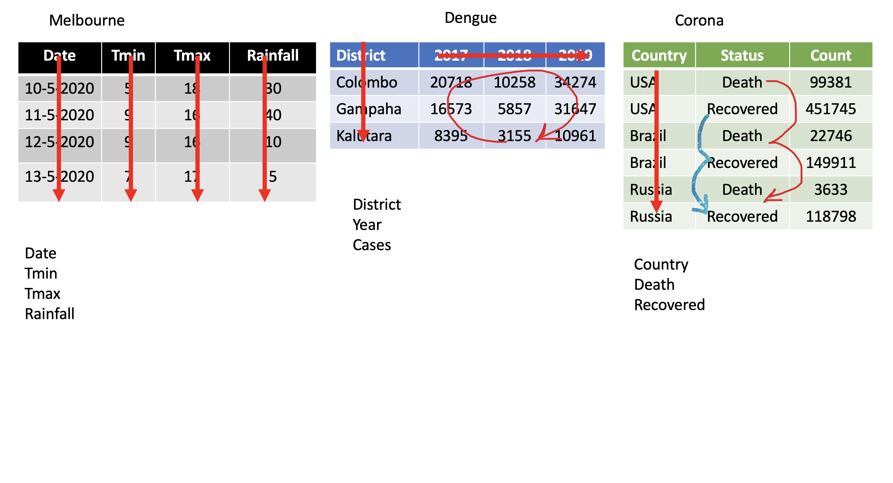

```{r setup, include=FALSE}
options(htmltools.dir.version = FALSE)
knitr::opts_chunk$set(
  fig.width=9, fig.height=3.5, fig.retina=3,
  out.width = "100%",
  cache = FALSE,
  echo = TRUE,
  message = FALSE, 
  warning = FALSE,
  fig.show = TRUE,
  hiline = TRUE
)
```

<style type="text/css">
.remark-slide-content {
    font-size: 35px;
}
</style>


```{css, echo = FALSE}
h1, #TOC>ul>li {
  color: #006837;
  font-weight: bold;
}
h2, #TOC>ul>ul>li {
  color:  #006837;
  #font-family:  "Times";
  font-weight: bold;
}
h3, #TOC>ul>ul>li {
  color: #ce1256;
  #font-family:  "Times";
  font-weight: bold;
}
```

```{r xaringan-themer, include=FALSE, warning=FALSE}
library(xaringanthemer)
#style_duo_accent(
#  primary_color = "#1381B0",
#  secondary_color = "#FF961C",
#  inverse_header_color = "#FFFFFF"
#)
style_solarized_light(text_font_google   = google_font("Josefin Sans", "400", "400i", "800i", "800"))
#style_mono_light(
#  base_color = "#1c5253",
#  header_font_google = google_font("Josefin Sans"),
#  text_font_google   = google_font("Josefin Sans", "400", "400i", "800i", "800"),
#  code_font_google   = google_font("Fira Mono")
#)
```

# Today's menu

.pull-left[

- pivot_wider

- pivot_longer

- seperate

- unite

]

.pull-right[
<center></center>
]

---


## Data Wrangling/ Data Munging

```{r, comment=NA, echo=FALSE, out.width="80%", }
knitr::include_graphics("tidyr/tidyr0.png")
```


**Reshaping Data (tidying your data)**

How to reshape your data in order to make the analysis easier?

---
## Tidy Data

```{r, comment=NA, echo=FALSE, out.width="80%"}
knitr::include_graphics("tidy-1.png")
```


- Each **variable** is placed in its column

- Each **observation** is placed in its own row

- Each **value** is placed in its own cell


---

# packages


```{r, comment=NA, message=FALSE, warning=FALSE}
library(tidyverse) #or library(tidyr)
library(magrittr)

```

 
---

# `tidyr` package


.pull-left[


]

.pull-right[
Hadley Wickham, Chief Scientist at RStudio  explaining tidyr at WOMBAT organized by Monash University, Australia.


Image taken by [Thiyanga S Talagala](https://thiyanga.netlify.app/) at WOMBAT Melbourne, Australia, December-2019

]
---


---

---

---

---

---
background-image: url(tidyr.jpeg)
background-size: 100px
background-position: 98% 6%

# tidyr verbs
.pull-left[

### Main verbs

- `pivot_longer` (gather)

- `pivot_wider` (spread)
]

.pull-right[

### Other

- `separate`

- `unite`
]

#### Input and Output 

Main input: `data frame` or `tibble`.

Output: `tibble`

---
class: duke-orange, center, middle

# `pivot_longer`
---
## `pivot_longer()`

- Turns columns into rows.

- From wide format to long format.

```{r, comment=NA, echo=FALSE, out.width="72%"}

```


---
## `pivot_longer()`
.pull-left[
```{r, comment=NA, warning=FALSE, message=FALSE}
dengue <- tibble( dist = c("Colombo", "Gampaha", "Kalutara"), 
                  '2017' = c(20718, 10258, 34274), 
                  '2018' = c(16573, 5857, 31647), 
                  '2019' = c(8395, 3155, 10961)); 
dengue
```

]

.pull-right[

```{r, comment=NA, warning=FALSE, message=FALSE}
dengue %>% 
  pivot_longer(2:4,
               names_to="Year", 
               values_to = "Dengue counts")
```
]
---
class: duke-orange, center, middle

# `pivot_wider`

---

# `pivot_wider()` 

- From long to wide format.


---

# `pivot_wider()` 


```{r, comment=NA}
Corona <- tibble(
country = rep(c("USA", "Brazil", "Russia"), each=2),
status = rep(c("Death", "Recovered"), 3),
count = c(99381, 451745, 22746, 149911, 3633, 118798))
```


```{r, comment=NA}
Corona 
```

---

# `pivot_wider()` 

.pull-left[
```{r, comment=NA}
Corona 
```
]

.pull-right[

```{r, comment=NA, message=FALSE, warning=FALSE}
Corona %>% 
  pivot_wider(names_from=status, 
              values_from=count)

```


]


---

# Assign a name:

```r
*corona_wide_format <- Corona %>% 
  pivot_wider(names_from=status, 
  values_from=count)
*corona_wide_format

```


```{r, comment=NA, message=FALSE, warning=FALSE, echo=FALSE}
corona_wide_format <- Corona %>% 
  pivot_wider(names_from=status, 
              values_from=count)
corona_wide_format 

```

---

# `pivot_longer` vs `pivot_wider`


---
# `pivot_longer` and `pivot_wider`


```{r, comment=NA}
profit <- tibble(
year = c(2015, 2015, 2015, 2015, 2016, 2016, 2016),
quarter = c( 1, 2, 3, 4, 2, 3, 4),
income = c(2, NA, 3, NA, 4, 5, 6)
)
profit
```
---
# `pivot_longer` and `pivot_wider` 

.left-plot[

```{r, comment=NA, echo=FALSE, comment=NA}
profit <- tibble(
year = c(2015, 2015, 2015, 2015, 2016, 2016, 2016),
quarter = c( 1, 2, 3, 4, 2, 3, 4),
income = c(2, NA, 3, NA, 4, 5, 6)
)
profit
```
]

.right-plot[

```{r, comment=NA, message=FALSE, warning=FALSE}
profit %>%
pivot_wider(names_from = year, values_from = income)
```
]
---

# Missing values

.left-plot[

```{r, comment=NA, message=FALSE, warning=FALSE, echo=FALSE}
profit %>%
pivot_wider(names_from = year, values_from = income)
```
]

.right-plot[
```r
profit %>%
pivot_wider(names_from = year, values_from = income) %>%
*pivot_longer(
*cols = c(`2015`, `2016`),
*names_to = "year",
*values_to = "income",
*values_drop_na = TRUE
)
```

```{r, echo=FALSE, comment=NA, message=FALSE}
profit %>%
pivot_wider(names_from = year, values_from = income) %>%
pivot_longer(
cols = c(`2015`, `2016`),
names_to = "year",
values_to = "income",
values_drop_na = TRUE
)
```
]
---
class: duke-orange, center, middle

# `separate`
---

# `separate()`

- Separate one column into several columns.


```{r, comment=NA, message=FALSE}
Melbourne <- 
  tibble(Date = c("10-5-2020", "11-5-2020", "12-5-2020","13-5-2020"),
         Tmin = c(5, 9, 9, 7), Tmax = c(18, 16, 16, 17),
         Rainfall= c(30, 40, 10, 5)); Melbourne
```

---

`separate()`: Separate one column into several columns.


```{r, comment=NA, message=FALSE, echo=FALSE}
Melbourne <- 
  tibble(Date = c("10-5-2020", "11-5-2020", "12-5-2020","13-5-2020"),
         Tmin = c(5, 9, 9, 7), Tmax = c(18, 16, 16, 17),
         Rainfall= c(30, 40, 10, 5)); Melbourne
```


```{r, comment=NA, message=FALSE}
Melbourne %>% separate(Date, into=c("day", "month", "year"), sep="-")
```


---

 `separate()`


```{r, comment=NA, message=FALSE, warning=FALSE}
df <- data.frame(x = c(NA, "a.b", "a.d", "b.c"))
df
df %>% separate(x, c("Text1", "Text2"))
```

---
`separate()`


```{r, comment=NA}
tbl <- tibble(input = c("a", "a b", "a-b c", NA)); tbl
```

--

```{r, comment=NA}
tbl %>% separate(input, c("Input1", "Input2"))
```

---
 `separate()`


```{r, comment=NA}
tbl <- tibble(input = c("a", "a b", "a-b c", NA)); tbl
```

--

```r
tbl %>% separate(input, c("Input1", "Input2", "Input3"))*\
```

```{r, comment=NA, echo=FALSE}
tbl %>% separate(input, c("Input1", "Input2", "Input3"))
```

---

class: duke-orange, center, middle

# `unite`

---
# `unite()`

- Unite several columns into one.

.pull-left[
```{r, comment=NA, warning=FALSE, message=FALSE}
projects <- tibble(
  Country = c("USA", "USA", "AUS", "AUS"),
  State = c("LA", "CO", "VIC", "NSW"),
  Cost = c(1000, 11000, 20000,30000)
)
projects
```
]


---
 `unite()`


```{r, echo=FALSE, comment=NA}
projects
```

```{r, comment=NA, warning=FALSE, message=FALSE}

projects %>% unite("Location", c("State", "Country"))
```

---
 `unite()`

```{r, echo=FALSE, comment=NA}
projects
```


```r
projects %>% unite("Location", c("State", "Country"),
*                   sep="-")
```

```{r, comment=NA, warning=FALSE, message=FALSE, echo=FALSE}
projects %>% unite("Location", c("State", "Country"),
                   sep="-")
```


---
# `separate`  vs  `unite`


---
class: center, middle


Slides available at: hellor.netlify.app

All rights reserved by [Thiyanga S. Talagala](https://thiyanga.netlify.com/)
