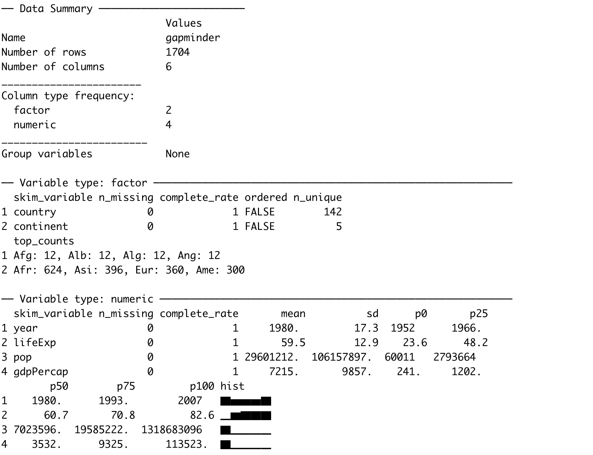

```{r setup, include=FALSE}
options(htmltools.dir.version = FALSE)
knitr::opts_chunk$set(
  fig.width=9, fig.height=3.5, fig.retina=3,
  out.width = "100%",
  cache = FALSE,
  echo = TRUE,
  message = FALSE, 
  warning = FALSE,
  fig.show = TRUE,
  hiline = TRUE
)
```

<style type="text/css">
.remark-slide-content {
    font-size: 35px;
}
</style>


```{css, echo = FALSE}
h1, #TOC>ul>li {
  color: #006837;
  font-weight: bold;
}
h2, #TOC>ul>ul>li {
  color:  #006837;
  #font-family:  "Times";
  font-weight: bold;
}
h3, #TOC>ul>ul>li {
  color: #ce1256;
  #font-family:  "Times";
  font-weight: bold;
}
```

```{r xaringan-themer, include=FALSE, warning=FALSE}
library(xaringanthemer)
#style_duo_accent(
#  primary_color = "#1381B0",
#  secondary_color = "#FF961C",
#  inverse_header_color = "#FFFFFF"
#)
style_solarized_light(text_font_google   = google_font("Josefin Sans", "400", "400i", "800i", "800"))
#style_mono_light(
#  base_color = "#1c5253",
#  header_font_google = google_font("Josefin Sans"),
#  text_font_google   = google_font("Josefin Sans", "400", "400i", "800i", "800"),
#  code_font_google   = google_font("Fira Mono")
#)
```

# Today's menu

.pull-left[

- pivot_wider

- pivot_longer

- seperate

- unite

]

.pull-right[
<center></center>
]

---


# packages


```{r, comment=NA, message=FALSE, warning=FALSE}
library(tidyverse) # TO obtain dplyr
library(magrittr)
```

 

---

# Dataset

```{r, comment=NA, message=FALSE}
library(gapminder)
str(gapminder)
head(gapminder)
```

---
# Dataset (cont.)

```{r, comment=NA, message=FALSE}
glimpse(gapminder)
```

---
# Dataset (cont.)

```{r, comment=NA, message=FALSE}
tbl_df(gapminder)
```

---

# Dataset (cont.)

```{r, comment=NA, out.height="50%", eval=FALSE}
library(skimr)
skim(gapminder)
```



---
background-image: url(dplyr.png)
background-size: 100px
background-position: 98% 6%


# `dplyr` verbs

.pull-left[
- `filter`

- `select`

- `mutate`

- `summarise`
]

.pull-right[

- `arrange`

- `group_by`

- `rename`

]

---
background-image: url(dplyr.png)
background-size: 70px
background-position: 98% 6%


# `filter`: Picks observations by their values.

- Takes logical expressions and returns the rows for which all are `TRUE`.

```{r, comment=NA, message=FALSE}
filter(gapminder, lifeExp < 50)
```

---
background-image: url(dplyr.png)
background-size: 70px
background-position: 98% 6%

# `filter` (cont)


```{r, comment=NA, message=FALSE}
# gapminder %>% filter(country == "Sri Lanka")
filter(gapminder, country == "Sri Lanka")
```

---
background-image: url(dplyr.png)
background-size: 70px
background-position: 98% 6%

# `filter` (cont)


```{r, comment=NA, message=FALSE}
filter(gapminder, country %in% c("Sri Lanka", "Australia"))
```

---
background-image: url(dplyr.png)
background-size: 70px
background-position: 98% 6%

# `filter` (cont)

```r
filter(gapminder, country %in% c("Sri Lanka", "Australia")) %>%
* head()
```

```{r, comment=NA, message=FALSE, echo=FALSE}
filter(gapminder, country %in% c("Sri Lanka", "Australia")) %>%
 head()
```

---
```r
filter(gapminder, country %in% c("Sri Lanka", "Australia")) %>%
* tail()
```

```{r, comment=NA, message=FALSE, echo=FALSE}
filter(gapminder, country %in% c("Sri Lanka", "Australia")) %>%
 tail()
```
---
background-image: url(dplyr.png)
background-size: 70px
background-position: 98% 6%

# `select`: Picks variables by their names.


```{r, comment=NA, message=FALSE}
head(gapminder, 3)
```

```{r, comment=NA, message=FALSE, warning=FALSE}
select(gapminder, year:gdpPercap)
```

---
background-image: url(dplyr.png)
background-size: 70px
background-position: 98% 6%

# `select` (cont.)


```{r, comment=NA, message=FALSE}
head(gapminder, 3)
```

```{r, comment=NA, message=FALSE, warning=FALSE}
select(gapminder, year, gdpPercap)
```

---
background-image: url(dplyr.png)
background-size: 70px
background-position: 98% 6%

# `select` (cont.)


```{r, comment=NA, message=FALSE}
head(gapminder, 3)
```

```{r, comment=NA, message=FALSE, warning=FALSE}
select(gapminder, -c(year, gdpPercap))
```

---

background-image: url(dplyr.png)
background-size: 70px
background-position: 98% 6%

# `select` (cont.)


```{r, comment=NA, message=FALSE}
head(gapminder, 3)
```

```{r, comment=NA, message=FALSE, warning=FALSE}
select(gapminder, -(year:gdpPercap))
```


---
background-image: url(dplyr.png)
background-size: 70px
background-position: 98% 6%

# `mutate`

- Creates new variables with functions of existing variables

```{r, comment=NA, message=FALSE, warning=FALSE}
gapminder %>% mutate(gdp = pop * gdpPercap)
```

---
background-image: url(dplyr.png)
background-size: 70px
background-position: 98% 6%

# `summarise`(British) or `summarize` (US)

- Collapse many values down to a single summary

```{r, comment=NA, message=FALSE, warning=FALSE}
gapminder %>%
  summarise(
    lifeExp_mean=mean(lifeExp),
    pop_mean=mean(pop),
    gdpPercap_mean=mean(gdpPercap))
```


---

background-image: url(dplyr.png)
background-size: 70px
background-position: 98% 6%

# `arrange`

- Reorder the rows

```{r, comment=NA, message=FALSE, warning=FALSE}
arrange(gapminder, desc(lifeExp))
```


---

background-image: url(dplyr.png)
background-size: 70px
background-position: 98% 6%

# `group_by`

- Takes an existing tibble and converts it into a grouped tibble where operations are performed "by group". ungroup() removes grouping.

```{r, comment=NA, message=FALSE, warning=FALSE}
Japan_SL <- filter(gapminder, country %in% c("Japan", "Sri Lanka"))
Japan_SL %>% head()
```


---

# `group_by`

```{r, comment=NA, message=FALSE, warning=FALSE}
Japan_SL_grouped <- Japan_SL %>% group_by(country)
Japan_SL_grouped
```

---
background-image: url(dplyr.png)
background-size: 70px
background-position: 98% 6%

# `group_by` (cont.)


```{r, comment=NA, message=FALSE, warning=FALSE}
Japan_SL %>% summarise(mean_lifeExp=mean(lifeExp))
```


```{r, comment=NA, message=FALSE, warning=FALSE}
Japan_SL_grouped %>% summarise(mean_lifeExp=mean(lifeExp))
```


---
background-image: url(dplyr.png)
background-size: 70px
background-position: 98% 6%

# `rename`

- Rename variables

```{r, comment=NA, message=FALSE}
head(gapminder, 3)
```


```{r, comment=NA, message=FALSE, warning=FALSE}
rename(gapminder, `life expectancy`=lifeExp,
       population=pop) # new_name = old_name
```

---
background-image: url(dplyr.png)
background-size: 70px
background-position: 98% 6%

# Combine multiple operations


```{r, comment=NA, message=FALSE}
gapminder %>%
filter(country == 'China') %>% head(2)
```


```{r, comment=NA, message=FALSE}
gapminder %>%
filter(country == 'China') %>% summarise(lifemax=max(lifeExp))
```

---
background-image: url(dplyr.png)
background-size: 70px
background-position: 98% 6%

# Combine multiple operations (cont.)

```r
gapminder %>%
filter(country == 'China') %>%
*filter(lifeExp == max(lifeExp))
```

```{r, comment=NA, message=FALSE, echo=FALSE}
gapminder %>%
filter(country == 'China') %>%
filter(lifeExp == max(lifeExp))
```

---
background-image: url(dplyr.png)
background-size: 70px
background-position: 98% 6%

# Combine multiple operations

```{r, comment=NA}
gapminder %>%
filter(continent == 'Asia') %>%
group_by(country) %>%
filter(lifeExp == max(lifeExp)) %>%
arrange(desc(year))
```

---

class: duke-orange, center, middle

# Combine Data Sets


---

# Combine Data Sets

.pull-left[
### Mutating joins

- `left_join`

- `right_join`

- `inner_join`

- `full_join`


]

.pull-right[

### Set operations

- `intersect`

- `union`

### Binding

- `bind_rows`

- `bind_cols`

]

---
# `left_join`

```{r, comment=NA, message=FALSE, warning=FALSE}
first <- tibble(x1=c("A", "B", "C"), x2=c(1, 2, 3))
second <- tibble(x1=c("A", "B", "D"), x3=c("red", "yellow" , "green"))
```

.pull-left[

```{r, comment=NA, message=FALSE}
first


```

]

.pull-right[

```{r, comment=NA, message=FALSE}
second

```


]

---

# `left_join`

.pull-left[

```{r, comment=NA, message=FALSE}
first
second

```

]

.pull-right[

```{r, comment=NA, message=FALSE}
left_join(first, second, by="x1")
```
]


---
# `right_join`

```{r, comment=NA, message=FALSE, warning=FALSE}
first <- tibble(x1=c("A", "B", "C"), x2=c(1, 2, 3))
second <- tibble(x1=c("A", "B", "D"), x3=c("red", "yellow" , "green"))
```

.pull-left[

```{r, comment=NA, message=FALSE}
first

```

]

.pull-right[

```{r, comment=NA, message=FALSE}
second

```


]

---
# `right_join`

.pull-left[

```{r, comment=NA, message=FALSE}
first
second

```

]

.pull-right[

```{r, comment=NA, message=FALSE}
right_join(first, second, by="x1")
```
]
---
# `inner_join`

```{r, comment=NA, message=FALSE, warning=FALSE}
first <- tibble(x1=c("A", "B", "C"), x2=c(1, 2, 3))
second <- tibble(x1=c("A", "B", "D"), x3=c("red", "yellow" , "green"))
```

.pull-left[

```{r, comment=NA, message=FALSE}
first


```

]

.pull-right[

```{r, comment=NA, message=FALSE}
second

```
]

---
# `inner_join`

.pull-left[

```{r, comment=NA, message=FALSE}
first
second

```

]

.pull-right[

```{r, comment=NA, message=FALSE}
inner_join(first, second, by="x1")
```
]
---

# `full_join`

```{r, comment=NA, message=FALSE, warning=FALSE}
first <- tibble(x1=c("A", "B", "C"), x2=c(1, 2, 3))
second <- tibble(x1=c("A", "B", "D"), x3=c("red", "yellow" , "green"))
```

.pull-left[

```{r, comment=NA, message=FALSE}
first


```

]

.pull-right[

```{r, comment=NA, message=FALSE}

second

```
]

---


# `full_join`

.pull-left[

```{r, comment=NA, message=FALSE}
first
second

```

]

.pull-right[

```{r, comment=NA, message=FALSE}
full_join(first, second, by="x1")
```
]
---
# Set operations

Two compatible data sets. Column names are the same.

```{r, comment=NA, message=FALSE, warning=FALSE}
first <- tibble(x1=c("A", "B", "C"), x2=c(1, 2, 3))
second <- tibble(x1=c("D", "B", "C"), x2=c(10, 2, 3))
```

.pull-left[


```{r, comment=NA, message=FALSE}
first


```

]

.pull-right[
```{r, comment=NA, message=FALSE}
second

```
]

---

# Set operations

.pull-left[


```{r, comment=NA, message=FALSE}
first
second

```

]

.pull-right[
**intersect**
```{r, comment=NA, message=FALSE}
intersect(first, second)
```


]
---


# Set operations

.pull-left[


```{r, comment=NA, message=FALSE}
first
second

```

]

.pull-right[


**union**
```{r, comment=NA, message=FALSE}
union(first, second)
```
]
---

# Set operations (cont.)

Two compatible data sets. Column names are the same.

```r
first <- tibble(x1=c("A", "B", "C"), x2=c(1, 2, 3))
*second <- tibble(x1=c("D", "B", "C"), x2=c(10, 20, 30))
```

```{r, comment=NA, message=FALSE, warning=FALSE, echo=FALSE}
first <- tibble(x1=c("A", "B", "C"), x2=c(1, 2, 3))
second <- tibble(x1=c("D", "B", "C"), x2=c(10, 20, 30))
```

.pull-left[


```{r, comment=NA, message=FALSE}
first


```

]

.pull-right[
```{r, comment=NA, message=FALSE}

second

```
]


---
# Set operations (cont.)


.pull-left[


```{r, comment=NA, message=FALSE}
first
second

```

]

.pull-right[
**intersect**
```{r, comment=NA, message=FALSE}
intersect(first, second)
```


]

---

# Set operations (cont.)


.pull-left[


```{r, comment=NA, message=FALSE}
first
second

```

]

.pull-right[

**union**
```{r, comment=NA, message=FALSE}
union(first, second)
```
]


---


# Set operations (cont.)

```r
first <- tibble(x1=c("A", "B", "C"), x2=c(1, 2, 3))
*second <- tibble(x1=c("D", "B", "C"), x2=c(10, 20, 30))
```

```{r, comment=NA, message=FALSE, warning=FALSE, echo=FALSE}
first <- tibble(x1=c("A", "B", "C"), x2=c(1, 2, 3))
second <- tibble(x1=c("D", "B", "C"), x2=c(10, 20, 30))
```

.pull-left[

```{r, comment=NA, message=FALSE}
first


```

]

.pull-right[

```{r, comment=NA, message=FALSE}
second


```

]

---

# Set operations (cont.)


.pull-left[


```{r, comment=NA, message=FALSE}
first
second

```

]

.pull-right[

**union**
```{r, comment=NA, message=FALSE}
union(first, second)
```


]

---

# Set operations (cont.)


.pull-left[


```{r, comment=NA, message=FALSE}
first
second

```

]

.pull-right[


**intersect**
```{r, comment=NA, message=FALSE}
intersect(first, second)
```


]


---

# Binding


```{r, comment=NA, message=FALSE, warning=FALSE}
first <- tibble(x1=c("A", "B", "C"), x2=c(1, 2, 3))
second <- tibble(x1=c("D", "B", "C"), x2=c(10, 20, 30))
```

.pull-left[


```{r, comment=NA, message=FALSE}
first


```

]

.pull-right[

```{r, comment=NA, message=FALSE}
second


```
]

---


# Binding

.pull-left[


```{r, comment=NA, message=FALSE}
first
second

```

]

.pull-right[
**bind_rows**
```{r, comment=NA, message=FALSE}
bind_rows(first, second)
```


]


---
# Binding (cont.)


```{r, comment=NA, message=FALSE, warning=FALSE}
first <- tibble(x1=c("A", "B", "C"), x2=c(1, 2, 3))
second <- tibble(x1=c("D", "B", "C"), x2=c(10, 20, 30))
```

.pull-left[


```{r, comment=NA, message=FALSE}
first

```

]

.pull-right[
```{r, comment=NA, message=FALSE}

second

```
]


---
# Binding (cont.)

.pull-left[


```{r, comment=NA, message=FALSE}
first
second

```

]

.pull-right[
**bind_cols**
```{r, comment=NA, message=FALSE}
bind_cols(first, second)
```
]

---

background-image: url('dplyrcs1.png')
background-position: center
background-size: contain

---

background-image: url('dplyrcs2.png')
background-position: center
background-size: contain

---
class: center, middle


Slides available at: hellor.netlify.app

All rights reserved by [Thiyanga S. Talagala](https://thiyanga.netlify.com/)
