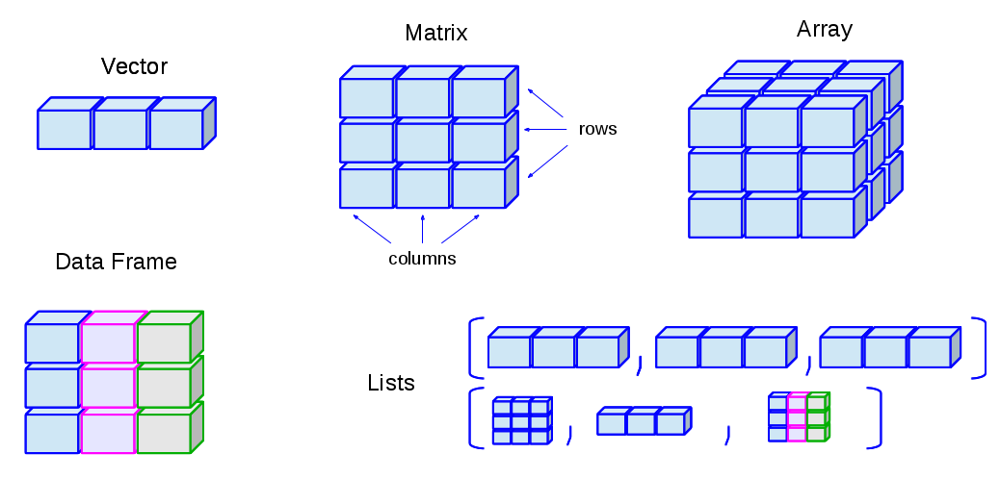
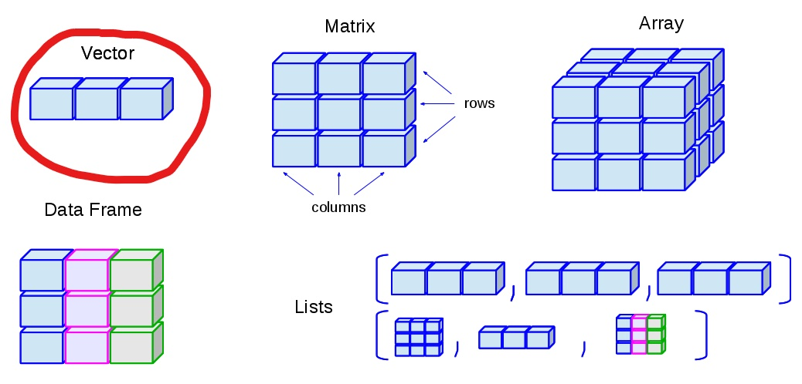
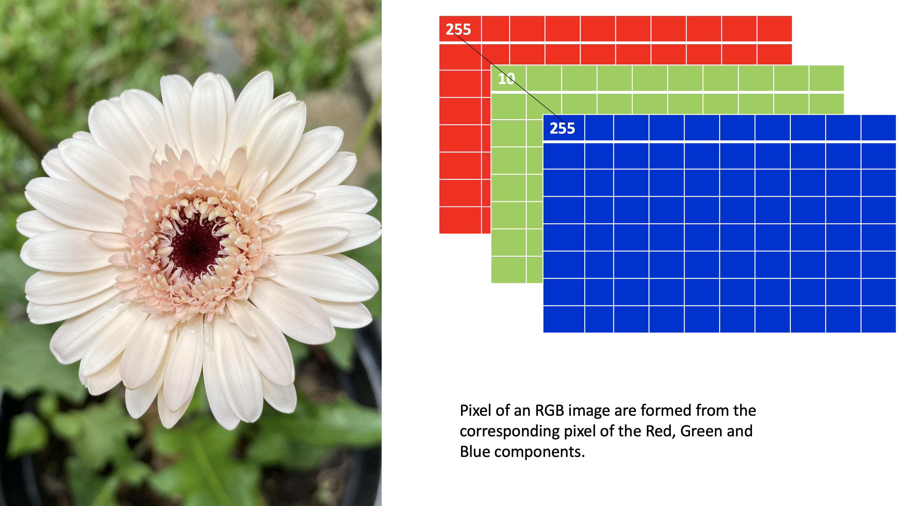
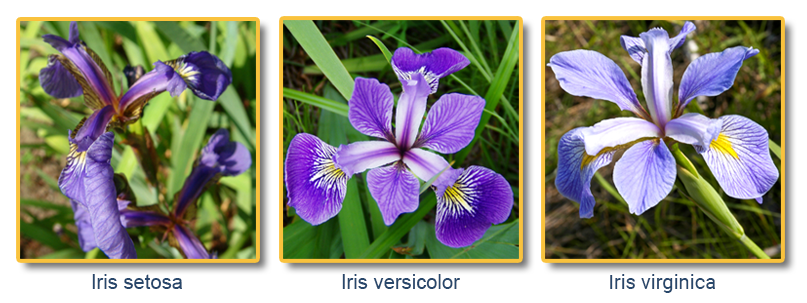

```{r setup, include=FALSE}
options(htmltools.dir.version = FALSE)
knitr::opts_chunk$set(
  fig.width=9, fig.height=3.5, fig.retina=3,
  out.width = "100%",
  cache = FALSE,
  echo = TRUE,
  message = FALSE, 
  warning = FALSE,
  fig.show = TRUE,
  hiline = TRUE
)
```

<style type="text/css">
.remark-slide-content {
    font-size: 35px;
}
</style>

```{r xaringan-themer, include=FALSE, warning=FALSE}
library(xaringanthemer)
#style_duo_accent(
#  primary_color = "#1381B0",
#  secondary_color = "#FF961C",
#  inverse_header_color = "#FFFFFF"
#)
style_solarized_light(text_font_google   = google_font("Josefin Sans", "400", "400i", "800i", "800"))
#style_mono_light(
#  base_color = "#1c5253",
#  header_font_google = google_font("Josefin Sans"),
#  text_font_google   = google_font("Josefin Sans", "400", "400i", "800i", "800"),
#  code_font_google   = google_font("Fira Mono")
#)
```

# Today's menu

.pull-left[

- Vector

- Matrix

- Array

- Data Frame

- List

]

.pull-right[
<center></center>
]

---



Image Credit: venus.ifca.unican.es

---



Image Credit: venus.ifca.unican.es
---
# Recap

Write an R code to create the following vector?

```{r, echo=FALSE, comment=NA}
c(1:5, 5:1)
```

--

- Method 1

```r
c(1, 2, 3, 4, 5, 5, 4, 3, 2, 1)

```
--

- Method 2

```r
c(1:5, 5:1)
```

```{r, echo=FALSE}
library(countdown)
countdown(minutes = 2L, seconds = 00)
```

---
# Recap

- Name elements 

```{r, comment=NA}
a <- c(1:5, 5:1)
a
names(a) <- c("a1", "a2", "a3", "a4", "a5", "b1", "b2", "b3", "b4", "b5")
a
```

---


### Operations between vectors 

```{r,  comment=NA}
a
```

```{r, comment=NA}
a * c(10, 100)
```

---


class: inverse, center, middle

#  Vectors: subsetting

**Select some particular elements (i.e., a `subset`) from a vector.**


---
## Vectors: Subsetting

```{r, comment=NA}
myvec <- 1:20; myvec
```

--

```{r, comment=NA}
myvec[1]
```

--
```{r, comment=NA}
myvec[5:10]
```

---
## Vectors: Subsetting (cont.)

--
```{r, comment=NA}
myvec[-1]
```
--

```{r, comment=NA}
myvec[myvec > 3]
```

---

## vector subsetting - special cases

```{r, comment=NA}
myvec[0]
```

```{r, comment=NA}
myvec[]
myvec
```

---


- Extract elements present in vector `a` from `myvec` (cont.).

```{r, comment=NA}
a; myvec
myvec %in% a
myvec[myvec %in% a]
```


---

### Vectors: Subsetting (cont.)

```{r, comment=NA}
 myvec
b <- 100:105
b
myvec[myvec %in% b]
```

---
class: inverse, center, middle

# Your turn
---

1. Generate a sequence using the code `seq(from=1, to=10, by=1)`.

2. What other ways can you generate the same sequence? 

3. Using the function `rep` , create the below sequence 1, 2, 3, 4, 1, 2, 3, 4, 1, 2, 3, 4


```{r, echo=FALSE}
library(countdown)
countdown(minutes = 3L, seconds = 00)
```

---

## Changing values of a vector

.pull-left[
```{r, comment=NA}
covid <- c(100, 30, 40, 50, -1, 100)
covid
covid[1] <- 50000
covid
```

]

--
.pull-right[

```{r, comment=NA}
covid[covid < 0] <- 0
covid
covid[c(1, 2)] <- c(1000, 10000)
covid

```
]

---
background-image: url('horse.png')
background-position: center
background-size: cover


---

class: inverse, center, middle

# 2. Matrices
---

background-image: url('dataStructures.png')
background-position: center
background-size: contain

---

Matrix is a 2-dimentional and a homogeneous data structure

**Syntax to create a matrix**

```r
matrix_name <- matrix(vector_of_elements, 
                      nrow=number_of_rows,
                      ncol=number_of_columns,
                      byrow=logical_value, # If byrow=TRUE, then the matrix is filled in by row.
                      dimnames=list(rnames, cnames)) # To assign row names and columns
```

**Example**


```{r, comment=NA}
matrix(1:6, nrow=2, ncol=3)
```

---

cont.

```{r, comment=NA}
matrix(1:6, nrow=2)
matrix(1:6, ncol=3)

```


---

# Matrix fill by rows/ columns

```{r, comment=NA}
values <- c(10, 20, 30, 40)
matrix1 <- matrix(values, nrow=2) # Matrix filled by columns (default option)
matrix1
matrix2 <- matrix(values, nrow=2, byrow=TRUE) # Matrix filled by rows
matrix2
```

---

# Matrix fill by rows/ columns (cont.)

- byrow=TRUE: matrix is filled in by row

- byrow=FALSE: matrix is filled in by column

- Default is by column

---

# Naming matrix rows and columns

```{r, comment=NA}
rnames <- c("R1", "R2")
cnames <- c("C1", "C2")
matrix_with_names <- matrix(values, nrow=2, dimnames=list(rnames, cnames))
matrix_with_names
```

---

## `class` function on vectors vs matrices

.pull-left[

### with vectors

```{r, comment=NA}
vec <- 1:10
class(vec)

```


]

.pull-right[

### with matrices

```{r, comment=NA}
mat <- matrix(1:10, ncol=5)
class(mat)

```

]

---

class: inverse, center, middle

# Matrix: subsetting

---

# Matrix: subsetting

.pull-left[

```{r, comment=NA}
matrix1

```


]

.pull-right[

`matraix_name[i, ]` gives the ith row of a matrix

```{r, comment=NA}
matrix1[1, ]
```

`matraix_name[, j]` gives the jth column of a matrix

```{r, comment=NA}
matrix1[, 2]
```


]


---

# Matrix: subsetting (cont.)


`matraix_name[i, j]` gives the ith row and jth column element

.pull-left[

```{r, comment=NA}
matrix1
```


]

.pull-right[

```{r, comment=NA}
matrix1[1, 2]
```


```{r, comment=NA}
matrix1[1, c(1, 2)] 
```

]

---

**Beware!**

.pull-left[

```{r, comment=NA}

amat <- matrix(10:90, 3, 3); amat

bmat <- amat[1:2,]; bmat
class(bmat)


```

]


--

.pull-right[

```{r, comment=NA}

cmat <- amat[1,]; cmat
class(cmat)

dmat <- amat[, 1]; dmat
class(dmat)


```


]

---
**drop = FALSE**

.pull-left[

```{r, comment=NA}
cmat <- amat[1,]; cmat
class(cmat)
```

]

.pull-right[

```{r, comment=NA}
cmat <- amat[1, , drop = FALSE]; cmat
class(cmat)
```

]


---

## Diagonal elements

.pull-left[

```{r, comment=NA}
a <- matrix(1:9, ncol=3)
a

```


]

.pull-right[

```{r, comment=NA}
diag(a)

```


]

---

## Replacing elements in a matrix

.pull-left[
```{r, comment=NA}
a <- matrix(1:9, ncol=3)
a

a[1, 1] <- 100
a
```

]

.pull-right[

```{r, comment=NA}
diag(a) <- 0
a
```


]

---

# `cbind` and `rbind`

Matrices can be created by column-binding and row-binding with `cbind()` and `rbind()`

```{r, comment=NA}
x <- 1:3
y <- c(10, 100, 1000)
cbind(x, y) # binds matrices horizontally
rbind(x, y) #binds matrices vertically
```


---

# `cbind` and `rbind` (cont.)

.pull-left[

```{r, comment=NA}
a <- matrix(1:3, ncol=3)
a
b <- matrix(c(10, 100, 1000), ncol=3)
b

```

]

.pull-right[

```{r, comment=NA}
cbind(a, b) # binds matrices horizontally
rbind(a, b) #binds matrices vertically
```

]
---

class: inverse, center, middle

# Matrix operations


---

# Matrix operations

Transpose

```{r, comment=NA}
t(x)
```

Matrix multiplication

```{r, comment=NA}
y <- matrix(seq(10, 60, by=10), nrow=3)
z <- x %*% y
z
```


---
# Matrix operations (cont.)

- matrix inverse is solve()

Find x in: m*x=n

```r
solve(m, n)
```


---
class: inverse, center, middle

# Your turn

---

background-image: url('paper.png')
background-position: center
background-size: contain

```{r, echo=FALSE}
library(countdown)
countdown(minutes = 5L, seconds = 00)
```


---


Help:
$$\hat{\beta}=(X^TX)^{-1}X^TY$$


---

background-image: url('slr.png')
background-position: center
background-size: contain

```{r, echo=FALSE}
library(countdown)
countdown(minutes = 5L, seconds = 00)
```

---


.pull-left[

## Logical operators with matrices

```{r, comment=NA}
a <- matrix(c(1:12), nrow = 3, ncol = 4) 
a > 10
b <- matrix(1:4, ncol=4)

```

```{r, comment=NA, eval=FALSE}
a > b # Error 
```

]

.pull-right[

## %in% operator

```{r, comment=NA}

b %in% a
a %in% b
class(a %in% b)
```
]


---

class: inverse, center, middle

# 3. Arrays

---
background-image: url('dataStructures.png')
background-position: center
background-size: contain

Image Credit: venus.ifca.unican.es
---

## Array

- data structures for storing **higher** dimensional data.

- a **homogeneous** data structure.

- a special case of the array is the matrix.

```r
array(vector, dimensions, dimnames) #dimnames-as a list
```

```{r, comment=NA}
a <-  array(c(10, 20, 30, 40, 50, 60), c(1, 2, 3))

```

---

```{r, comment=NA}
a <-  array(c(10, 20, 30, 40, 50, 60), c(1, 2, 3))
a
```


---

background-image: url('array.png')
background-position: center
background-size: contain

## Array
---

## Subsetting arrays

.pull-left[

```{r, comment=NA}
a
```

]

.pull-right[

```{r, comment=NA}
a[1, 2, 3] 
a[, , 1] # Extract first entry
```
]
---

## Subsetting arrays (cont.)

.pull-left[

```{r, comment=NA}
a

```

]


.pull-right[

```{r, comment=NA}
a[1, ,] # All rows in each entry
```
]

---
class: inverse, center, middle

# Your turn

---

1. Create the following matrix using the `array` function

```{r, comment=NA}

matrix(1:20, ncol=5)
```

```{r, echo=FALSE}
library(countdown)
countdown(minutes = 2L, seconds = 00)
```

---

## Array with dimnames

```{r, comment=NA}
dim1 <- c("A1", "A2"); dim2 <- c("B1", "B2", "B3"); dim3 <- c("c1", "c2", "c3", "c4")
z <- array(1:24, c(2, 3, 4), dimnames = list(dim1, dim2, dim3))
z
```

---

```{r}
z
```

---





---

class: inverse, center, middle

# 4. Data Frames

---

background-image: url('dataStructures.png')
background-position: center
background-size: contain

---
# Data frames

- Rectangular arrangement of data with rows corresponding to observational units and columns corresponding to variables.

- More general than a matrix in that different columns can contain different modes of data.

- It’s similar to the datasets you’d typically see in SPSS and MINITAB.

- Data frames are the most common data structure you’ll deal with in R.


---


Image Credit: Hadley Wickham 

---
## Create a data frame

**Syntax**

```r
name_of_the_dataframe <- data.frame(
                          var1_name=vector of values of the first variable,
                          var2_names=vector of values of the second variable)

```

**Example**

```{r, comment=NA}
corona <- data.frame(ID=c("C001", "C002", "C003", "C004"),
                     Location=c("Beijing", "Wuhan", "Shanghai", "Beijing"),
                     Test_Results=c(FALSE, TRUE, FALSE, FALSE))
corona
```


To check if it is a dataframe

```{r, comment=NA}
is.data.frame(corona)

```

---

# Some useful functions with dataframes

```{r, comment=NA}
colnames(corona)
```

```{r, comment=NA}
length(corona)
dim(corona)
nrow(corona)
ncol(corona)
```
---

# Some useful functions with dataframes (cont.)

```{r, comment=NA}
summary(corona)
```

```{r, comment=NA}
str(corona)
```


---

## Convert a matrix to a dataframe
  
```{r, comment=NA}
mat <- matrix(1:16, ncol=4)
mat
mat_df <- as.data.frame(mat)
mat_df
```

---

## Subsetting data frames 

**Select rows**

.pull-left[
```{r, comment=NA}
head(mat_df) # default it shows 5 rows

head(mat_df, 3) # To extract only the first three rows 
```

]

.pull-right[

```{r, comment=NA}
tail(mat_df, 2)
```
]
---

## Subsetting data frames 

.pull-left[

```{r, comment=NA}
mat_df
```

]

.pull-right[

**To select some specific rows**

```{r, comment=NA}
mat_df[4, ]
index <- c(1, 3)
mat_df[index, ]

```

]

---
## Subsetting data frames: select columns

.pull-left[

```{r, comment=NA}
mat_df
```

]

.pull-right[

Select column(s) by variable names

```{r, comment=NA}
mat_df$V1 # Method 1

mat_df[, "V1"] # Method 2
```


]
---

## Subsetting data frames: select columns

.pull-left[

```{r, comment=NA}
mat_df
```

]

.pull-right[


Select column(s) by index

```{r, comment=NA}
mat_df[, 2]
```

]
---

class: inverse, center, middle

# Your turn
---
background-image: url('datafr.png')
background-position: center
background-size: contain

```{r, echo=FALSE}
library(countdown)
countdown(minutes = 3L, seconds = 00)
```

---
background-image: url('iris.jpg')
background-position: center
background-size: cover


**Built-in dataframes**


---
## Built-in dataframes

```{r}
data(iris)
```


.full-width[.content-box-blue[Use `help` function to find more about the iris dataset.]]

---
background-image: url('helpiris.png')
background-position: center
background-size: contain

---
# `iris` dataset

```{r, comment=NA}
head(iris)
```


---

```{r, comment=NA}
head(iris)
```


---

```{r, comment=NA}
head(iris)
```

- Introduced by Sir Ronald A. Fisher, 1936


---

Use	the	R	dataset	“iris”	to	answer	the	following	questions:

1. How many rows and columns does iris have?

2. Select the first 4 rows.

3. Select the last 6 rows.

4. Select rows 10 to 20, with all columns in the iris dataset.

5. Select rows 10 to 20 with only the Species, Petal.Width and Petal.Length.

```{r, echo=FALSE}
library(countdown)
countdown(minutes = 5L, seconds = 00)
```


---

cont.

6. Create a single vector (a new object) called ‘width’ that is the Sepal.Width column of iris.

7.  What are the column names and data types of the different columns in iris?

8. How many rows in the iris dataset have `Petal.Length` larger than 5 and `Sepal.Width` smaller than 3?


```{r, echo=FALSE}
library(countdown)
countdown(minutes = 5L, seconds = 00)
```
---

class: inverse, center, middle

# 5. List

---

background-image: url('dataStructures.png')
background-position: center
background-size: contain


---

# List

- Lists are heterogeneous

**Syntax**

```r
list_name <- list(entry1, entry2, entry3, ...)

```

**Example**

```{r, comment=NA}
first_list <-list(1:3, matrix(1:6, nrow=2), iris)

```

---

## List (str)

```{r, comment=NA}
first_list <-list(1:3, matrix(1:6, nrow=2), iris)
first_list
```
---

## Structure of a list

```{r, comment=NA}
str(first_list)
```

--
## Extract elements

```{r, comment=NA}
first_list[[1]]
first_list[[3]]$Species
```

---

# Name entries in a list

```{r, comment=NA}
first_list_with_names <-list(a=1:3, b=matrix(1:6, nrow=2), c=iris)
first_list_with_names
```
---

## Extract elements using names

```{r, comment=NA}
str(first_list_with_names)
```


```{r, comment=NA}
first_list_with_names$a
```


---

```{r, comment=NA}
first_list_with_names$c$Species
```

---

class: inverse, center, middle

# Your turn
---


```{r, comment=NA}
c("Jan","Feb","Mar"); matrix(c(3,9,5,1,-2,8), nrow = 2); list("green",12.3)
```

1. Create a list containing the above vector, matrix and the list.

2. Name the elements as `first`, `second` and `third`.


---


class: center, middle

## Thank you!

Slides available at: hellor.netlify.app

All rights reserved by [Thiyanga S. Talagala](https://thiyanga.netlify.app/)


