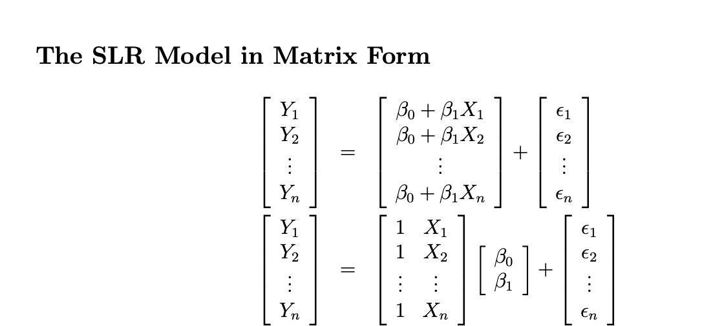

```{r setup, include=FALSE}
options(htmltools.dir.version = FALSE)
knitr::opts_chunk$set(
  fig.width=9, fig.height=3.5, fig.retina=3,
  out.width = "100%",
  cache = FALSE,
  echo = TRUE,
  message = FALSE, 
  warning = FALSE,
  fig.show = TRUE,
  hiline = TRUE
)
```

<style type="text/css">
.remark-slide-content {
    font-size: 30px;

}
</style>

```{r xaringan-themer, include=FALSE, warning=FALSE}
library(xaringanthemer)
#style_duo_accent(
#  primary_color = "#1381B0",
#  secondary_color = "#FF961C",
#  inverse_header_color = "#FFFFFF"
#)
style_solarized_light(text_font_google   = google_font("Josefin Sans", "400", "400i", "800i", "800"))
#style_mono_light(
#  base_color = "#1c5253",
#  header_font_google = google_font("Josefin Sans"),
#  text_font_google   = google_font("Josefin Sans", "400", "400i", "800i", "800"),
#  code_font_google   = google_font("Fira Mono")
#)
```

# Today's menu

.pull-left[


- User-written functions


]

.pull-right[
<center></center>
]

---

## Functions in R

👉🏻 Perform a specific task according to a set of instructions.

--
👉🏻  Some functions we have discussed so far,

> `c`, `matrix`, `array`, `list`, `data.frame`, `str`, `dim`, `length`, `nrow`, `plot`

--

👉🏻 In R, functions are **objects** of **class** *function*.

```{r, comment=NA}
class(length)
```

---

## Functions in R (cont.)

👉🏻 There are basically two types of functions:

    
 > 💻 Built-in functions 
  
      Already created or defined in the programming framework to make our work easier.
> 👨 User-defined functions
           
      Sometimes we need to create our own functions for a specific purpose.

---

.pull-left[

## Syntax

```r

name <- function(arg1, aug2, ...){

<FUNCTION BODY>

return(value)

}

```


]


.pull-right[

### Example

```{r}
cal_power <- function(x){

a <- x^2; b <- x^3
out <- c(a, b)
names(out) <- c("squared", "cubed")
out # or return(out)

}
```

### Evaluation

```{r, comment=NA}
cal_power(2)
```

]

--

👉 Functions are created using the `function()`

---

class: inverse

## Basic components of a function

**1. Function name**

---

.pull-left[

### Syntax

```r

name <- function(arg1, aug2, ...){

<FUNCTION BODY>

return(value)

}

```


]

.pull-right[

### Example

```{r, eval=FALSE}
*cal_power <- function(x){

a <- x^2
b <- x^3
out <- c(a, b)
names(out) <- c("squared", "cubed")
out # or return(out)

}
```

```{r, echo=FALSE}
cal_power <- function(x){

a <- x^2
b <- x^3
out <- c(a, b)
names(out) <- c("squared", "cubed")
out # or return(out)

}
```


]


.content-box-yellow[Function name: **`cal_power`**]

---

.content-box-yellow[Function name: **`cal_power`**]

 - use verbs, where possible
 
 - should be meaningful
 
 - use an underscore (_) to separate words
 
 - avoid names of built-in functions
 
 - start with lower case letters. Note that R is a case sensitive language


---

class: inverse

## Basic components of a function

1. Function name

**2. Function arguments/ inputs**


---


.pull-left[

### Syntax

```r

name <- function(arg1, aug2, ...){

<FUNCTION BODY>

return(value)

}

```


]

.pull-right[

### Example

```{r, eval=FALSE}
*cal_power <- function(x){

 a <- x^2
 b <- x^3
 out <- c(a, b)
 names(out) <- c("squared", "cubed")
 out # or return(out)

}
```

```{r, echo=FALSE}
cal_power <- function(x){

a <- x^2
b <- x^3
out <- c(a, b)
names(out) <- c("squared", "cubed")
out # or return(out)

}
```


]


.content-box-yellow[Function arguments: **`x`**]


- value passed to the function to obtain the function's result.

---

class: inverse

## Basic components of a function

1. Function name

2. Function arguments/ inputs

**3. Function body**

---


.pull-left[

### Syntax

```r

name <- function(arg1, aug2, ...){

<FUNCTION BODY>

return(value)

}

```


]

.pull-right[

### Example

```{r, eval=FALSE}
cal_power <- function(x){

* a <- x^2
* b <- x^3
* out <- c(a, b)
* names(out) <- c("squared", "cubed")
* out # or return(out)

}
```

```{r, echo=FALSE}
cal_power <- function(x){

a <- x^2
b <- x^3
out <- c(a, b)
names(out) <- c("squared", "cubed")
out # or return(out)

}
```


]


.content-box-yellow[Function body]

---

## Function with single line

.pull-left[

### Mathod 1

```r
cal_sqrt <- function(x){

x^2

}
```

]

.pull-right[

### Method 2

```r
cal_sqrt <- function(x) x^2
```

]

---

### Function body (Cont.)

- Place spaces around all operators such as =, +, -, <-, etc. 

- Exception: Do not place spaces around the operators :, :: and ::: 

```r
1+2 # bad
1 + 2 # good 
```
--

- Place a space before left parentheses except evaluating the function (function call)

```r
if (a > 2) # good
if(a>2) # bad

# Function call ----
rnorm(2) # good
rnorm (2) # bad
```

---

### Function body (Cont.)

- Use extra spacing to align multiple lines with <- or =

```r
# Bad ------
a = sum(c(1, 5, 8, 10))/2
sd = sd(c(1, 5, 8, 10))

# Good ------
a  = sum(c(1, 5, 8, 10))/2
sd = sd(c(1, 5, 8, 10))
```

---

### Function body (Cont.)

- Spacing inside parentheses or square brackets 

```r
# Good ---
a[1, 2]
a[1, ]
if(x < 2)

# Bad ---
a[1,2]
a[1,]
if(x<2)
if( x<2 )

```

---

### Function body (Cont.)

- {} do not go in one single line, always two lines

```r
# Good ---
if(y == 2){
print("even")
}

# Bad ---
if(y == 2){ print("even")}
```


---


background-image: url('dengue.jpg')
background-position: center
background-size: contain

---

**Load the mozzie dataset**

```{r, comment=NA}
library(mozzie)
data(mozzie); head(mozzie, 2)
```

--

> Use Min-Max transformation to rescale all the districts variables onto 0-1 range.

> Min-Max transformation is $\frac{x_i-min(x)}{max(x)-min(x)}$ where $x=(x_1, x_2, ...x_n)$.

---

** Min-Max transformation on `mozzie`**

```{r, comment=NA}
minmax.colombo <- (mozzie$Colombo - min(mozzie$Colombo, na.rm = TRUE)) /
  (max(mozzie$Colombo, na.rm=TRUE) - min(mozzie$Colombo, na.rm=TRUE))
head(minmax.colombo) # Colombo district
```

--

```{r, comment=NA}
minmax.gampaha <- (mozzie$Gampaha - min(mozzie$Gampaha, na.rm = TRUE)) /
  (max(mozzie$Gampaha, na.rm = TRUE) - min(mozzie$Gampaha, na.rm = TRUE)) 
head(minmax.gampaha) # Gampaha district
```


--
```{r, comment=NA}
minmax.kalutara <- (mozzie$Gampaha - min(mozzie$Kalutara, na.rm = TRUE)) /
  (max(mozzie$Kalutara, na.rm = TRUE) - min(mozzie$Kalutara, na.rm = TRUE))
head(minmax.kalutara) # Kalutara district
```

---
## Copying-and-pasting 

> You could easily make errors.

> A mistake copied becomes a mistake repeated.

--

## When should you write a function?

- Whenever you need to copy and paste a block of codes many times

      - A function is a reusable block of programming code designed to do a specific task.

- If you don't find a suitable built-in function to serve your purpose, you can write your own function

- To share your work with others


---

# Writing a function

### Step 1: Function name

```r
rescale_minmax

```
--

### Step 2: Assign your function to the name

```r
rescale_minmax <- 
```
--

### Step 3: Tell R that you are writing a function

```r_
rescale_minmax <- function() # Arguments/inputs should be defined inside ()

```
---

### Step 4: Curly braces define the start and the end of your work

```r
rescale_minmax <- function(){

# Task

# output

}

```


---
## Step 5: Function inputs, task and outputs

**Find all the inputs that correspond to a given function output?**

```{r, comment=NA, eval=FALSE}
# Colombo district
(mozzie$Colombo - min(mozzie$Colombo, na.rm = TRUE)) /
  (max(mozzie$Colombo, na.rm=TRUE) - min(mozzie$Colombo, na.rm=TRUE))

```

--
**Re-write the code with general names**

```{r, comment=NA, eval=FALSE}
x <- mozzie$Colombo
(x - min(x, na.rm = TRUE)) / (max(x, na.rm=TRUE) - min(x, na.rm=TRUE))

```

```{r, comment=NA, eval=T, echo=FALSE}
x <- mozzie$Colombo

```

--
**Remove duplication/ Make your code efficient and readable**

```{r, comment=NA}
rng <- range(x, na.rm = TRUE)
rng
```

```{r, comment=NA, eval=FALSE}
rng <- range(x, na.rm = TRUE)
(x - rng[1]) / (rng[2] - rng[1])

```

---

# Step 6: Complete your function

.pull-left[

**Type A**

```{r, comment=NA}
rescale_minmax <- function(x){
  rng <- range(x, na.rm = TRUE)
  (x - rng[1]) / (rng[2] - rng[1])
}

```

**Type B**

```{r, comment=NA}
rescale_minmax <- function(x){
  rng <- range(x, na.rm = TRUE)
  out.rescaled <- (x - rng[1]) / (rng[2] - rng[1])
  out.rescaled
}

```

]

--

.pull-right[


**Type C**

```{r, comment=NA}
rescale_minmax <- function(x){
  rng <- range(x, na.rm = TRUE)
  out.rescaled <- (x - rng[1]) / (rng[2] - rng[1])
  return(out.rescaled)
}

```


> In this situation Type A is the best.

]

---

# Step 7: Check your function with a few different inputs

```{r, comment=NA}
rescale_minmax <- function(x){
  rng <- range(x, na.rm = TRUE)
  (x - rng[1]) / (rng[2] - rng[1])
}

```

--

```{r, comment=NA}
rescale_minmax(c(1, 200, 250, 80, NA))

```

---

## Back to our original example

```{r, comment=NA}
minmax.colombo <- rescale_minmax(mozzie$Colombo)
head(minmax.colombo)
```

--

```{r, comment=NA}
minmax.gampaha <- rescale_minmax(mozzie$Gampaha)
head(minmax.gampaha)
minmax.kalutara <- rescale_minmax(mozzie$Kalutara)
head(minmax.kalutara)
```

---

# Move forward: When the requirements changes

```{r, comment=NA}
new.data.col <- c(400, 500, 350, 250, 60, 70, Inf)
rescale_minmax(new.data.col)

```

--

## Fix the code

```{r, comment=NA, eval=FALSE}
rescale_minmax <- function(x){
*  rng <- range(x, na.rm = TRUE, finite=TRUE)
  (x - rng[1]) / (rng[2] - rng[1])
}

```

```{r, comment=NA, eval=T, echo=F}
rescale_minmax <- function(x){
  rng <- range(x, na.rm = TRUE, finite=TRUE)
  (x - rng[1]) / (rng[2] - rng[1])
}

```

```{r, comment=NA}
new.data.col <- c(400, 500, 350, 250, 60, 70, Inf)
rescale_minmax(new.data.col)
```
---

class: duke-orange, center, middle

# Your turn

---

Rewrite `rescale_minmax` so that `-Inf` is set to 0, and `Inf` is mapped to 1.

```{r, echo=FALSE}
library(countdown)
countdown(minutes = 4L, seconds = 00)
```

---

class: duke-orange, center, middle

# Your turn

---

R for Data Science - Exercise 19.2.1, Question 3

```{r, echo=FALSE}
knitr::include_url('https://r4ds.had.co.nz/functions.html')

```

```{r, echo=FALSE}
library(countdown)
countdown(minutes = 5L, seconds = 00)
```

---

class: duke-orange, center, middle

# Your turn

---

R for Data Science - Exercise 19.2.1, Question 4

```{r, echo=FALSE}
knitr::include_url('https://r4ds.had.co.nz/functions.html')

```

```{r, echo=FALSE}
library(countdown)
countdown(minutes = 10L, seconds = 00)
```

---

background-image: url('laptop.jpg')
background-position: center
background-size: cover

.content-box-yellow[
# Functions are for humans and computers

- Descriptive names for variables.

- Comment your code.
]


---

class: duke-orange, center, middle

# Your turn

---

Write your own function to calculate parameter estimates of simple linear regression model.

Help:
$$\hat{\beta}=(X^TX)^{-1}X^TY$$




```{r, echo=FALSE}
library(countdown)
countdown(minutes = 5L, seconds = 00)
```

---

Write a function to calculate confidence intervals for mean.
$$\bar{x} \pm t_{\alpha/2, (n-1)}\frac{s}{\sqrt(n)}$$

```{r, echo=FALSE}
library(countdown)
countdown(minutes = 10L, seconds = 00)
```

---


## Function arguments

```{r, comment=NA}
cal_mean_ci <- function(x, conf){
  len.x <- length(x)
  se <- sd(x) / sqrt(len.x)
  alpha <- 1-conf
  mean(x) + se * qt(c(alpha / 2, 1 - alpha / 2), df = len.x-1)
  
}

data <- c(165, 170, 175, 180, 185)
cal_mean_ci(data, 0.95)
```

---

## Function with default values

```{r, comment=NA}
cal_mean_ci <- function(x, conf = 0.95){
  len.x <- length(x)
  se <- sd(x) / sqrt(len.x)
  alpha <- 1-conf
  mean(x) + se * qt(c(alpha / 2, 1 - alpha / 2), df = len.x-1)
  
}

cal_mean_ci(data)
cal_mean_ci(data, 0.99)
```

---
class: inverse, center, middle

## In-class questions

---

## Problem 1

Write a function to calculate the median.

help:

```{r, comment=NA}
5%%2

4%%2
```

Note: Do not use the built-in function `median` inside your function.

```{r, echo=FALSE}
library(countdown)
countdown(minutes = 8L, seconds = 00)
```

---

## Problem 2

Write a function to calculate the correlation coefficient

$$r=\frac{\sum_{i=1}^{n}(x_i-\bar{x})(y_i-\bar{y})}{\sqrt{\sum_{i=1}^n(x_i-\bar{x})^2\sum_{i=1}^n(y_i-\bar{y})^2}}$$

Do not use the function `cor` inside your function.

```{r, echo=FALSE}
library(countdown)
countdown(minutes = 8L, seconds = 00)
```

---

## Problem 3

Write a function to generate 100 random numbers from a normal distribution and plot the distribution of the random numbers. Your function should display the generated random numbers and the corresponding plot.


```{r, echo=FALSE}
library(countdown)
countdown(minutes = 10L, seconds = 00)
```

---

## Problem 4

Write a function compute z-score value of a A/L Mathematics student given the marks of the student. Assume

mean(Mathematics) = 60, sd(Mathematics) = 10,

mean(Chemistry) = 45, sd(Chemistry) = 20,

mean(Physics) = 55, sd(Physics) = 5.

```{r, echo=FALSE}
library(countdown)
countdown(minutes = 5L, seconds = 00)
```


---
background-image: url('PAGE-05.jpeg')
background-position: center
background-size: contain


---

## Local variables vs Global variables

in-class discussion using R Demo

---

class: center, middle

## Thank you!

Slides available at: hellor.netlify.app

All rights reserved by [Thiyanga S. Talagala](https://thiyanga.netlify.app/)


