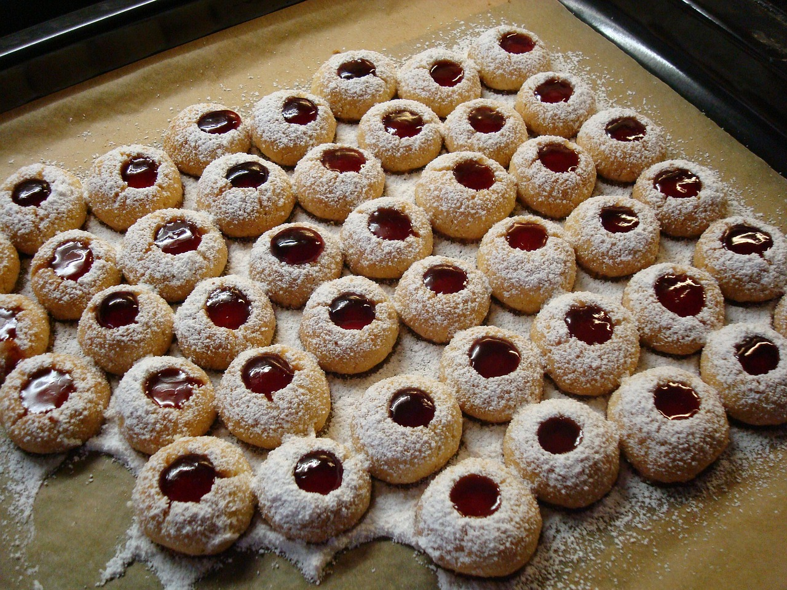

```{r setup, include=FALSE}
options(htmltools.dir.version = FALSE)
knitr::opts_chunk$set(
  fig.width=9, fig.height=3.5, fig.retina=3,
  out.width = "100%",
  cache = FALSE,
  echo = TRUE,
  message = FALSE, 
  warning = FALSE,
  fig.show = TRUE,
  hiline = TRUE
)
```

<style type="text/css">
.remark-slide-content {
    font-size: 30px;

}
</style>

```{r xaringan-themer, include=FALSE, warning=FALSE}
library(xaringanthemer)
#style_duo_accent(
#  primary_color = "#1381B0",
#  secondary_color = "#FF961C",
#  inverse_header_color = "#FFFFFF"
#)
style_solarized_light(text_font_google   = google_font("Josefin Sans", "400", "400i", "800i", "800"))
#style_mono_light(
#  base_color = "#1c5253",
#  header_font_google = google_font("Josefin Sans"),
#  text_font_google   = google_font("Josefin Sans", "400", "400i", "800i", "800"),
#  code_font_google   = google_font("Fira Mono")
#)
```

```{r xaringan-tachyons, echo=FALSE}
xaringanExtra::use_tachyons()
```

```{r xaringan-fit-screen, echo=FALSE}
xaringanExtra::use_fit_screen()
```

### Today's menu

**Control structures (loops/ conditional executions)**

.pull-left[


if, else

for

while

repeat

break

next

switch


]

.pull-right[


<top></top>


]


---
class: inverse, center, middle

# Conditional executions control the flow of the execution.
---
background-image: url(ifloop.jpeg)
background-size: cover

.bg-washed-green.b--dark-green.ba.bw2.br3.shadow-5.ph4.mt5[
Draw a star on star shaped cookies and draw a heart of heart shape cookies.

.tr[

]]


---
background-image: url(ifloop.jpeg)
background-size: cover

.bg-yellow.b--dark-yellow.ba.bw2.br3.shadow-5.ph4.mt5[

## if-else

.tr[


]]


.bg-washed-green.b--dark-green.ba.bw2.br3.shadow-5.ph4.mt5[
Draw a star on star shaped cookies and draw a heart of heart shape cookies.

.tr[

]]

---

.pull-left[

# if-else

```r
if (condition) {
    # do something
} else {
    # do something else
}

```

]

.pull-right[

Example

```{r, comment=FALSE}
test_even_odd <- function(x){
  if (x %% 2 == 0){
    print("even number")
  } else {
    print("odd number")
  }
}

```


```{r, comment=NA}
test_even_odd(5)
test_even_odd(6)
```

]
---

# `ifelse`: vectorization with `ifelse`

```r
ifelse(condition, TRUE condition output, FALSE condition output)

```

Example

```{r, comment=FALSE}
test_even_odd_v2 <- function(x){
  
  ifelse(x %% 2 == 0, "even number", "odd number")
  
}
```

```{r, comment=FALSE}
test_even_odd_v2(5)
test_even_odd_v2(c(1,6))

```

---

## Difference between `if, else` and `ifelse`

.pull-left[
**`if, else`**

```{r, comment=FALSE}
test_even_odd <- function(x){
  if (x %% 2 == 0) {
    print("even number")
  } else {
    print("odd number")
  }
}
```

```{r, comment=FALSE}
test_even_odd(5)
test_even_odd(c(1,6))

```

]

.pull-right[

**`ifelse`**

```{r, comment=FALSE}
test_even_odd_v2 <- function(x){
  ifelse (x %% 2 == 0, "even number", "odd number")
}

test_even_odd_v2(5)
test_even_odd_v2(c(1,6))

```


]

---

# Nested if-else

- Multiple conditions


```{r, comment=NA}
grade_marks <- function(marks){
  
  if (marks < 20) {
    "D"
  } else if (marks <= 50) {
    "C"
  } else if (marks <= 60) {
    "B"
  } else {
    "A"
  }
}

grade_marks(75)
```

---

class: inverse, center, middle

# Your turn

---

Write a function to count the number of even numbers in a vector.

```{r, echo=FALSE}
library(countdown)
countdown(minutes = 8L, seconds = 00)
```

---

R for Data Science-Exercises 9.4.4 - Q2

```{r, echo=FALSE}
knitr::include_url('https://r4ds.had.co.nz/functions.html')
```

Help:

`lubridate::now()` and `lubridate::hour()`

```{r, echo=FALSE}
library(countdown)
countdown(minutes = 10L, seconds = 00)
```

---

background-image: url(forloop.jpeg)
background-size: cover

.bg-washed-green.b--dark-green.ba.bw2.br3.shadow-5.ph4.mt5[

Decorate 50 cookies with jam.

.tr[

]]


---

background-image: url(forloop.jpeg)
background-size: cover

.bg-yellow.b--dark-yellow.ba.bw2.br3.shadow-5.ph4.mt5[

## for

.tr[


]]

.bg-washed-green.b--dark-green.ba.bw2.br3.shadow-5.ph4.mt5[

Decorate 50 cookies with jam.

.tr[

]]

---

# `for` loop

- execute a block of code a specific number of times or until the end of a sequence.

```{r, comment=NA}
for (i in 1:5) {
  print(i*100)
}

```


---
```{r, comment=NA, eval=FALSE}

continents <- c("Asia", "EU", "AUS", "NA", "SA", "Africa")

for (i in continents) {
  print(continents[i])
}

for (i in 1:4) {
  print(continents[i])
}

for (i in seq(continents)) {
  print(continents[i])
}

for (i in 1:4)  print(continents[i])

```

```{r, echo=FALSE, comment=NA}
continents <- c("Asia", "EU", "AUS", "NA", "SA", "Africa")
for (i in seq(continents)) {
  print(continents[i])
}

```

---

background-image: url(ifloop.jpeg)
background-size: cover


.bg-washed-green.b--dark-green.ba.bw2.br3.shadow-5.ph4.mt5[
Draw a star on star shaped cookies and draw a heart of heart shape on the first 20 cookies.

.tr[

]]


---

background-image: url(ifloop.jpeg)
background-size: cover

.bg-yellow.b--dark-yellow.ba.bw2.br3.shadow-5.ph4.mt5[

## nested loops

.tr[


]]


.bg-washed-green.b--dark-green.ba.bw2.br3.shadow-5.ph4.mt5[
Draw a star on star shaped cookies and draw a heart of heart shape on the first 20 cookies.

.tr[

]]

---

## Nested loops

```{r, comment=NA}
a <- 1:10

testfun <- function(x){
for (x in 1:5) {
  
   if (x %% 2 == 0) {
    print("even number")
  } else {
    print("odd number")
  }
  
}}

testfun(a)
```

---

# Nested loops

```{r, comment=NA}
mat <- matrix(1:6, ncol=2)
mat

for (i in 1:3) {
  for (j in 1:2) {
    print(mat[i, j])
  }
}

```

---

background-image: url(cookie9.jpeg)
background-size: cover

.bg-washed-green.b--dark-green.ba.bw2.br3.shadow-5.ph4.mt5[

Taste the cookies one by one until you find the star shaped cookie.

.tr[

]]


---

background-image: url(cookie9.jpeg)
background-size: cover

.bg-yellow.b--dark-yellow.ba.bw2.br3.shadow-5.ph4.mt5[

## while

.tr[


]]


.bg-washed-green.b--dark-green.ba.bw2.br3.shadow-5.ph4.mt5[

Taste the cookies one by one until you find the star shaped  cookie.

.tr[

]]

---

# while

.pull-left[

```{r, comment=NA}
i <- 1 # initial value

while (i != 10) {
  
  print(i)
  i <- i + 1 # increment
  
}


```
]

.pull-right[

```{r, comment=NA}
i <- 1 # initial value

while (i < 10) {
  
  print(i)
  i <- i + 1 # increment
  
}


```
]

---

class: inverse, center, middle

# Your turn


---

Can you guess the output?

```{r, comment=NA}
i <- 1 # initial value

while (i == 10) {
  
  print(i)
  i <- i + 1 # increment
  
}


```


```{r, echo=FALSE}
library(countdown)
countdown(minutes = 1L, seconds = 00)
```

---

class: inverse, center, middle

# Your turn


---

background-image: url(cookie9.jpeg)
background-size: cover

.bg-washed-green.b--dark-green.ba.bw2.br3.shadow-5.ph4.mt5[

Taste the cookies one by one until you find the strawberry flavour cookie.

.tr[

]]


---

background-image: url(cookie9.jpeg)
background-size: cover

.bg-yellow.b--dark-yellow.ba.bw2.br3.shadow-5.ph4.mt5[

## repeat-break

.tr[


]]


.bg-washed-green.b--dark-green.ba.bw2.br3.shadow-5.ph4.mt5[

Taste the cookies one by one until you find the strawberry flavour cookie.

.tr[

]]


---


background-image: url(cookie9.jpeg)
background-size: cover

.bg-yellow.b--dark-yellow.ba.bw2.br3.shadow-5.ph4.mt5[

## repeat-break

.tr[


]]


.bg-washed-green.b--dark-green.ba.bw2.br3.shadow-5.ph4.mt5[

Taste the cookies one by one until 8.00am

.tr[

]]


---

# repeat and break

- Iterate over a block of code multiple number of times. 

-  No condition check in repeat loop to exit the loop. 

- The only way to exit a repeat loop is to call break. 

---

## repeat and break

.pull-left[

Example 1

```{r, comment=NA}
x <- 5

repeat {
  print(x)
  x = x+1
  if (x == 10){
    break
  }
}

```
]

--
.pull-right[

Example 2

```{r, comment=NA}
set.seed(1)

repeat {
 x<-runif(1, 5, 10)
 print(x)
 if(x < 6.1){
   break
 }
}

```
]

---
background-image: url(decorating-2702974_1920.jpg)
background-size: cover

.bg-washed-green.b--dark-green.ba.bw2.br3.shadow-5.ph4.mt5[

Skip the cracked muffins and decorate the rest.

.tr[

]]

---

background-image: url(decorating-2702974_1920.jpg)
background-size: cover

.bg-yellow.b--dark-yellow.ba.bw2.br3.shadow-5.ph4.mt5[

## next

.tr[


]]

.bg-washed-green.b--dark-green.ba.bw2.br3.shadow-5.ph4.mt5[

Skip the cracked muffins and decorate the rest.

.tr[

]]


---

# Next

```{r, comment=NA}
for(i in 1:10) {
  if(i <= 5) {
  next # Skip the first 5 iterations
  }
print(i)
}

```

---


background-image: url(switch.jpeg)
background-size: cover


.bg-washed-green.b--dark-green.ba.bw2.br3.shadow-5.ph4.mt5[

Green base - roses, small - dots, etc..

.tr[

]]


---


background-image: url(switch.jpeg)
background-size: cover

.bg-yellow.b--dark-yellow.ba.bw2.br3.shadow-5.ph4.mt5[

## switch

.tr[


]]

.bg-washed-green.b--dark-green.ba.bw2.br3.shadow-5.ph4.mt5[

Green base - roses, small - dots, etc..

.tr[

]]


---

# switch 

When you want a function to do different things in different
circumstances, then the switch function can be useful.

```{r, comment=NA}
feelings <- c("sad", "afraid")

for (i in feelings){
  print(
  switch(i,
  happy = "I am glad you are happy",
  afraid = "There is nothing to fear",
  sad = "Cheer up",
  angry = "Calm down now"
  ))
}

```

---
class: center, middle

## Thank you!

Slides available at: hellor.netlify.app

All rights reserved by [Thiyanga S. Talagala](https://thiyanga.netlify.app/)


