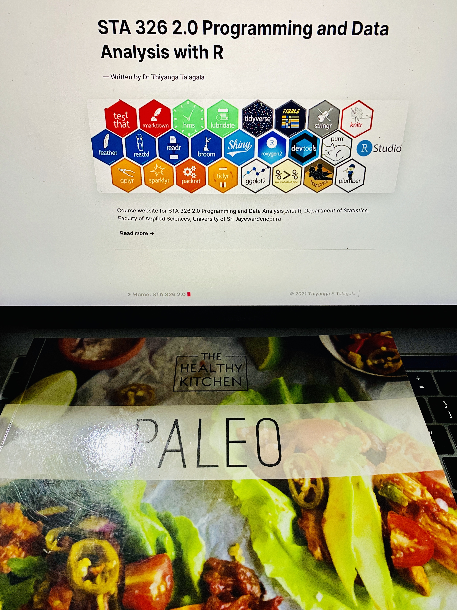
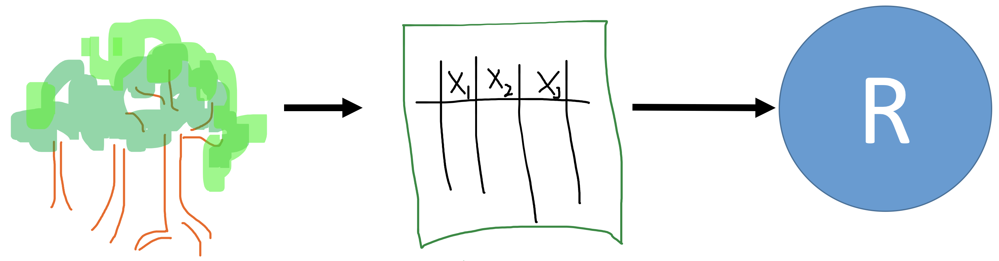
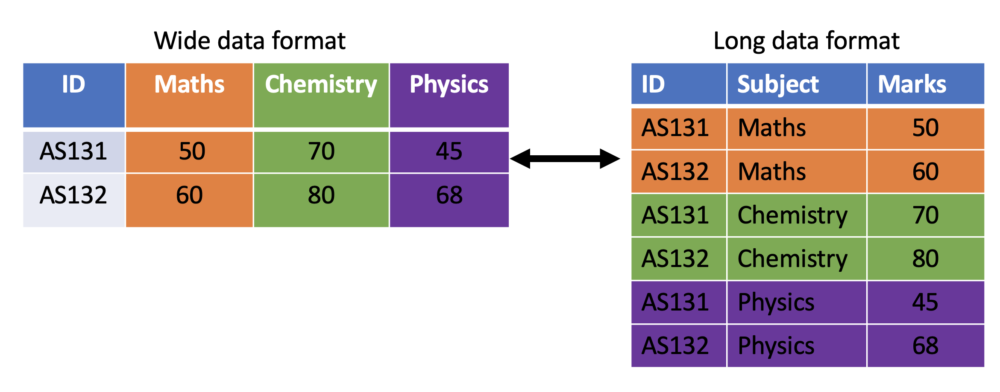
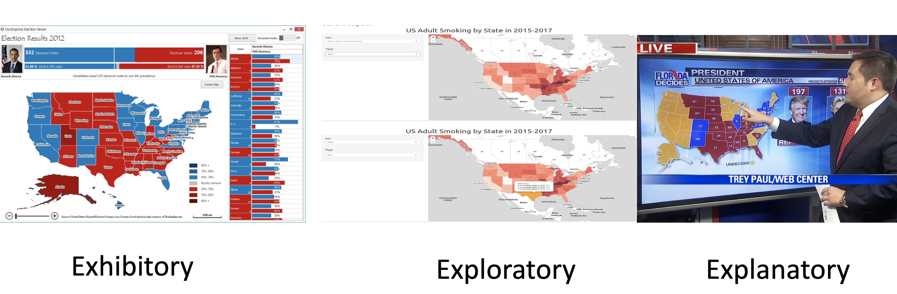
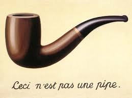

```{r setup, include=FALSE}
options(htmltools.dir.version = FALSE)
knitr::opts_chunk$set(
  fig.width=9, fig.height=3.5, fig.retina=3,
  out.width = "100%",
  cache = FALSE,
  echo = TRUE,
  message = FALSE, 
  warning = FALSE,
  fig.show = TRUE,
  hiline = TRUE
)
```

```{r xaringan-themer, include=FALSE, warning=FALSE}
library(xaringanthemer)
style_mono_accent(
  base_color = "#081d58",
  text_bold_color = "#ce1256",
  title_slide_text_color = "#edf8b1",
  header_font_google = google_font("Josefin Sans"),
  base_font_size = "18px",
  text_font_size = "1.5rem",
 # code_inline_font_size = "1em",
  code_font_size="1em"
 #text_font_google   = google_font("Montserrat", "300", "300i")
 # code_font_google   = google_font("Fira Mono")
)
```


### Today's menu


.pull-left[

1. What is the tidyverse?

2. Data science workflow

3. Tibble

4. Factor

5. Pipe


]

.pull-right[


<top></top>


]


---
background-image: url(tidyverse.jpeg)
background-size: 100px
background-position: 98% 6%
 
 # What is the tidyverse?

- Collection of essential R packages for data science.

- All packages share a common design philosophy, grammar, and data structures.


---

## Setup

```r
install.packages("tidyverse") # install tidyverse packages
library(tidyverse) # load tidyverse packages

```


---

background-image: url(workflowds.png)
background-position: center
background-size: contain

# Workflow

.footer-note[.tiny[.green[Image Credit: ][Wickham](https://clasticdetritus.com/2013/01/10/creating-data-plots-with-r/)]]

---
background-image: url(readr.png)
background-size: 100px
background-position: 98% 6%

# Workflow: import




---
background-image: url(tidyr.jpeg)
background-size: 100px
background-position: 98% 6%


---

background-image: url(tidyr.jpeg)
background-size: 100px
background-position: 98% 6%


# Workflow: tidy




---
background-image: url(dplyr.png)
background-size: 100px
background-position: 98% 6%


---
background-image: url(dplyr.png)
background-size: 100px
background-position: 98% 6%

# Workflow: transform


---
background-image: url(ggplot2.png)
background-size: 100px
background-position: 98% 6%


---
background-image: url(ggplot2.png)
background-size: 100px
background-position: 98% 6%


# Workflow: visualise

### Illustration

.pull-left[

```r
library(ggplot2)
ggplot(iris, 
aes(Sepal.Width, Sepal.Length, 
color=Species)) + 
geom_point() +
theme(aspect.ratio  = 1) +
scale_color_manual(values = 
c("#1b9e77", "#d95f02", "#7570b3"))
```
]

.pull-right[
```{r, comment=NA, echo=FALSE, fig.height=6}
library(ggplot2)
ggplot(iris, 
  aes(Sepal.Width, Sepal.Length, color=Species)) + 
  geom_point()+
  theme(aspect.ratio  = 1)+
  scale_color_manual(values = c("#1b9e77", "#d95f02", "#7570b3"))
```
]
---
background-image: url(purrr.png)
background-size: 100px
background-position: 98% 6%

# Workflow: model

```{r, echo=FALSE,  message=FALSE, warning=FALSE}
library(tidyverse)
library(magrittr)
```

## Illustration: Apply a linear model to each group
```{r, message=FALSE, warning=FALSE, comment=NA}
nested_iris <- group_by(iris, Species) %>% nest()
fit_model <- function(df) lm(Sepal.Length ~ Sepal.Width, data = df)
nested_iris <- nested_iris %>%
 mutate(model = map(data, fit_model))
```

---
```{r, comment=NA}
nested_iris$model[[1]] # To print other two models nested_iris$model[[2]] nested_iris$model[[3]]
```

---

# Workflow: communicate


---

# Workflow: communicate




---

# Workflow: R packages

---
background-image: url(tidyvflowpkg.png)
background-size: contain
background-position: center


---

class: duke-softblue,  middle, center

# 1. Tibble

# 2. Factor

# 3. Pipe
---

class: duke-orange, middle, center

# Tibble


---
background-image: url(tibble.png)
background-size: 100px
background-position: 98% 6%

# Tibble

- Tibbles are data frames.

- A modern re-imagining of data frames.

---

# Create a tibble

```{r, comment=NA, message=FALSE}
library(tidyverse) # library(tibble)
first.tbl <- tibble(height = c(150, 200, 160), weight = c(45, 60, 51))
first.tbl
```

```{r, comment=NA, message=FALSE}
class(first.tbl)
```

---

# Convert an existing dataframe to a tibble

```{r, comment=NA}
as_tibble(iris)

```

---

# Convert a tibble to a dataframe

```{r, comment=NA}
first.tbl <- tibble(height = c(150, 200, 160), weight = c(45, 60, 51))
class(first.tbl)
first.tbl.df <- as.data.frame(first.tbl)
class(first.tbl.df)
```

---
class: inverse, center, middle

# tibble vs data.frame

---


**tibble**

```{r, comment=NA}
first.tbl <- tibble(height = c(150, 200, 160), weight = c(45, 60, 51))
first.tbl
```


---

**data.frame**
```{r, comment=NA}
dataframe <- data.frame(height = c(150, 200, 160), weight = c(45, 60, 51))
dataframe
```

---


- You can create new variables that are functions of existing variables.

**tibble**

```{r, comment=NA}
first.tbl <- tibble(height = c(150, 200, 160), weight = c(45, 60, 51), 
                    bmi = (weight)/height^2)
first.tbl
```

---

**data.frame**

```{r, comment=NA, eval=FALSE}
df <- data.frame(height = c(150, 200, 160), weight = c(45, 60, 51), 
                    bmi = (weight)/height^2) # Not working
```

You will get an error message 

<span style="color:red">`Error in data.frame(height = c(150, 200, 160), weight = c(45, 60, 51),  : 
  object 'height' not found.`</span>


---

With `data.frame` this is how we should create a new variable from the existing columns.

```{r, comment=NA}
df <- data.frame(height = c(150, 200, 160), weight = c(45, 60, 51)) 
df$bmi <- (df$weight)/(df$height^2)
df
```

---


- In contrast to data frames, the variable names in tibbles can contain spaces.

**Example 1**

```{r, comment=NA}
tbl <- tibble(`patient id` = c(1, 2, 3))
tbl
```

---

```{r, comment=NA}
df <- data.frame(`patient id` = c(1, 2, 3))
df
```

---

- In contrast to data frames, the variable names in tibbles can start with a number.

.pull-left[
```{r, comment=NA}
tbl <- tibble(`1var` = c(1, 2, 3))
tbl
```

]

.pull-right[

```{r, comment=NA}
df <- data.frame(`1var` = c(1, 2, 3))
df
```

]

In general, tibbles do not change the names of input variables and do not use row names.

---

.pull-left[

**tibble**

A tibble can have columns that are lists.

```{r, comment=NA}
tbl <- tibble (x = 1:3, y = list(1:3, 1:4, 1:10))
tbl
```
]

.pull-right[

**data.frame**

This feature is not available in `data.frame`.

If we try to do this with a traditional data frame we get an error.

```{r, comment=NA, eval=FALSE}
df <- data.frame(x = 1:3, y = list(1:3, 1:4, 1:10)) ## Not working, error

```

`Error in (function (..., row.names = NULL, check.rows = FALSE, check.names = TRUE,  : arguments imply differing number of rows: 3, 4, 10`

]

---
class: inverse, center, middle

# Subsetting: tibble vs data.frame


---
class: inverse, center, middle

# Subsetting single columns

---

.pull-left[

**data.frame**

```{r, comment=NA, message=FALSE}
df <- data.frame(x = 1:3, 
                 yz = c(10, 20, 30)); df
df[, "x"]
df[, "x", drop=FALSE]
```

]


.pull-right[

**tibble**

```{r,  comment=NA, message=FALSE}
tbl <- tibble(x = 1:3, 
              yz = c(10, 20, 30)); tbl
tbl[, "x"]
```


]

---


---

.pull-left[

**data.frame**

```{r, comment=NA, message=FALSE}
df[, "x"]
df[, "x", drop=FALSE]
```

]


.pull-right[

**tibble**

```{r,  comment=NA, message=FALSE}
tbl[, "x"]
```


]

---

###Subsetting single columns (cont) - tibble:

.pull-left[

```{r,  comment=NA, message=FALSE}
tbl <- tibble(x = 1:3, 
              yz = c(10, 20, 30))
tbl
tbl[, "x"]

```


]

.pull-right[


```{r,  comment=NA, message=FALSE}
# Method 1
tbl[, "x", drop = TRUE]

# Method 2
as.data.frame(tbl)[, "x"]

```


]

---
#### Subsetting single rows with the drop argument

.pull-left[

**data.frame**

```{r comment=NA, message=FALSE}
df[1, , drop = TRUE]
```

]


.pull-right[

**tibble**

```{r comment=NA, message=FALSE}
tbl[1, , drop = TRUE]
as.list(tbl[1, ])
```

]

---

### Accessing non-existent columns

.pull-left[

**data.frame**

```{r comment=NA, message=FALSE}
df$y

df[["y", exact = FALSE]]

df[["y", exact = TRUE]]
```

]

.pull-right[

**tibble**

```{r comment=NA, message=FALSE}
tbl$y


tbl[["y", exact = FALSE]]

tbl[["y", exact = TRUE]]

```

]

---

### Functions work with both tibbles and dataframes

```r
names(), colnames(), rownames(), ncol(), nrow(), length() # length of the underlying list
```

---
.pull-left[

**tibble**

```{r, comment=NA}
tb <- tibble(a = 1:3)
names(tb)
colnames(tb)
rownames(tb)
nrow(tb); ncol(tb); length(tb)
```
]

.pull-right[

**data.frame**

```{r, comment=NA}
df <- data.frame(a = 1:3)
names(df)
colnames(df)
rownames(df)
nrow(df); ncol(df); length(df)
```
]
---

However, when using tibble, we can use some additional commands

```{r, comment=NA}
is.tibble(tb)
is_tibble(tb) # is.tibble()` is deprecated as of tibble 2.0.0, Please use `is_tibble()` instead of is.tibble
glimpse(tb)
```

---

class: duke-orange, middle, center

# Factors


---
**factor**

- A vector that is used to store categorical variables.

- It can only contain predefined values. Hence, factors are useful when you know the possible values a variable may take. 

**Creating a factor vector**

```{r, comment=NA}
grades <- factor(c("A", "A", "A", "C", "B"))
grades
```

---
Now let's check the class type

```{r, comment=NA}
class(grades) # It's a factor
```
--
To obtain all levels

```{r, comment=NA}
levels(grades)
```

---
## Creating a factor vector (cont)

- With factors all possible values of the variables can be defined under levels.

```{r, comment=NA}
grade_factor_vctr <- 
  factor(c("A", "D", "A", "C", "B"), 
         levels = c("A", "B", "C", "D", "E"))
grade_factor_vctr
levels(grade_factor_vctr)
```

---

```{r, comment=NA}
class(levels(grade_factor_vctr))
```

---

### Character vector vs Factor

- Observe the differences in outputs. Factor prints all possible levels of the variable.

**Character vector**

```{r, comment=NA}
grade_character_vctr <- c("A", "D", "A", "C", "B")
grade_character_vctr
```

**Factor vector**

```{r, comment=NA}
grade_factor_vctr <- factor(c("A", "D", "A", "C", "B"), 
         levels = c("A", "B", "C", "D", "E"))
grade_factor_vctr
```

---
### Character vector vs Factor (cont.)

- Factors behave like character vectors but they are
actually integers.

**Character vector**

```{r, comment=NA}
typeof(grade_character_vctr)
```

**Factor vector**

```{r, comment=NA}
typeof(grade_factor_vctr)
```


---


- Let's create a contingency table with `table` function.

.pull-left[

**Character vector output with table function**

```{r, comment=NA}
grade_character_vctr <- c("A", "D", "A", "C", "B")
table(grade_character_vctr)
```

]

.pull-right[

**Factor vector (with levels) output with table function**

```{r, comment=NA}
grade_factor_vctr <- 
  factor(c("A", "D", "A", "C", "B"), 
         levels = c("A", "B", "C", "D", "E"))
table(grade_factor_vctr)
```

]

- Output corresponds to factor prints counts for all possible levels of the variable. Hence, with factors it is obvious when some levels contain no observations. 

---

- With factors you can't use values that are not listed in the levels, but with character vectors there is no such restrictions.

**Character vector**

```{r, comment=NA}
grade_character_vctr[2] <- "A+"
grade_character_vctr
```

**Factor vector**

```{r, comment=NA}
grade_factor_vctr[2] <- "A+"
grade_factor_vctr
```
---
### Modify factor levels


.pull-left[

This our factor

```{r, comment=NA}
grade_factor_vctr
```

### Change labels

```{r, comment=NA}
levels(grade_factor_vctr) <- 
  c("Excellent", "Good", "Average", "Poor", "Fail")
grade_factor_vctr
```
]

.pull-right[
### Reverse the level arrangement

```{r, comment=NA}
levels(grade_factor_vctr) <- rev(levels(grade_factor_vctr))
grade_factor_vctr
```

]

---

### Order of factor levels

.pull-left[
**Default order of levels**

```{r, fih.height=3, comment=NA}
fv1 <- factor(c("D","E","E","A", "B", "C"))
fv1

```

```{r, fih.height=3, comment=NA}
fv2 <- factor(c("1T","2T","3A","4A", "5A", "6B", "3A"))
fv2

```

]

--

.pull-right[

```{r, comment=NA, fig.height=3}
qplot(fv2, geom = "bar")
```

]

---
# Order of factor levels (cont.)

You can change the order of levels

```{r, comment=NA, fig.height=2}
fv2 <- factor(c("1T","2T","3A","4A", "5A", "6B", "3A"), 
              levels = c("3A", "4A", "5A", "6B", "1T", "2T"))
fv2
```

---

```{r, comment=NA, fig.height=3}
qplot(fv2, geom = "bar")
```

---

Note that tibbles do not change the types of input variables (e.g., strings are not converted to factors by default).

```{r, comment=NA}
tbl <- tibble(x1 = c("setosa", "versicolor", "virginica", "setosa"))
tbl
```


---

```{r, comment=NA}
df <- data.frame(x1 = c("setosa", "versicolor", "virginica", "setosa"))
df
class(df$x1)
```

---

class: duke-orange, middle, center

# Pipe operator: %>%


---
background-image: url(magrittrlogo.png)
background-size: 100px
background-position: 98% 6%

## Required package: `magrittr` 

```{r, eval=FALSE}
install.packages("magrittr")
library(magrittr)
```

```{r, echo=FALSE}
library(magrittr)
```

---

## What does it do? 

It takes whatever is on the left-hand-side of the pipe and makes it the first argument of whatever function is on the right-hand-side of the pipe.


For instance,

```{r, comment=NA}
mean(1:10)
```

can be written as

```{r, comment=NA}
1:10 %>% mean()
```

---

# Pipe operator: %>%


---

## Illustrations

1. `x %>% f(y)` turns into `f(x, y)`

1. `x %>% f(y) %>% g(z)` turns into `g(f(x, y), z)`

---
### Why %>%

- This helps to make your code more readable.

.pull-left[
**Method 1: Without using pipe (hard to read)**

```{r, comment=NA}
colSums(matrix(c(1, 2, 3, 4, 8, 9, 10, 12), nrow=2))

```

]

.pull-right[

**Method 2: Using pipe (easy to read)**

```{r, comment=NA}
c(1, 2, 3, 4, 8, 9, 10, 12) %>%
  matrix( , nrow = 2) %>%
  colSums()
```

or

```{r, comment=NA}
c(1, 2, 3, 4, 8, 9, 10, 12) %>%
  matrix(nrow = 2) %>% # remove comma
  colSums()
```

]

---

```{r, comment=NA}
library(tidyverse) # to use as_tibble
library(magrittr) # to use %>%
df <- data.frame(x1 = 1:3, x2 = 4:6)
df
```

## Rules

---

.pull-left[

**Rule 1**

```r
head(df) 
df %>% head()

```

```{r, echo=FALSE, comment=NA}
library(tidyverse)
library(magrittr)
df %>% head()
```

**Rule 2**

```r
head(df, n = 2)  
df %>% head(n = 2)

```

```{r, echo=FALSE, comment=NA}
df %>% head(n = 2)
```

]

.pull-right[

**Rule 3**

```r
head(df, n = 2)
2 %>% head(df, n = .)

```

```{r, echo=FALSE, comment=NA}
2 %>% head(df, n = .)
```


**Rule 4**
```r
head(as_tibble(df), n = 2)
df %>% as_tibble() %>%
head(n = 2)

```


```{r, echo=FALSE, comment=NA}
df %>% as_tibble() %>% head(n = 2)
```

]

---


**Rule 5: subsetting**

```r
df$x1
df %>% .$x1
```

```{r, echo=FALSE, comment=NA}
df %>% .$x1
```

or 

```r
df[["x1"]]
df %>% .[["x1"]]
```


```{r, echo=FALSE, comment=NA}
df %>% .[["x1"]]
```

or 

```r
df[[1]]
df %>% .[[1]]
```

---

```{r, echo=FALSE, comment=NA}
df %>% .[[1]]
```

---

## Offline reading materials

Type the following codes to see more examples:

```{r, eval=FALSE}
vignette("magrittr")
vignette("tibble")
```

---

class: center, middle

Slides available at: hellor.netlify.app

All rights reserved by [Thiyanga S. Talagala](https://thiyanga.netlify.com/)

