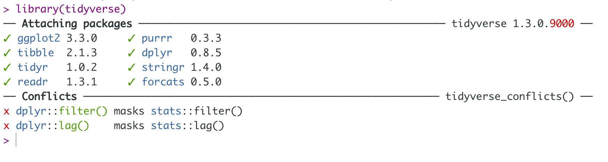
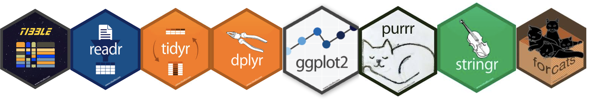
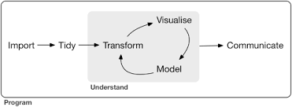

```{r setup, include=FALSE}
options(htmltools.dir.version = FALSE)
```

background-image: url(tidyverse.jpeg)
background-size: 100px
background-position: 98% 6%
 
 # What is tidyverse?

- Collection of essential R packages for data science.

- All packages share a common design philosophy, grammar, and data structures.

### Setup

```r
install.packages("tidyverse") # install the tidyverse packages
library(tidyverse) # load the tidyverse packages

```




---

background-image: url('workflowds.png')
background-position: center
background-size: 700px

# Workflow

---
background-image: url(readr.png)
background-size: 100px
background-position: 98% 6%

# Workflow: import




---

background-image: url(tidyr.jpeg)
background-size: 100px
background-position: 98% 6%


# Workflow: tidy


---
background-image: url(dplyr.png)
background-size: 100px
background-position: 98% 6%

# Workflow: transform


---
background-image: url(ggplot2.png)
background-size: 100px
background-position: 98% 6%


# Workflow: visualise


### Illustration

```{r, comment=NA, fig.width=4.5,fig.height=4.5}
library(ggplot2)
ggplot(iris, aes(Sepal.Width, Sepal.Length, color=Species)) + geom_point()+theme(aspect.ratio  = 1)+scale_color_manual(values = c("blue", "red", "orange"))
```

---
background-image: url(purrr.png)
background-size: 100px
background-position: 98% 6%

# Workflow: model


```{r, echo=FALSE,  message=FALSE, warning=FALSE}
library(tidyverse)
library(magrittr)
```

## Illustration: Apply a linear model to each group
```{r, message=FALSE, warning=FALSE, comment=NA}
nested_iris <- group_by(iris, Species) %>% nest()
fit_model <- function(df) lm(Sepal.Length ~ Sepal.Width, data = df)
nested_iris <- nested_iris %>%
 mutate(model = map(data, fit_model))

nested_iris$model[[1]] # To print other two models nested_iris$model[[3]] nested_iris$model[[3]]
```

---

# Workflow: communicate


---

background-image: url(tidyvflowpkg.png)
background-size: contain
background-position: center

# Workflow: R packages


---

class: duke-orange, middle, center

# Tibble

---
background-image: url(tibble.png)
background-size: 100px
background-position: 98% 6%

# Tibble

- Tibbles are data.frames

- Modern version the data.frames

# Create a tibble

```{r, comment=NA, message=FALSE}
library(tidyverse) # library(tibble)
first.tbl <- tibble(height=c(150, 200, 160), weight=c(45, 60, 51))
first.tbl
```

---

# Convert an existing dataframe to a tibble

```{r, comment=NA}
as_tibble(iris)

```

---

# tibble vs. data.frame

1. Output

**tibble**

```{r, comment=NA}
first.tbl <- tibble(height=c(150, 200, 160), weight=c(45, 60, 51))
first.tbl
```

**data.frame**
```{r, comment=NA}
dataframe <- data.frame(height=c(150, 200, 160), weight=c(45, 60, 51))
dataframe
```

---

# tibble vs data.frame (cont.)

- You can create new variables

**tibble**

```{r, comment=NA}
first.tbl <- tibble(height=c(150, 200, 160), weight=c(45, 60, 51), 
                    bmi=(height)/weight^2)
first.tbl
```

**data.frame**

```{r, comment=NA, eval=FALSE}
df <- data.frame(height=c(150, 200, 160), weight=c(45, 60, 51), 
                    bmi=(height)/weight^2) # Not working
```

You will get the following error message 

`Error in data.frame(height = c(150, 200, 160), weight = c(45, 60, 51),  : 
  object 'height' not found`


---

# tibble vs data.frame (cont.)

With `data.frame` this is how we should create a new variable from the existing columns

```{r, comment=NA}
df <- data.frame(height=c(150, 200, 160), weight=c(45, 60, 51)) 
df$bmi <- (df$height)/(df$weight^2)
df
```

---

# tibble vs data.frame (cont.)

- Variable names: 

```{r, comment=NA}
tbl <- tibble(`patient id`=c(1, 2, 3))
tbl
```

```{r, comment=NA}
df <- data.frame(`patient id`=c(1, 2, 3))
df
```

---

# tibble vs data.frame (cont.)

A tibble can have columns that are lists.

```{r, comment=NA}
tbl <- tibble (x = 1:3, y = list(1:3, 1:4, 1:10))
tbl
```

This feature is not available in `data.frames`.

If we try to do this with a traditional data frame we get an error.

```{r, comment=NA, eval=FALSE}
df <- data.frame(x = 1:3, y = list(1:3, 1:4, 1:10)) ## Not working, error

```

`Error in (function (..., row.names = NULL, check.rows = FALSE, check.names = TRUE,  : arguments imply differing number of rows: 3, 4, 10`

---

class: duke-orange, middle, center

# Factors


---
# Factors

- A vector that is used to store categorical variables

- It can only contain predefined values. Hence, factors are useful when you know the possible values a variable may take. 

## Creating a factor vector

```{r, comment=NA}
grades <- factor(c("A", "A", "A", "C", "B"))
grades
```
--
Now let's check the class type

```{r, comment=NA}
class(grades) # It's a factor
```
--
To obtain all levles

```{r, comment=NA}
levels(grades)
```

---

# Character vector vs Factor

- Observe the differences in outputs. Factor list all unique values.

**Character vector**

```{r, comment=NA}
grade_character_vctr <- 
  c("A", "D", "A", "C", "B")
grade_character_vctr
```

**Factor vector**

```{r, comment=NA}
grade_factor_vctr <- 
  factor(c("A", "D", "A", "C", "B"))
grade_factor_vctr
```

---
# Character vector vs Factor (cont.)

- Factors behave like character vectors but they are
actually integers.

**Character vector**

```{r, comment=NA}
typeof(grade_character_vctr)
```

**Factor vector**

```{r, comment=NA}
typeof(grade_factor_vctr)
```

--
- With factors all possible values of the variables can be defined under levels.

```{r, comment=NA}
grade_factor_vctr <- 
  factor(c("A", "D", "A", "C", "B"), levels = c("A", "B", "C", "D", "E"))
```

---


# Character vector vs Factor (cont.)


- Let's create a contingency table with `table` function.

**Character vector output with table function**

```{r, comment=NA}
table(grade_character_vctr)
```

**Factor vector (with levels) output with table function**

```{r, comment=NA}
table(grade_factor_vctr)
```

- Output corresponds to factor prints counts for all possible levels of the variable. Hence, with factors it is obvious when some levels contain no observations. 

---
# Character vector vs Factor (cont.)

- With factors you can't use values that are not listed in the levels, but with character vectors there is no such restrictions.

**Character vector**

```{r, comment=NA}
grade_character_vctr[2] <- "A+"
grade_character_vctr
```

**Factor vector**

```{r, comment=NA}
grade_factor_vctr[2] <- "A+"
grade_factor_vctr
```
---
# Modify factor levels

This our factor

```{r, comment=NA}
grade_factor_vctr
```

## Change labels

```{r, comment=NA}
levels(grade_factor_vctr) <- 
  c("Excellent", "Good", "Average", "Poor", "Fail")
grade_factor_vctr
```
## Reverse the level arrangement

```{r, comment=NA}
levels(grade_factor_vctr) <- rev(levels(grade_factor_vctr))
grade_factor_vctr
```

---

# Order of factor levels

```{r, fih.height=3, comment=NA}
fv1 <- factor(c("D","E","E","A", "B", "C"))
fv1

```

```{r, fih.height=3, comment=NA}
fv2 <- factor(c("1T","2T","3A","4A", "5A", "6B", "6B"))
fv2

```


---

class: duke-orange, middle, center

# Pipe operator: %>%


---
background-image: url(magrittrlogo.png)
background-size: 100px
background-position: 98% 6%

# Pipe operator: %>%

## Required package: `magrittr` 

```{r, eval=FALSE}
install.packages("magrittr")
library(magrittr)
```

```{r, echo=FALSE}
library(magrittr)
```

## What does it do? 

It takes whatever is on the left-hand-side of the pipe and makes it the first argument of whatever function is on the right-hand-side of the pipe.


For instance,

```{r, comment=NA}
mean(1:10)
```

can be written as

```{r, comment=NA}
1:10 %>% mean()
```

---

# Pipe operator: %>%


## Illustrations

1. `x %>% f(y)` turns into `f(x, y)`

1. `x %>% f(y) %>% g(z)` turns into `g(f(x, y), z)`

---
# Why %>%

- This helps to make your code more readable.

**Method 1: Without using pipe (hard to read)**

```{r, comment=NA}
colSums(matrix(c(1, 2, 3, 4, 8, 9, 10, 12), nrow=2))

```

**Method 2: Using pipe (easy to read)**

```{r, comment=NA}
c(1, 2, 3, 4, 8, 9, 10, 12) %>%
  matrix( , nrow = 2) %>%
  colSums()
```

or

```{r, comment=NA}
c(1, 2, 3, 4, 8, 9, 10, 12) %>%
  matrix(nrow = 2) %>% # remove comma
  colSums()
```

---

# Rules

```{r, comment=NA}
library(tidyverse) # to use as_tibble
library(magrittr) # to use %>%
df <- data.frame(x1 = 1:3, x2 = 4:6)
```

.pull-left[

**Rule 1**

```r
head(df) 
df %>% head()

```

```{r, echo=FALSE, comment=NA}
library(tidyverse)
library(magrittr)
df %>% head()
```

**Rule 2**

```r
head(df, n = 2)  
df %>% head(n = 2)

```

```{r, echo=FALSE, comment=NA}
df %>% head(n = 2)
```

]

.pull-right[

**Rule 3**

```r
head(df, n = 2)
2 %>% head(df, n = .)

```

```{r, echo=FALSE, comment=NA}
2 %>% head(df, n = .)
```


**Rule 4**
```r
head(as_tibble(df), n = 2)
df %>% as_tibble %>% head(n = 2)

```


```{r, echo=FALSE, comment=NA}
df %>% as_tibble %>% head(n = 2)
```

]

---

# Rules (cont.)

**Rule 5: subsetting**

```r
df$x1
df %>% .$x1
```

```{r, echo=FALSE, comment=NA}
df %>% .$x1
```

or 

```r
df[["x1"]]
df %>% .[["x1"]]
```


```{r, echo=FALSE, comment=NA}
df %>% .[["x1"]]
```

or 

```r
df[[1]]
df %>% .[[1]]
```

```{r, echo=FALSE, comment=NA}
df %>% .[[1]]
```

---

# Offline reading materials

Type the following code to see more examples

```{r, eval=FALSE}
vignette("magrittr")
```

---

class: center, middle

Slides available at: hellor.netlify.com

All rights reserved by [Thiyanga S. Talagala](https://thiyanga.netlify.com/)


