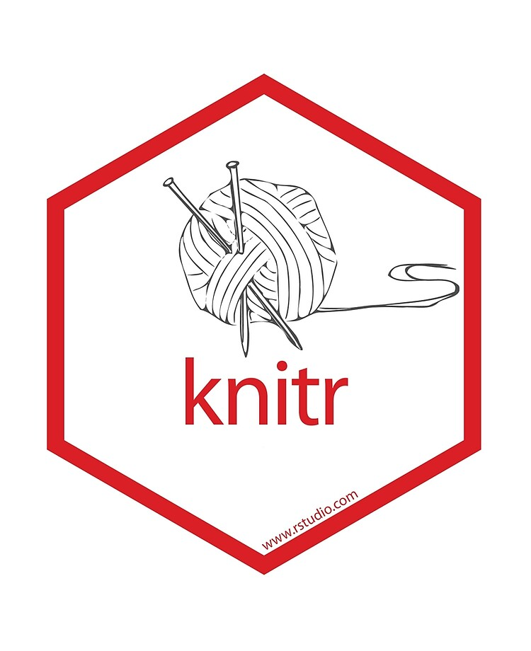
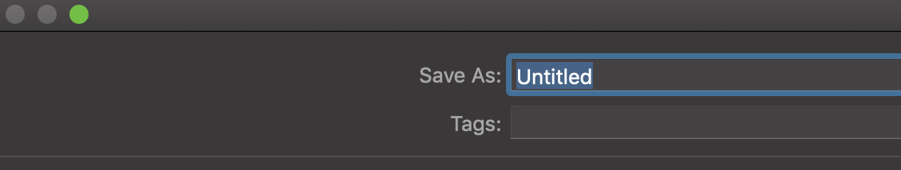
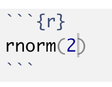
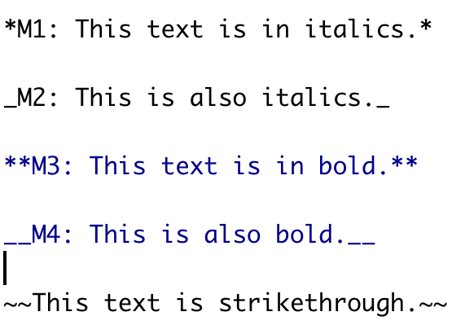

```{r setup, include=FALSE}
options(htmltools.dir.version = FALSE)
library(emo)
```

background-image: url(workflowds_communication.png)
background-position: center
background-size: contain

# Data Science Workflow: Communicate

---

# Necessary packages

## Installation

```r
install.packages(knitr)
install.packages(rmarkdown)
```
 


---

# Introduction to R Markdown

- Markdown is one of the world's most popular markup language.

- R Markdown (in R)

- Jupyter Notebooks (in Python)
---

# Advantages

1. For .bold[.green[communicating]] to .bold[.red[decision makers]], who want to focus on the results and conclusions, not the code behind the analysis.

1. For .bold[.green[collaborating]] with other .bold[.red[data scientists]], who are interested in both your conclusions, and how you reached them (i.e. the codes that you used to take the outputs).

---
class: duke-orange, center, middle

# Your first rmarkdown document.


---
background-image: url(rmarkdown_step1.png)
background-position: center
background-size: contain


---
background-image: url(rmarkdown_step2.png)
background-position: center
background-size: contain

---

background-image: url(rmarkdown_step2_1.png)
background-position: center
background-size: contain
---

background-image: url(rmarkdown_step3.png)
background-position: center
background-size: contain

class: center, middle

---

background-image: url(rmarkdown_step4.png)
background-position: center
background-size: contain

class: center, middle

---

# Select a folder to save the document 


---

# Give a name to the document


---

background-image: url(rmarkdown_step5.png)
background-position: center
background-size: contain

class: center, middle

---

background-image: url(rmarkdown_step6.png)
background-position: center
background-size: contain

class: center, middle

---

background-image: url(rmarkdown_step7.png)
background-position: center
background-size: contain

class: center, middle

---

# Edit .rmd file to include your content


---

# Change header

.pull-left[

**Code**

```r

# Header 1

## Header 2

### Header 3

```

]

.pull-right[

**Output**


# Header 1

## Header 2

### Header 3


]


---

# Add content

.pull-left[

**Code**

```r

# Header 1

This is section 1.

## Header 2

This is section 1.2

### Header 3

This is section 1.2.1

```

]

.pull-right[

**Output**


# Header 1

This is section 1.

## Header 2

This is section 1.2

### Header 3

This is section 1.2.1


]

---

# Add R codes

.pull-left[

**Code**

```r

# Header 1

This is section 1.

## Header 2

This is section 1.2

### Header 3

This is section 1.2.1

```


]

.pull-right[

**Output**


# Header 1

This is section 1.

## Header 2

This is section 1.2

### Header 3

This is section 1.2.1

```{r}
rnorm(2)
```

]


---
# Chunk options

* `eval = FALSE` - prevents the code from being evaluated

* `include = FALSE` - runs the code but doesn't show it in the final document

* `echo = FALSE` - prevents the code but not the results from appearing

* `message = FALSE` - prevents messages from appearing in the finished file

* `results = "hide"` - hides the printed output

* `error = TRUE` - causes the render to continue even if the code returns an error
---

# Text formatting

.pull-left[

## Code




]

.pull-right[

## Output

*M1: This text is in italics.*

_M2: This is also italics._

**M3: This text is in bold.**

__M4: This is also bold.__


~~This text is strikethrough.~~

]

---

# Type Equations

.pull-left[

````md
This is $e^x$.
````


]

.pull-right[

This is $e^x$.


]


---

# Mathematical Symbols

---
# Create PDF files

```r
tinytex::install_tinytex()

```

---

Please read by blog post here: 

https://thiyanga.netlify.app/post/greekletters/

---


---
class: center, middle


Slides available at: hellor.netlify.app

All rights reserved by [Thiyanga S. Talagala](https://thiyanga.netlify.com/)


